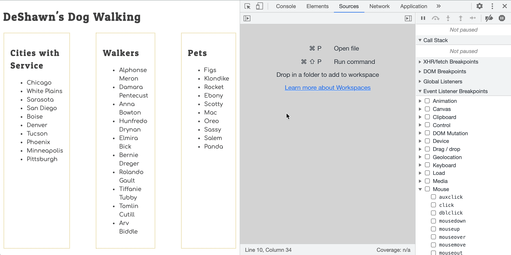

# Examining Events in the Dev Tools

You have started your journey on gathering evidence about your code and the way it operates by using the Developer Tools in Chrome. In the last chapter, you implemented an event listener and then used a breakpoint to step through the code that runs when the browser generated that events.

Watch the <a href="https://vimeo.com/568120309">Dev Tools - Discovering and Debugging Events</a> video to explore a more advanced way to discover and debug event listeners that you defined in your code.

## Try it Out

Discover and debug the event listener code that you created in the last chapter.

