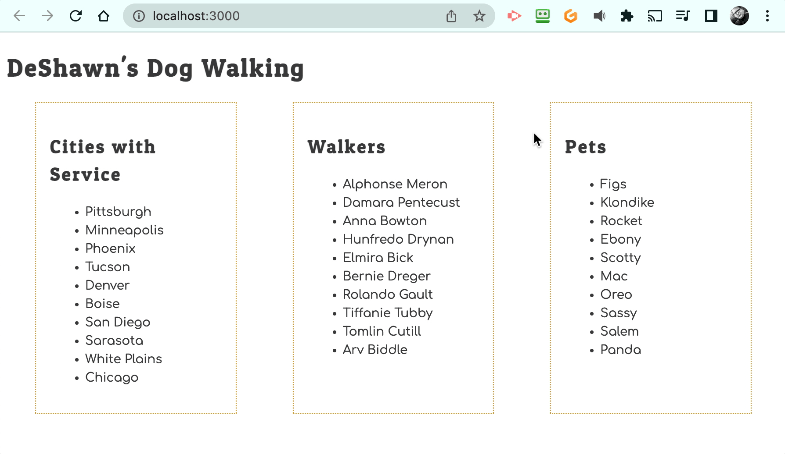

# Navigating ERD Relationships

In this chapter, you will continue to use data attributes to embed more state into the DOM than is visible to the users. When a pet is clicked, the goal is to show the person walking the dog.

Since those two bits of information are in different arrays, you will need to access state that is stored in the DOM, and then use that state to find a related object in a different array.

## Finding Related Data with JavaScript

Watch the following video to see how this can be accomplished using the state stored in the DOM and iterating an array of related data to find an object that matches a foreign key.

