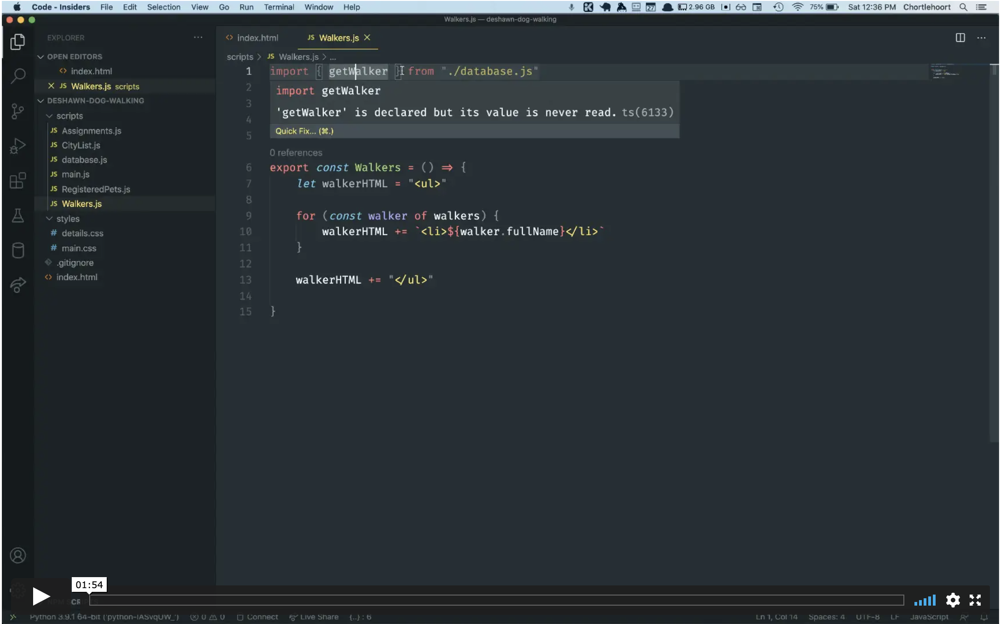
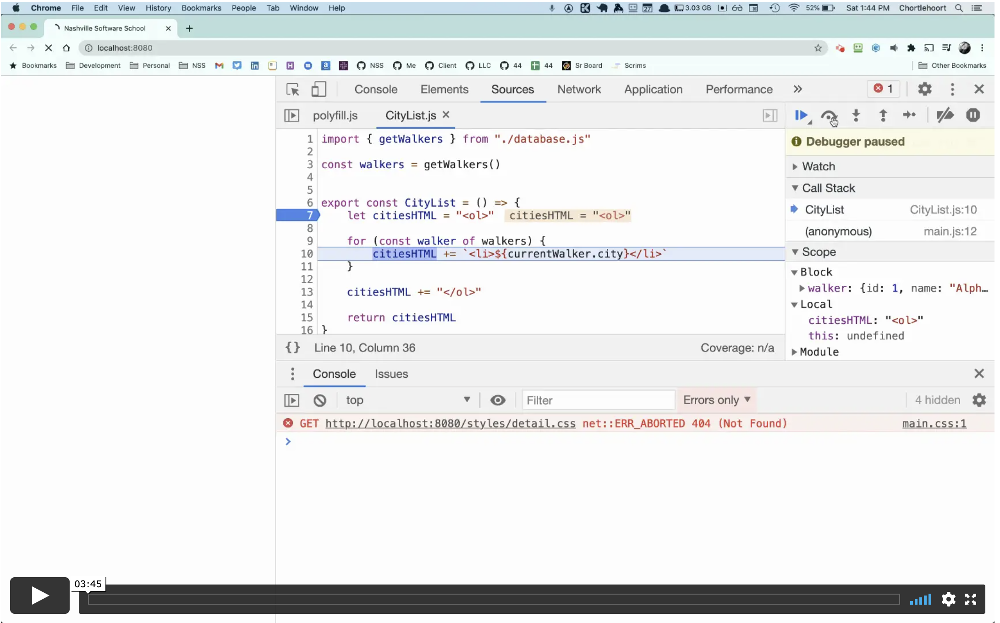

# Using the Debugger

As a software developer, the developer tools in the browser are where you will spend about 75% of your time and focus. Being comfortable with the debugger and stepping through your code one line at a time to see what's happening is a crucial, core skill for a junior developer.

By the end of the client side course, you are expected to be proficient in the use of your developer tools.

> "But they are scary, I want to avoid them."

That's not a Growth Mindset. That is your Fixed Mindset talking. Professional software developers have a Growth Mindset and strategically use their time to get better at the skills needed to be successful.

| | |
|:---:|:---|
| <h1>&#x2757;</h1> |  _Debugging and the developer tools is how you gather **evidence**. Professional developers use evidence, at all times, when examining issues with their code. They never guess or assume what the problem is._ |

## Knowing Where to Look

This video introduces you to understanding how to read an error in the developer tools and knowing where to go look into your code for the bug.

## Breakpoints and Inspecting Values

In this video, you will see how to set breakpoints, evaluate the values of variables, and how to step through your code one line at a time.

## Chrome Dev Tools Walkthrough Demo

Now that you've seen a few quick walkthroughs of how to use the Developer Tools to debug your code, your next job is to try it out.

Visit the [Debug JavaScript](https://developer.chrome.com/docs/devtools/javascript/#reproduce) site and follow the 7 step demo on using the Developer Tools to find and fix issues in JavaScript.
