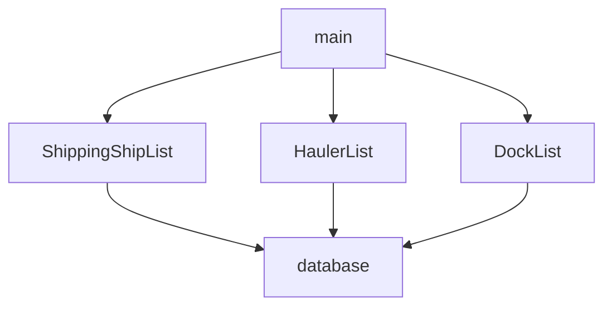

# Designing Dependencies

Before you start building this project, you should draw a dependency graph to have a plan of attack before you begin coding. This project is nearly identical to DeShawn's Dog Walking, in that there are several collections of data, each of which need to be converted to HTML for display in the browser.

## Dependency Graph

Given the ERD that you made in the last chapter, and knowing that the list of haulers, shipping ships, and docks must all be rendered separately, and taking into account that all of your data will be stored in its own module, build a dependency graph.

Once you are done, you can compare with the one provided in the hint below.

## Sequence Diagram

Now draw a sequence diagram for the algorithm of how the application will operate when the HTML is first rendered to the browser.

    
Hint: Dependency Graph for Shipping Ships

