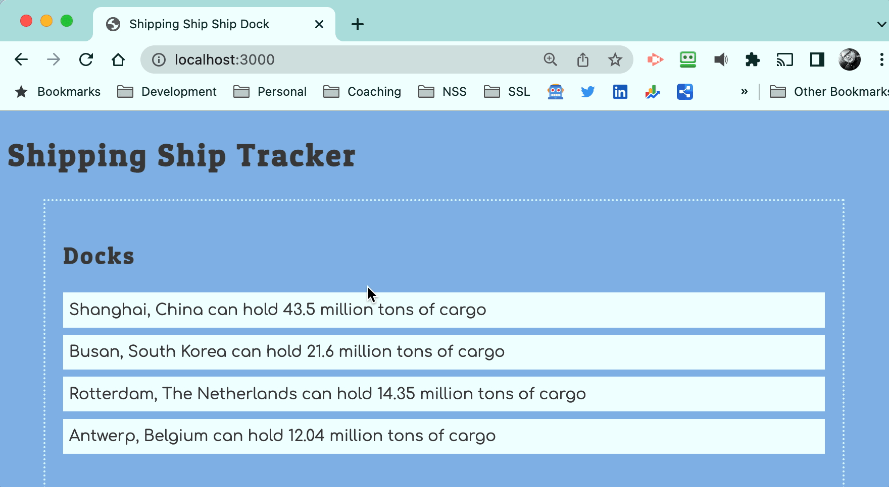

# Dock Service

The next step for you is to add a click event listener that displays the haulers being serviced by a dock.



## Handling Click Event

Add the following click event listener to the docks list module and capture the DOM element that was clicked.

```js
document.addEventListener(
    "click",
    (clickEvent) => {
        const itemClicked = clickEvent.target

        /*
            Your job is to design an algorithm and implement it
        */
    }
)
```

When a dock is clicked, present a message to the user that follows the format below if a hauler is currently at that dock.

```txt
The Shanghai, China dock is currently unloading Boaty McBoatface
```

If there is no hauler at the dock, present the following message.

```txt
The Shanghai, China dock is currently unloading nothing
```

If there is more than one hauler at the dock, present the following message.

```txt
The Shanghai, China dock is currently unloading Boaty McBoatface, Seawise Giant
```
