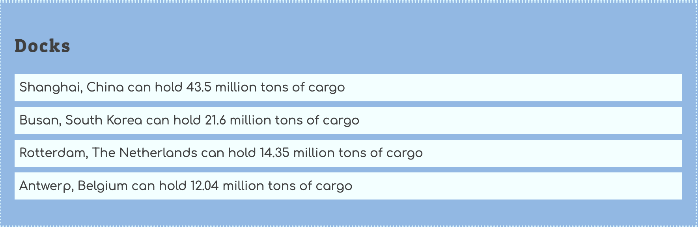

# List of Docks

Your first task is to create a list of available docks.



Here are some dock objects that you can add to your database module.

```js
docks: [
    { id: 1, location: "Shanghai, China", volume: 43.5 },
    { id: 2, location: "Busan, South Korea", volume: 21.6 },
    { id: 3, location: "Rotterdam, The Netherlands", volume: 14.35 },
    { id: 4, location: "Antwerp, Belgium", volume: 12.04 }
]
```