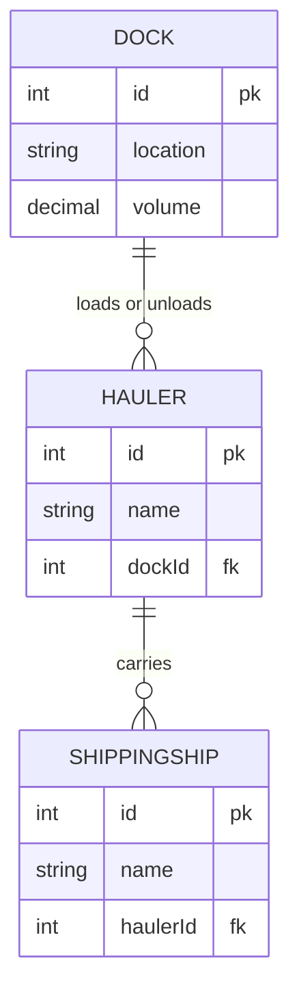

# Hauler Cargo

The next step for you is to add a click event listener that displays the number of ships that each hauler is carrying.


## Handling Click Event

Add the following click event listener to the hauler list module and capture the DOM element that was clicked. The algorithm is included. Review it carefully.

```js
document.addEventListener(
    "click",
    (clickEvent) => {
        const itemClicked = clickEvent.target

        // Was a hauler list item clicked?

            // Get the id of the hauler clicked

            // Start a counter variable at 0

            // Iterate all of the shipping ships

                // Does the haulerId foreign key match the id?

                    // Increase the counter by 1

    }
)
```

What information does this algorithm need to do its job?

* The type of item was clicked.
* The `id` value of the hauler item that was clicked.
* The array of shipping ships so that it can be iterated.

You will add some information to each list item using data attributes to fulfill this algorithm.

### Augmenting the List Items with Data Attributes

Right now, when you generate list items for each hauling ship, you likely just have the name of the ship interpolated inside the tags.

```js
shipsHTML += `<li>${ship.name}</li>`
```

In order for your click event to have the data it needs to do its job - finding all the matching shipping ships - you need to know, at the very least, the `id` of the hauler. Look at the diagram below and recall that the `haulerId` foreign key property on a shipping ship refers to a specific hauler.




To enable getting the `id` property of the hauler that is clicked on, you will set a data attribute _(see [MDN: Using data attributes](https://developer.mozilla.org/en-US/docs/Learn/HTML/Howto/Use_data_attributes) to learn more)_ on each list item the store the id.

```js
shipsHTML += `<li data-id="${ship.id}">${ship.name}</li>`
```

Now each hauler list item will be rendered like this.

```html
<li data-id="1">Pioneering Spirit</li>
<li data-id="2">Boaty McBoatface</li>
<li data-id="3">Seawise Giant</li>
```

You also need to specify what _kind of data_ that the list item represents. You will use another data attribute for this.

```js
shipsHTML += `<li data-id="${ship.id}"
                  data-type="hauler">
                ${ship.name}
              </li>`
```

That will generate list items in this format.

```html
<li data-id="1" data-type="hauler">Pioneering Spirit</li>
<li data-id="2" data-type="hauler">Boaty McBoatface</li>
<li data-id="3" data-type="hauler">Seawise Giant</li>
```

## Completing the Algorithm

Now watch a 7:23 long video that demonstrates how to use those data attributes on the list items to implement the algorithm. After watching the video, implement the code yourself.

[](https://watch.screencastify.com/v/kaWPyxCnewek1lgFyX7e)

