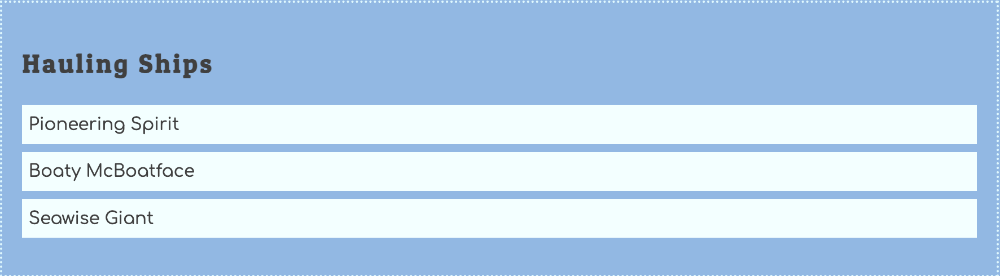

# List of Hauling Ships

Now build out the module to create the HTML for a list of available hauling ships.



Here is some starter code for adding an array of hauling ship objects to your database. Only the primary is provided. Refer back to your ERD and add the other two properties to the object. Then create 3 or 4 more hauling ships with names of your choice.

```js
const database = {
    docks: [...],
    haulers: [
        { id: 1 }
    ]
}
```

Remember to put an accessor, or getter, function in the database module so that the other modules can get a copy of this array of objects.

```js
export const getHaulingShips = () => {
    // You write the code for copying the array and returning it
}
```

## Build an HTML List of Hauling Ships

Now open your module that is responsible for building the HTML for each hauler and implement the code.