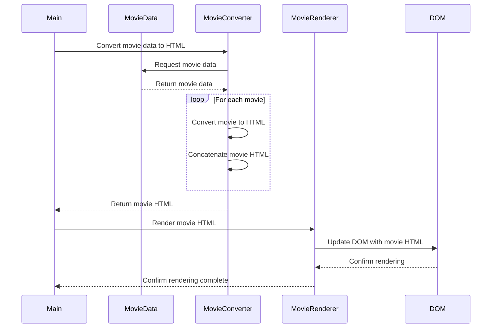

# Setting Up the Project

In this chapter, we will set up the foundation for our movie collection project. We'll create the necessary files and directories, and implement a basic HTML structure to serve as the starting point for our movie showcase.

## Project Algorithm

This sequence diagram visualizes the algorithm of the project you are about to build.




## Step 1: Create Project Directory and Files

First, let's create a new directory for our project and navigate into it:

```bash
cd ~/workspace
mkdir movie-majesty
cd movie-majesty
```

Next, create the following files and directories inside the project directory:

- `index.html`: This will be the main HTML file for our movie showcase.
- `styles`: This directory will contain our CSS files.
  - `layout.css`: This file will contain the CSS styles for the layout of our project.
  - `main.css`: This file will contain the main CSS styles for our project.
- `scripts`: This directory will hold our JavaScript files.
  - `main.js`: This file will be the entry point for our JavaScript code.
  - `movie-converter.js`: This file will contain the logic for converting movie data to HTML.
  - `movie-render.js`: This file will handle rendering the movie cards to the DOM.
  - `movies-data.js`: This file will store the movie data.

## Step 2: Implement Basic HTML Structure

Open the `index.html` file in a text editor and add the following HTML code:

```html
<!DOCTYPE html>
<html lang="en">
<head>
  <meta charset="UTF-8">
  <meta name="viewport" content="width=device-width, initial-scale=1.0">
  <title>Movie Majesty</title>
  <link rel="stylesheet" href="styles/layout.css">
  <link rel="stylesheet" href="styles/main.css">
</head>
<body>
  <header>
    <h1>Movie Majesty</h1>
  </header>

  <main>
    <section id="movie-list">
      <!-- Movie cards will be dynamically added here -->
    </section>
  </main>

  <footer>
    <p>&copy; 2023 Movie Majesty. All rights reserved.</p>
  </footer>

  <script src="scripts/main.js"></script>
</body>
</html>
```

Let's break down the important parts of this HTML structure:

- The `<head>` section contains metadata about the HTML document, such as the character encoding, viewport settings, and the page title.
- We link the external CSS files (`layout.css` and `main.css`) using the `<link>` tags, which will allow us to style our movie showcase.
- Inside the `<body>`, we have a `<header>` element that displays the title of our movie collection.
- The `<main>` section contains a `<section>` with the ID `movie-list`. This is where we will dynamically add our movie cards using JavaScript.
- The `<footer>` section can include additional information or copyright notice.
- Finally, we include the `main.js` file using the `<script>` tag, which will be our entry point for the JavaScript code.

## Step 3: Test the HTML Structure

Open the `index.html` file in a web browser to ensure that the basic structure is displayed correctly. You should see the page title, header, and footer.

At this point, our movie showcase page is still empty, but we have set up the necessary files and structure to build upon in the upcoming chapters.

## Step 4: Initialize Repository and First Commit

1. Make a new repository named `dynamite-duo` on Github.
2. In your project directory, run `git init` to create the local repository.
3. Run `git add .` to stage the files.
4. Run `git commit -m "Initial commit"` to commit the initial version of all of your files to the commit history.
5. Get the SSH URL of your Github repository and run `git remote add origin ssh_url` and replace `ssh_url` with what you copied from Github.
6. Push your code to Github with `git push -u origin main`.


## Explanation

Creating a well-structured project directory and HTML file is crucial for any web development project. It serves as the foundation upon which we will build our movie collection showcase.

By separating concerns and organizing our files into dedicated directories (`styles` and `scripts`), we keep our code modular and maintainable. The `<section>` element with the ID `movie-list` provides a designated area where we will dynamically add our movie cards using JavaScript.

In the next chapter, we will focus on creating the movie data that will be used to generate the movie cards in our showcase.