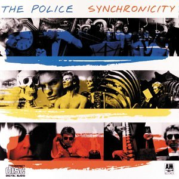

# Asynchronicity

No, I'm not talking about a Police album.



Asynchronicity in the world of modern software means that you have to account for the fact that your code run from line 1 to line 127 and it is done executing. Especially in the context of building browser-based, client-side applications, we have to build software that will respond when certain events happen. Whenever they happen. You can't predict it, or be assured that **anything** will happen in a specific order.

That's asynchronicity.

You've already been introduced to the concept of asynchronous applications - the event handlers.

1. click
1. keypress
1. dragstart
1. ondrop
1. onmouseover
1. onmouseout

etc...

You write code that will execute at _some point in the future_ when a specific event happens. If you provide a button, and attach an event listener to it, that event may be triggered 5 seconds after the user interacts with your application, or 5 hours after, or they may never click it at all.

```js
const clickableButton = document.createElement("button")
clickableButton.textContent = "Magic!"
clickableButton.onclick = function (clickEvent) {
    // This code may never run, but is sitting here patiently
    // waiting for a user to click the button and respond
    // to that event
    alert("Magic!!!")
}
```

## AJAX and Async

Using jQuery to make an `$.ajax()` request is the largely same thing. The difference is that you're not writing code to run in reaction to a user behavior, but rather you're writing code to run in reaction to getting a response to an HTTP request.

Open a new Quokka file, and put in the following code. If you haven't installed the Quokka plugins for using jQuery, see the installation section below.

```js
({
    plugins: ['jsdom-quokka-plugin', 'quokka-jquery-loader']
})


const goGetTheData = () => {
    $.ajax("https://api.github.com/users/your-username-here/events")
        .then(responseFromGithub => {
            /*
                The time for the request to make it to Github's servers,
                get processed, and then have a response travel back to your
                machine can take as little as 100ms, or as much as 3s.

                Just like a click event listener, this code is intended to
                run in the future, when a certain event takes place. In this
                case, that event is getting a response from Github.
            */
            console.log(responseFromGithub)
        })
}

goGetTheData()
```

Now to show you how understanding asynchronous programming will affect your code. Without understanding how an XHR is async by nature, a developer might write this code.

```js
({
    plugins: ['jsdom-quokka-plugin', 'quokka-jquery-loader']
})

let myEvents = null

const goGetTheData = () => {
    $.ajax("https://api.github.com/users/your-username-here/events")
        .then(responseFromGithub => {
            /*
                The time for the request to make it to Github's servers,
                get processed, and then have a response travel back to your
                machine can take as little as 100ms, or as much as 3s.

                Just like a click event listener, this code is intended to
                run in the future, when a certain event takes place. In this
                case, that event is getting a response from Github.
            */
            myEvents = responseFromGithub
        })
}

goGetTheData()
console.log(myEvents)
```

In this case `myEvents` will **always** be equal to `null`. Can you think of why?

If this doesn't make sense, let's look at the order of operations.

1. `myEvents` is initialized
1. `goGetTheData` is initialized
1. `goGetTheData` is invoked
1. `myEvents` is logged in the console
1. The XHR completes and `myEvents` gets a new value

The time is take the JavaScript engine to do steps 1-4 is less than 1ms. As mentioned above the time is takes for the request to Github to complete is, at best, 100ms. Therefore, `myEvents` is logged to the console before its value is reassigned.

## Installing Quokka plugins

```sh
cd ~/.quokka
npm i quokka-jquery-loader
npm i jsdom-quokka-plugin
```

Then open the `~/.quokka/config.json` file and put this JSON in it.

```json
{
    pro: false,
    plugins: [
        "quokka-jquery-loader",
        "jsdom-quokka-plugin"
    ]
}
```