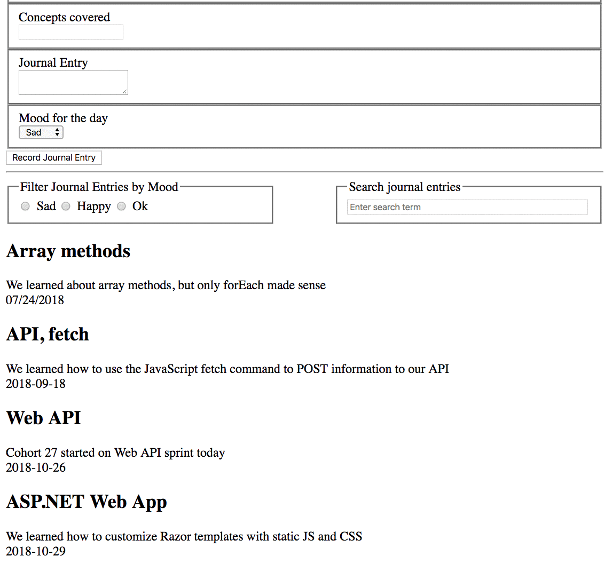

# Daily Journal

The learning objective for this chapter is to be able to search your journal entries using array iteration, and object property iteration.

## Search Input

Add a search input field to the right of your mood buttons. Practice your Flex skills to get them side-by-side, with each component taking up 40% of the width of the page.

## Add Event Listener

Attach a `keypress` listener to the input field. When the user presses their return key, get the input field's value and look through each of your journal entries to find any property whose value contains that text.

You will need to use your newly acquired skills with `for..of` loops and `Object.values()`.

## Update the DOM

Once you've found matching entries, render only those entries in the DOM.

