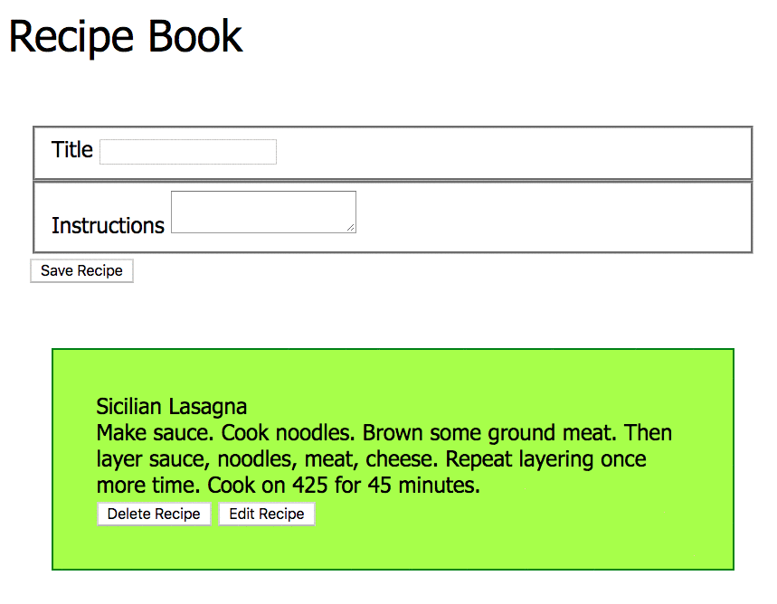

# Editing Data

Editing data is the most complex operation to perform in a web application because you have to do the following steps.

1. Have an event handler on some affordance for a user to edit a particular resource
1. Get the corresponding resource from the API
1. Render a form to the DOM with input fields
1. Populate input fields in the DOM to represent the current state of the resource
1. Have an event handler on a button to allow the user to save changes
1. Collect the user input from the DOM
1. Send a request to the API to update the correct resource
1. Redirect the user to either a list view, or a detail view of the resource s/he just modified



## Edit Form

Here's a simple collection of input fields I can use for editing a recipe. You can add it to your `index.html`.

```html
<header class="title">Recipe Book</header>

<section id="recipeForm">
    <form>
        <fieldset class="fieldset">
            <label for="recipeTitle">Title</label>
            <input type="text" name="recipeTitle" id="recipeTitle">
        </fieldset>
        <fieldset class="fieldset">
            <label for="recipeInstructions">Instructions</label>
            <textarea type="date" name="recipeInstructions" id="recipeInstructions"></textarea>
        </fieldset>
    </form>
    <button id="saveRecipe">Save Recipe</button>
</section>
```

## Hidden Input Fields

Hidden input fields are a mechanism that software developers use to put information about the data into the DOM without adding useless, visual noise for the user. It's an input field that you can get or set the value of, but the user doesn't see it.

Here's what it looks like. You would add it as the first field in the form.

```html
<section id="recipeForm">
    <form>
        <input type="hidden" id="recipeId" value="" />
        ...
    </form>
</section>
```

### Add Id to Button Element

Just like when you implemented the delete functionality, you needed the recipe id added to the end of the `id` attribute of the delete button. The edit button needs the same thing so that you can capture which recipe to edit.

```js
const createRecipeCard = recipe => `
    <section class="recipe--${recipe.id}">
        <header class="recipe__title">
            ${recipe.title}
        </header>
        <div class="recipe__instructions">
            ${recipe.instructions}
        </div>
        <button id="editRecipe--${recipe.id}">
            Edit Recipe
        </button>
        <button id="deleteRecipe--${recipe.id}">
            Delete Recipe
        </button>
    </section>
`
```

## Edit Request Syntax

### Capture the Edit Button Click

As before, let the click event on the edit button bubble up to the `<article>` element. Then add another conditional to check if the edit button was clicked.

```js
recipeList.addEventListener("click", event => {
    if (event.target.id.startsWith("editRecipe--")) {
        const recipeIdToEdit = event.target.id.split("--")[1]

        /*
            This function will get the recipe from the API
            and populate the form fields (see below)
        */
        updateFormFields(recipeIdToEdit)
    }
})
```

Once you have extracted the `id` of the recipe to be editing, send a `GET` request to your API to get the current state of that recipe. Then, represent that current state in your user interface by setting the value of the appropriate input fields in your form.

```js
const updateFormFields = recipeId => {

    // Get reference to input fields in the form
    const hiddenRecipeId = document.querySelector("#recipeId")
    const recipeTitleInput = document.querySelector("#recipeTitle")
    const recipeInstructionsInput = document.querySelector("#recipeInstructions")

    fetch(`http://localhost:8088/recipes/${recipeId}`)
        .then(response => response.json())
        .then(recipe => {
            /*
                Now that you KNOW you have the data, render
                an editing form that represents the current
                state of the resource.
            */
            hiddenRecipeId.value = recipe.id // Hidden value. User no see. 🙈
            recipeTitleInput.value = recipe.title
            recipeInstructionsInput.value = recipe.instructions
        })
}
```

## How Do You Know the Information is Being Edited?

Since you are simply updating your existing form with values for an edit operation, you application needs to know that when the user clicks the "Save" button, information should not be **created** in the API, but **updated**.

Remember that hidden input field you added to your HTML? Well, we can use that to solve the problem.

* If the input field has a value, then user is editing
* If the input field has no value, then user is creating


```js
saveButton.addEventListener("click", event => {
    const hiddenRecipeId = document.querySelector("#recipeId")

    if (hiddenRecipeId.value !== "") {
        editRecipe(recipeId)
    } else {
        // Save functionality goes here
    }
}
```

## Using PUT to Complete the Edit Process

Now that you've retrieved the `id` of the recipe to edit, pass it to an `editReipe` function, and use `fetch()` to perform a `PUT` operation.

```js
const editRecipe = id => {
    const updatedObject = {
        title: document.querySelector("#recipeTitle").value,
        instructions: document.querySelector("#recipeInstructions").value
    }

    // Logic for the PUT operation
    fetch(`http://localhost:8088/resource/${id}`, {
        method: "PUT",
        headers: {
            "Content-Type": "application/json"
        },
        body: JSON.stringify(updatedObject)
    })
    .then(res => res.json())
    .then(() => {
        /*
            Since this is the point in the code where you KNOW
            the operation completed successfully, clear the
            value of the hidden input field to that your
            application is back to the state of creating instead
            of editing
        */
        document.querySelector("#recipeId").value = ""
    })

}


```

## Edit and Get All

Just like with the delete operation, you have changed the state of your API. This means that you need to get all of the resources again from the API and display them so that the updated information gets rendered in the DOM for the user to see.