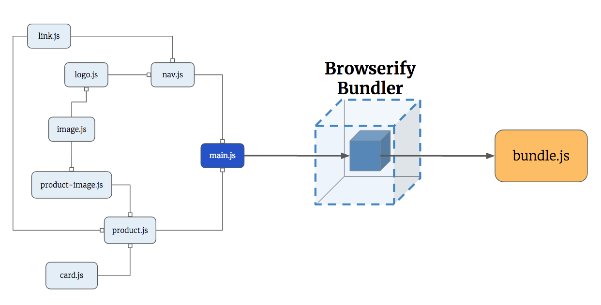

# Browserify Modules

Browserify allows you to build modules of JavaScript logic that export functionality that can be imported by any other module. When building a modular application, consider that each module is an independent utility that does one specific thing. When another module needs the functionality of one of the other utilities, they can import it.



## Why are You Learning This?

Every major application that you will ever work on is modular by design. Building applications with modularity in mind achieves several goals.

1. Easier to fix bugs.
1. Easier to understand for new teammates.
1. Easier to refactor.
1. Easier to add new features.
1. Reduces code conflicts on a team.
1. Easier to remove obsolete features.

Also, there is a more immediate goal. Your main client-side library that you will be learning in a few weeks - React - is based on the whole concept of building modular applications by using Components.

## Setting Up Your Project

The first step is to create the directories that you need.

```sh
cd  ~/workspace/javascript
git clone https://github.com/nashville-software-school/browserify-boilerplate
cd browserify-boilerplate/src/lib
npm install
```

### The Public Directory

This is going to seem confusing at first, but one step in using a tool like Browserify is to create a new directory named `public` at the same level as `src`. You will see that directory in the project you just cloned. It's time to talk about compiled applications.

Up until this point, you have been requesting HTML files via `http-server` and the HTML has been rendered in the browser. If the HTML had `<script>` tags in it, then a new HTTP request was made for each of those files, one at a time, and they were delivered to you by `http-server`, just like your HTML file.

For example. Each of these files below are delivered as separate HTTP requests.

```html
<script src="domManager.js"></script>
<script src="componentFactory.js"></script>
<script src="eventListeners.js"></script>
<script src="apiManager.js"></script>
<script src="layoutManager.js"></script>
```

Since these were all considered source code, they could all live in the `src` directory and times were good.

With Browserify, all of your source code is compressed together into a **_single JavaScript file!!_** It's this single, compressed (_a.k.a. compiled_) file that will be linked in your HTML file. Your actual source code still exists in the `src` directory, but is no longer going to be requested by the browser.

In the sample application you cloned, the four source code files - `src/scripts/main.js`, `src/scripts/hello.js`, `src/scripts/goodbye.js`, and `src/scripts/sandwichMaker.js` - are all compiled into the `public/hellogoodbye.js` file.

If you open `public/index.html`, you will notice only one script component.

```html
<script src="bundle.js"></script>
```

That file actually contains **ALL** of the code that exists in the four source code files you created.

It's weird. I know.

Since it's the compiled file that you will actually be using when you make your application available to the public so they can use it, then that compiled file should be placed in a `public` directory along with your `index.html`. Those will be the only two files in that directory.

The other files that would be included are CSS files, but we don't need those for now.

Now you only need to upload two files to a hosting service to make your application available. If you uploaded your `src` directory, it would take **forever** because not only are there many source code files, but there are all of the files in your `node_modules` directory. Thousands of them.

## Basic Browserify Application

Now that setup is complete, and you have a boilerplate directory structure set up from the cloned repository, it's time for you to build your first Browserify application. This sample application will use the `main.js` that you already have, but you will replace the code in there, and add other modules to generate car objects and place them in an array that acts as the garage for the cars.

### Your First Module

In your boilerplate project, you will define a code module that contains the code for a very specific task. In this module, there is one function that acts a car factory that has the unique ability of building a car of any make and model.

Make sure you are in the root directory of the application.

```sh
touch src/scripts/createCar.js
```

In Visual Studio Code, open that file and place the following code in it. This module does one thing only: it produces car objects. Each car object has a `make` and `model` property on it as well as a `drive` method which returns a string.

```js
/*
    Author: your name here
    Name: createCar.js
    Purpose: Produces a new car object
*/
const CarFactory = (make, model) => {
    const newCar = {
        "make": make,
        "model": model,
        "drive: function(str) {
          return `You drove the car to ${str}`
          }
    }

    return newCar
}

export default CarFactory
```

### Main Application Logic

The `main.js` module is the entry point of your application. It's the code in that module that gets executed when your refresh your browser.

Open the `src/scripts/main.js` file and get rid of what's in there already, and replace it with the following code.

```js
/*
    Author: your name here
    Name: main.js
    Purpose: Entry point of our application
*/
import createCar from "./createCar"

const garage = []

// Create two cars using the function you imported
const mustang = createCar("Ford", "Mustang")
const accord = createCar("Honda", "Accord")

// Drive the cars for a while
console.log(mustang.drive("the grocery store"))
console.log(accord.drive("Indianapolis"))

// Park the cars in the garage
garage.push(mustang)
garage.push(accord)

console.table(garage)
```

## Compiling your Code

Make sure you are in the `src/lib` directory of your application, and run `grunt`. This will check your syntax, start the web server, and compile the source code.

## Viewing your Garage

Open [http://localhost:8080/](http://localhost:8080/) in Chrome, view the Developer Console and you should see an array with the two car objects in it.


## The Garage Module

You can take this a step further and make the car garage its own module.

```sh
touch src/scripts/createGarage.js
```

Instead of the garage being a simple array in your main module, you are going to make an object that has more complex behaviors - which are expressed as methods on an object.

[Read more about what a **method** is](https://javascript.info/object-methods) if that term still confuses you.

> garageFactory.js

```js
/*
    Author: your name here
    Name: createGarage.js
    Purpose: To store cars in garages
*/

/*
    This array only exists within the scope of this method.
    Therefore, no other module can access it. However,
    the `GarageManager` object you define below allows
    code in other modules to indirectly access it by using
    the methods.
*/
const garage = []

const GarageManager = {
    store: function (car) {
        garage.push(car)
    },
    retrieve: function (carToFind) {
        return garage.find(car => car.make === carToFind.make && car.model === carToFind.model)
    },
    /*
        The getInventory property is the only way for external code to
        read the value of the garage variable. There is no setter
        either. It is a read only property.
    */
    getInventory: function () {
        return garage
    }
}

export default GarageManager
```

Now let's import this module into our main module and use its methods. Adding a couple more cars just so the output changes.

```js
/*
    Author: your name here
    Name: main.js
    Purpose: Entry point of our application
*/
import carFactory from "./createCar"
import garage from "./createGarage"

// Create two cars using the function you imported
const mustang = carFactory("Ford", "Mustang")
const accord = carFactory("Honda", "Accord")
const santafe = carFactory("Hyundai", "Santa Fe")
const sierra = carFactory("GMC", "Sierra")

/// Store the cars in the garage
garage.store(mustang)
garage.store(accord)
garage.store(santafe)
garage.store(sierra)

console.table(garage.getInventory())
console.table(garage.retrieve(sierra))
```


## Resources

* [ECMAScript 6 modules: the final syntax](http://2ality.com/2014/09/es6-modules-final.html)

## Practice: Contact List

> The boilerplate repository does not include the task for starting a `json-server` API, so you need to add it for this practice exercise. Add the following task to the `src/lib/grunt/aliases.yaml` file before the "watch" task:
>
>    `- "bgShell:launchAPI"`
>
> Then make sure you add a `database.json` file to your `api` directory

Build four components:

1. A **ContactCollection** component that loads existing contacts from a `json-server` API, and saves new ones.
1. A **Contact** component that displays a person's name, phone number, and address.
1. A **ContactList** component that displays all contacts. It should import the **Contact** component and the **ContactCollection** component.
1. A **ContactForm** component that listens for when the submit button is pressed. When it is triggered, a new contact should be POSTed to the API. It should import the **ContactCollection** component.

In `main.js`, import the **ContactList** component and the **ContactForm** component.

The user should see the contact form at the top of the view, and the list of contacts underneath it.

> **Bonus:** Are there any other modules that could be made? Do any modules have more than one possible responsibility? Perhaps something that is a general utility function.

## Practice: Product Ordering

Your task is to simulate a product listing page like you would find on Etsy, Amazon, or Ebay. This application should implement the following features.

1. Display an individual product component. Each product should have a title, short description, price, quantity, and an image.
1. Display the application information in a navigation bar at the top of the page.
    1. The name of the company - Betsy
    1. Three links: *Categories*, *Orders*, and *Log Out* (these links won't actually do anything, you're just practicing making the navigation bar a component)
1. Display a review list component that contains a maximum of 3 product review components beneath a product. You can use [hipster ipsum](https://hipsum.co/) for the reviews themselves.

### Component/Module Map


## Technical Requirements

1. While you are developing, make sure Grunt is verifying your JavaScript syntax every time you save a file.
1. Grunt should be compiling your modules each time you save a JavaScript file.
1. Grunt should be minifying your code each time you save a JavaScript file.
