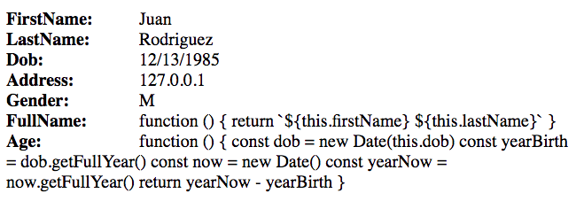

# Powerful Object Creation in JavaScript

## Key Concept

* Objects represent things we need to display, or use, in our application
* Properties describe the objects
* Methods define their behavior

## Using the Power of Object.create()

Up to this point, we've been using the simplistic method for creating objects, which gives us no power, or control, on how it gets manipulated.

```js
const boringObject = {}
```

In this chapter you're going to learn about `Object.create()`, which gives a JavaScript developer far more control over how external code can interact with it.

## Read Only Properties

When you use `{}` to create an object, you have zero control how properties are created, deleted, or changed. Here's an object with very sensitive data in it.

```js
const veryImportantInfo = {
    "socialSecurity": "934-11-0201",
    "accountNumber": "4483271255",
    "routingNumber": "458979043"
}
```

Another developer on your team is tasked with using that object in her code, so she writes a function for that purpose.

```js
const requestFunds = function (info) {
    /*
       Note: Banks require that the account number and
       routing number be combined into a single value
    */
    info.accountNumber = info.accountNumber + info.routingNumber
    const transactionInfo = info.accountNumber

    // Awesome code that performs the transaction goes here...
}
```

The requirements she got for her feature required that the account number and the routing number be combined into a single string for the transaction to be successful. So while her code works perfectly fine, she inadvertantly modified YOUR OBJECT! It wasn't malicious, just a standard bug introduced when a developer isn't focused.

```js
const requestFunds = function (info) {
    /*
       Note: Banks require that the account number and
       routing number be combined into a single value
    */
    info.accountNumber = info.accountNumber + info.routingNumber
    const transactionInfo = info.accountNumber

    // Awesome code that performs the transaction goes here...
}

const veryImportantInfo = {
    "socialSecurity": "934-11-0201",
    "accountNumber": "4483271255",
    "routingNumber": "458979043"
}

requestFunds(veryImportantInfo)

console.log(veryImportantInfo.accountNumber)   // 4483271255458979043 --> Yikes!
```


## Read-only Properties

Using the power of `Object.create()` you can prevent another developer from changing the value of any property on an object. You can specify whether a property can be changed with the `writable` property. By setting it to `false`, that value cannot be changed. It is now a read-only property.

```js
const veryImportantInfo = Object.create(null, {
    socialSecurity: {
        value: "934-11-0201",
        writable: false
    },
    accountNumber: {
        value: "4483271255",
        writable: false
    },
    routingNumber: {
        value: "458979043",
        writable: false
    }
})

veryImportantInfo.socialSecurity = "haxx0r attack"
console.log(veryImportantInfo.socialSecurity)    // 934-11-0201  --> It didn't change!
```

The `writable` property is actually `false` by default, so if you want it to be read-only, you can just leave it off of the property definition.

```js
const veryImportantInfo = Object.create(null, {
    socialSecurity: {
        value: "934-11-0201"
    },
    accountNumber: {
        value: "4483271255"
    },
    routingNumber: {
        value: "458979043"
    }
})
```

Try it out for yourself. Create a new Quokka file, paste the above object into it, and try to change one of the property values of `veryImportantInfo`. You can't!


### Non-Enumerble Properties

When you use a `for..in` loop to iterate over the keys of an object, only enumerable keys will be used. Let's see what that means. If you open a Quokka file and create an object using curly braces, and then iterate over its keys, nothing will appear.

```js
const boring = {}

for (let key in boring) {
    console.log(key)
}

// ... nothing appears
```

Now, after you define the object, add a key named `stale` with a value of `true`. Then define another key named `wait` whose value is a function. You'll see that both `stale`, and `wait` get logged.

```js
const boring = {}
boring.stale = true
boring.wait = function () {
    console.log("waiting for the paint to dry ")
}

for (let key in boring) {
    console.log(key)
}
```

What's weird about this is that a standard object inherits from the Big Object in JavaScript. It inherits `toString`, `hasOwnProperty` and several other keys. Why don't those show up in the console?? It's because they are non-enumerable. You can also provide that level of control with `Object.create()`, but can't with standard object creation.

Be aware that the `enumerable` configuration for a property is also `false` by default - just like `writable`, so if you want an enumerable property, you have to specify it.

```js
const exciting = Object.create(null, {
    fun: {
        value: "Wheeee",
        enumerable: true
    },
    joy: {
        value: ["bubbles", "puppies", "pizza"]
    }
})

for (let key in exciting) {
    console.log(key)
}

// Only `fun` gets logged
```

You may be wondering at this point, "So... what's the point? Why do I care if a property is enumerable or not?"

That's a great question. Let's consider an object that has property values that we want to display in the DOM, but it also has method properties.

```js
const JuanRodriguezPatient = {
    firstName: "Juan",
    lastName: "Rodriguez",
    dob: "12/13/1985",
    address: "127.0.0.1",
    gender: "M",
    fullName: function () {
        return `${this.firstName} ${this.lastName}`
    },
    age: function () {
        const dob = new Date(this.dob)
        const yearBirth = dob.getFullYear()
        const now = new Date()
        const yearNow = now.getFullYear()

        return yearNow - yearBirth
    }
}
```

In my application, I want to display all properties and their value into the DOM. Let's imagine that we are building a nurse's report to see a list of all active patients in a doctor's office.

> index.html

```html
<!doctype html>
<html lang="en">
<head>
  <meta charset="utf-8">
  <title>Nashville Software School</title>
  <link rel="stylesheet" href="./styles.css">

</head>

<body>
  <div id="patient-list"></div>

  <script src="juan.js"></script>
  <script src="createElement.js"></script>
</body>
</html>
```

> styles.css

```css
key {
    font-weight: bolder;
    margin: 0 20px 0 0;
    min-width: 100px;
    display: inline-block;
}

key::after {
    content: ":"
}
```

> createElement.js

```js
// Obtain a reference to the patient list container
const patientList = document.querySelector("#patient-list")

/*
    Create an in-memory DOM Node that will contain all elements
    which will display information about Juan
*/
const patientElementContainer = document.createDocumentFragment()

// Create an article element to contain all of the properties
const patient = document.createElement("article")

for (let key in JuanRodriguezPatient) { /* eslint no-undef: "off" */

    // The container element for each property
    const property = document.createElement("section")

    // Span element to hold the name of the property
    const keyElement = document.createElement("key")
    keyElement.textContent = `${key.charAt(0).toLocaleUpperCase() + key.slice(1)}`

    // Span element to hold the value of the property
    const valueElement = document.createElement("value")
    valueElement.textContent = `${JuanRodriguezPatient[key]}`

    // Add the two spans to the property <div>
    property.appendChild(keyElement)
    property.appendChild(valueElement)

    // Add the property <div> to the patient <div>
    patient.appendChild(property)
}

// Attach the `article` element to the document fragment
patientElementContainer.appendChild(patient)

// Add the document fragment to the DOM
patientList.appendChild(patientElementContainer)
```

Here's the resulting DOM in the browser.



__Oops!__

`FullName` and `Age` are methods of the `JuanRodriguezPatient` object - not properties. I don't want them displayed. This can't be achieved with ordinary object creation. We have to use `Object.create()`.

Let's make those methods non-enumerable, and the properties enumerable.

```js
const JuanRodriguezPatient = Object.create({}, {
    firstName: {
        value: "Juan",
        enumerable: true
    },
    lastName: {
        value: "Rodriguez",
        enumerable: true
    },
    dob: {
        value: "12/13/1985",
        enumerable: true
    },
    address: {
        value: "127.0.0.1",
        enumerable: true
    },
    gender: {
        value: "M",
        enumerable: true
    },
    fullName: {
        value: function () {
            return `${this.firstName} ${this.lastName}`
        }
    },
    age: {
        value: function () {
            const dob = new Date(this.dob)
            const yearBirth = dob.getFullYear()
            const now = new Date()
            const yearNow = now.getFullYear()

            return yearNow - yearBirth
        }
    }
}
```

Here's the output when we use `Object.create()` to make those methods non-enumerable.


You can view the working code in [JSFiddle](https://jsfiddle.net/chortlehoort/csf4qodj/).


## Practice: The toString Version of You

Create an object that represents you. It should have the following properties on it.

1. First name
1. Last name
1. Date of birth
1. Place of birth
1. Current city of residence
1. Current state of residence

Only the city and the state of residence should be able to be modified by other code in the application. The other properties should be read only (i.e. non-writable).

Once those are defined, create a method on your object named `toString()`.

```js
const Me = Object.create(null, {
    toString: {
        value: function () {
            // Your code goes here
        }
    }
})
```

When you invoke the `toString()` method, the following string should be generated.

```text
Ollie Osinusi was born in Sacramento, CA. He was born on 10/13/1990. He currently lives in Murfreesboro, TN.
```

## Practice: Financial Advisor

> The learning objective for this practice exercise is to use different combinations of object property configurations to understand how you can have control over what data can, and cannot, be changed by other code in an application.

Your job is to create an object that represents a financial advisor and has the following properties and methods.

1. Company (enumerable, writable, property)
1. Specialty (enumerable, writable, property)
1. Name (enumerable, property)
1. Portfolio (non-enumerable, property) - Should display the stocks the advisor currently holds
1. Worth (non-enumerable, method)
1. Purchase (non-enumerable, method) - This method takes a stock ticker symbol, a quantity, and a price as arguments
1. Sell (non-enumerable, method) - This method takes a stock ticker symbol, a quantity, and a price as arguments

When `sell()` or `purchase()` are invoked, then the stock portfolio should be modified accordingly. Start off with making `portfolio` property an array that holds transactions. Each transaction should be an object.

```js
// Example transaction
{
    stock: "TWTR",
    quantity: 100,
    price: 34.59,
    buyTransaction: true
}
```

When you invoke the `worth()` method, it should look at every transaction and calculate the advisor's net worth. Each buy transaction should add to the net worth. Each sell transaction should subtract from the net worth.

---

> Challenges are optional exercises that you should only attempt if you have completed the practice exercises, and fully understand the concepts used in them.

## Challenge: Fragments and Elements

> The learning objective for this challenge is to use modern JavaScript methods to create DOM elements.

1. Use `document.createElement` to build & display an HTML component to display the advisor's name, company, and specialty.
1. Iterate over the advisor's portfolio and use `document.createDocumentFragment` along with `document.createElement` to display some HTML components representing each stock owned by the advisor.

## Challenge: Advisor.toString()

> The learning objective of this challenge is to pratice using string templates and interpolation.

Add a `toString()` method to your financial advisor object that outputs the following message format.

`​​​​​Fernando Valenzuela is an advisor at Gold Heart Investments. Current portfolio value is US$ 13,647.00​​​​​`

## Advanced Challenge: Calculated Properties

> The learning objective for this challenge is to write a getter and a setter for the `worth` property of the financial advisor. This lets you explore the concept of calculated properties.

Up to this point, you have used methods (i.e. functions on objects) to perform logic and calculations needed for the object. Properties are simple, primitive values like "John", 100, and `true`. With the power of `Object.create()`, you can still have properties, but their value is calculated via a function rather than being simple assignment and retrieval.

Consider the `worth()` method on your object. Worth itself is not a behavior, or a process, of the financial advisor, but you had to write it as a method because you needed to iterate the portfolio and return the calculated value. You can use [get()](https://developer.mozilla.org/en-US/docs/Web/JavaScript/Reference/Functions/get) and [set()](https://developer.mozilla.org/en-US/docs/Web/JavaScript/Reference/Functions/set) with `Object.create()` to change `worth` into a property instead.

```js
// You need to define the values of the getter and setter
worth: {
    get: ...,
    set: ...
}
```

Once those are defined correctly, this code should output the worth of the portfolio.

```js
// Note the lack of parenthesis after worth. It's a property.
console.log(FinancialAdvisor.worth)
```

## Black Hat Advanced Challenge: Hiring More Advisors

> The learning objective of this black hat advanced challenge is to use prototypal inheritance with `Object.create()` to start understanding how, when you have many objects that share common properties and behaviors, inheritance reduces duplicating code.

Use the power of prototypal inheritance and `Object.create()` to hire three more financial advisors. All properties and behaviors that are **common to all advisors** should be on the more general prototype for the individual advisors.

1. All advisors will work for the same company
1. Each advisor maintains their own portfolio
1. Worth of each advisor's portfolios will be calculated with the same process
1. Each advisor specializes in a different sector

Two lines of code to get you started, hacker...

```js
const JuliaKimChung = Object.create(FinancialAdvisor, {
    ...
})

const IkeNwaelele = Object.create(FinancialAdvisor, {
    ...
})
```

