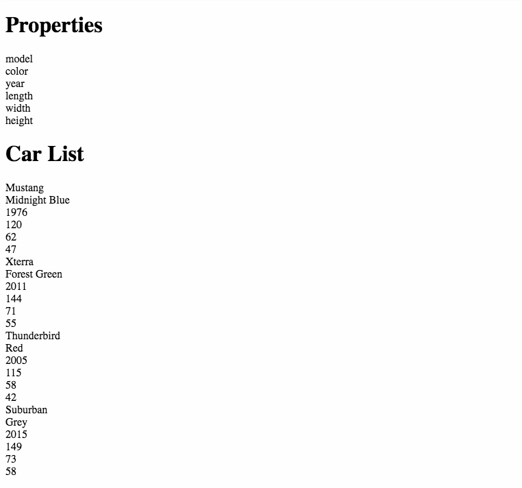
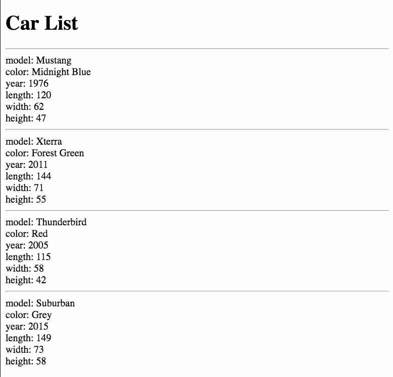

# Object Methods

## Why are you Learning This?

Since objects are the core concept behind Object Oriented Programming - what you are learning here at NSS - this chapter is going to prepare you for working with object methods which allow you to search object key and values and display them with more ease.

You are also going to learn a new kind of `for` loop in JavaScript. It's the [`for...of`](https://developer.mozilla.org/en-US/docs/Web/JavaScript/Reference/Statements/for...of) loop.

## Object Methods

Objects have some helpful methods that will allow you to iterate the collection of key/value pairs.

You are going to start with a simple object representing a Ford Mustang.

```js
const mustang = {
    color: "Midnight Blue",
    year: 1976,
    length: 120,
    width: 62,
    height: 47
}
```

You have already learned how to access object properties with dot notation and square bracket notation. So if you wanted to get the color of your Mustang, you could write any of the following code.

```js
// Dot notation
console.log(mustang.color)

// Square bracket notation
console.log(mustang["color"])

// Dynamic square bracket notation
const colorProperty = "color"
console.log(mustang[colorProperty])
```

Now you're going to learn how to work with all of the keys and values. You are tasked with taking an array of objects, and displaying all of the values in each one. For example, you work for a car dealership and the manager, Randall, wants to have a report that quickly shows the details of each car. Here's your array of cars.

```js
const allCars = [
    {
        model: "Mustang",
        color: "Midnight Blue",
        year: 1976,
        length: 120,
        width: 62,
        height: 47
    },
    {
        model: "Xterra",
        color: "Forest Green",
        year: 2011,
        length: 144,
        width: 71,
        height: 55
    },
    {
        model: "Thunderbird",
        color: "Red",
        year: 2005,
        length: 115,
        width: 58,
        height: 42
    },
    {
        model: "Suburban",
        color: "Grey",
        year: 2015,
        length: 149,
        width: 73,
        height: 58
    }
]
```

You want to produce the following report. It's not pretty, but it shows all the information that Randall needs.


Since you just need the values of each object, you can use the `Object.values()` method. Here is how you would start.

1. Iterate the array of cars with `forEach()`.
1. Use `Object.values()` to iterate the values of each car.


## For Of with Object.values()

For this to work, you will need an HTML element in your `index.html` with an id of `app`. Then you will use a `for..of` loop to display all the values.

```js
const outputElement = document.querySelector("#app")

// Iterate the array of cars. Individual objects stored in `car`.
allCars.forEach(car => {

    // Iterate all of the values of the current car
    for (const value of Object.values(car)) {
      outputElement.innerHTML += `<div>${value}</div>`
    }
})
```

### Lightning Exercises

> **Lightning Exercise 1:** Create an object that represents a bill from your doctor's office. It should have the following properties: `officeName`, `streetAddress`, `doctorName`, `patientName`, `visitDate`, `amountBilled`, `dueDate`. You provide example values for each one.

> **Lightning Exercise 2:** Copy the code below and paste it above your object.
>    ```js
>    const dateVisited = "visitDate"
>    const owed = "amountBilled"
>    const patient = "patientName"
>    ```
>
> Use square bracket notation to output the value of those three properties to the console in Chrome.

> **Lightning Exercise 3:** Use `Object.values()` to output **all** the property values to the console in Chrome.

## For Of with Object.keys()

At this point, you proudly show Randall the results of your hard work, and as usual, changes are immediately requested.

> **Randall:** "Ok this is good, but those numbers listed there aren't helpful unless I know what they mean. Like, is that the horsepower, engine size, and wheel base? Can you fix that?"

Of course you can! It's time for you to list all of the properties  at the top of the page so that Randall knows the labels for all of the values on each of the objects.



In order to do that, you can use the `Object.keys()` method.

```js
/*
    Just get a reference to the first object since
    they all have the same properties
*/
const firstCar = allCars[0]

// Now iterate its keys
outputElement.innerHTML += "<h1>Properties</h1>"
for (const key of Object.keys(firstCar)) {
  outputElement.innerHTML += `<div>${key}</div>`
}

// Iterate the array of cars. Individual objects stored in `car`.
outputElement.innerHTML += "<h1>Car List</h1>"
allCars.forEach(car => {

    // Iterate all of the values of the current car
    for (const value of Object.values(car)) {
      outputElement.innerHTML += `<div>${value}</div>`
    }
})
```

> **You:** "Here you go Randall. Now you can see all of the properties that are listed for each car. In fact, if we add more properties later, this page will automatically show those!"

You're very proud of yourself.

### Lightning Exercises

> **Lightning Exercise 1:** Output all of the key names from your doctor's office bill to the console in Chrome.

> **Lightning Exercise 2:** Output all of the key names from your doctor's office bill to the DOM inside a parent `<section>` element. Wrap each one in a `<span>` element.

## For Of with Object.entries()

> **Randall:** "Um, that's cool and all, but eventually we're going to have more than 4 cars to sell and if I'm scrolling and I forget what the properties are, that means I'll have to scroll all the way back up to the top to remember. Can't you just list the properties on each car as well as the values?"

Time to refactor!

To achieve this new requirement from Randall, you can use the `Object.entries()` method. This method returns an array, with the first item being the key name, and the second item being the value.

Here's a simple example.

```js
const bug = {
    flying: true,
    legs: 6
}

for (const entry of Object.entries(bug)) {
    console.log(entry)
}

> [ 'flying', true ]
> [ 'legs', 6 ]​​​​​
```

Now you can use it to display the information on each car object in the report.

> **Note:** Remember to use backticks when you are building string templates to interpolate variables in JavaScript. It's a common oversight for new developers.

```js
outputElement.innerHTML += "<h1>Car List</h1>"

allCars.forEach(car => {
    outputElement.innerHTML += "<hr/>"

    for (const entry of Object.entries(car)) {
        outputElement.innerHTML += `<div>${entry[0]}: ${entry[1]}</div>`
    }
})
```

Now your report meets all of Randall's basic requirements.




> **Lightning Exercise 1:** Create an object to represent your favorite dinner item (e.g. meatloaf, spaghetti, fried fish, gumbo). Each object should have a `name` property, but you can add any other properties that you like, such as size, weight, ethnicity, vegetarian boolean.

> **Lightning Exercise 2:** Output all of the key/value pairs into the DOM inside an `<article>` element with a class of `food`.

## Practice: Car Sales

Randall has come back with a new job for you. Each week, he wants to see a report of how many cars each salesperson sells for that week. Here's his requirements to display for each sale.

1. Display the first and last name of the sales agent.
1. Display all keys and values for the car sold.
1. Display the gross profit made on the sale.


Here's your first data structure for the sales made last week. You will need to start off by iterating the array of sales with a `forEach()` method. Then iterate the entries of the `vehicle` property of each sale.

```js
const salesByWeek = [
    {
        "vehicle": {
            "year": 2013,
            "model": "Tanex",
            "make": "Tamp-dax",
            "color": "quartz"
        },
        "sales_id": "782a23fd-8b83-4497-b9a1-41fd9b15648e",
        "sales_agent": {
            "mobile": "1-584-162-7444",
            "last_name": "Larkin",
            "first_name": "Tiara",
            "email": "ready@gmail.com"
        },
        "purchase_date": "2017-06-07",
        "gross_profit": 210,
        "credit": {
            "credit_provider": "United Services Automobile Assoc.",
            "account": "491697193540559"
        }
    },
    {
        "vehicle": {
            "year": 2012,
            "model": "Volttanphase",
            "make": "Tinlotis",
            "color": "french fuchsia"
        },
        "sales_id": "c6775819-5d17-40db-94f4-00425db590ee",
        "sales_agent": {
            "mobile": "1-573-820-3780",
            "last_name": "Schulist",
            "first_name": "Vada",
            "email": "davin@outlook.com"
        },
        "purchase_date": "2017-08-06",
        "gross_profit": 1886.61,
        "credit": {
            "credit_provider": "TD Group US Holding",
            "account": "494781657570"
        }
    },
    {
        "vehicle": {
            "year": 2013,
            "model": "Lexi-ton",
            "make": "Ware-com",
            "color": "metallic brown"
        },
        "sales_id": "d10631e7-24ca-414b-ac0f-34b286a30f14",
        "sales_agent": {
            "mobile": "1-356-831-5782",
            "last_name": "Leannon",
            "first_name": "Geovanni",
            "email": "need@hotmail.com"
        },
        "purchase_date": "2017-12-27",
        "gross_profit": 154.91,
        "credit": {
            "credit_provider": "State Street Corporation",
            "account": "546417363501851"
        }
    },
    {
        "vehicle": {
            "year": 2011,
            "model": "Onto-zun",
            "make": "Strongzoom",
            "color": "medium slate blue"
        },
        "sales_id": "586bf9d9-67c2-46c7-a6d1-de8484f6c474",
        "sales_agent": {
            "mobile": "774.020.0247",
            "last_name": "Lang",
            "first_name": "Jovani",
            "email": "spell55@yahoo.com"
        },
        "purchase_date": "2017-03-05",
        "gross_profit": 814.49,
        "credit": {
            "credit_provider": "M&T Bank Corporation",
            "account": "34730046974022"
        }
    },
    {
        "vehicle": {
            "year": 2014,
            "model": "Blue-run",
            "make": "Kon-flex",
            "color": "lumber"
        },
        "sales_id": "a5358cb3-6d47-4adb-a232-d5c5d91e25ec",
        "sales_agent": {
            "mobile": "886.374.3898",
            "last_name": "Feil",
            "first_name": "Kory",
            "email": "ducimus@outlook.com"
        },
        "purchase_date": "2017-02-08",
        "gross_profit": 587.52,
        "credit": {
            "credit_provider": "Atlantic Bank",
            "account": "601149379893233"
        }
    }
]
```

## Challenge: Sales Search

> **Reminder:** Challenges are completely optional. You should only attempt this challenge if you have understood everything covered so far. Otherwise, skip it.

Randall loves his weekly sales report. A year goes by and now he has a year's worth of sales reports, and he walks into your office...

> **Randall:** "Good morning. I wanted to run an idea by you. So I'm trying to look at all of my sales reports and find out how many sales Kory had for the year. I'll tell ya, it's taking up way too much of my time. What I need to be able to do is search all of the sales for the entire year and find sales only by Kory, or any other agent. In fact, I should be able to search by any of their properties: first name, last name, email or mobile number."

You can use your existing data set from above because the amount of data in your array has no impact on implemeting a solution for searching all of the data for a string.

Your first task is to use object methods to match the value of all properties of the `sales_agent` object in each sale against the input from Randall. Put an input field in your DOM, attach a `keypress` event listener to it, and search when Randall presses enter. You are given some starter code below.

```js
const searchInput = document.querySelector("#searchInput")

searchInput.addEventListener('', event => {
  if (event.charCode === 13) {
    const searchTerm = event.target.value

    salesByWeek.forEach(sale => {

    });
  }
})
```


