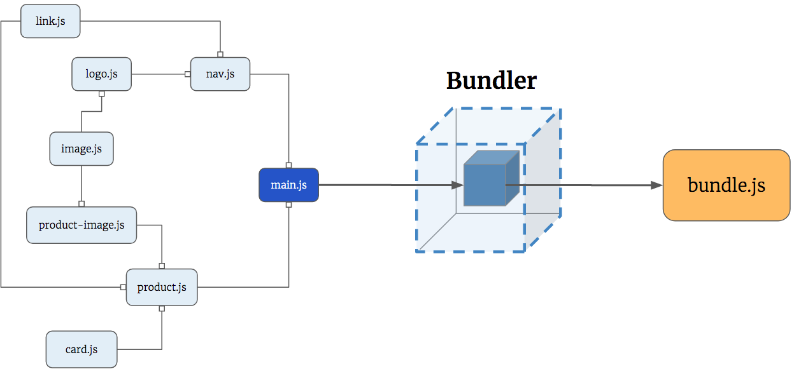
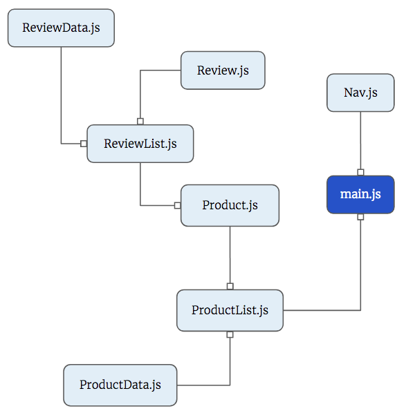

# Webpack: A Powerful Automation Tool for your Application

## Introduction to Webpack

Webpack is a task runner and a module bundler. It originally started as a module bundler. This means that it takes all of your separate Javascript modules and bundles them together into a single file. Webpack also automates some of the tasks that we have to run every time we change the code. It will automate these tasks so that we are not typing in the same commands every single time.

Visit the [Webpack documentation](https://webpack.js.org/concepts/) if you want to explore more.



## Quick Start

1. Visit the [Webpack Boilerplate repository](https://github.com/nashville-software-school/webpack-with-json-server-boilerplate) that we have built for you.
1. Follow the instructions in the README. Be sure you **fork** the repository into your own account first.
1. Once your instruction team is done live-coding and answering questions, you can work on the following exercises.


## Practice: Contact List

Build a Webpack application with the following four JS components:

1. A **ContactCollection** component that loads existing contacts from a `json-server` API, and saves new ones.
1. A **Contact** component that displays a person's name, phone number, and address.
1. A **ContactList** component that displays all contacts. It should import the **Contact** component and the **ContactCollection** component.
1. A **ContactForm** component that listens for when the submit button is pressed. When it is triggered, a new contact should be POSTed to the API. It should import the **ContactCollection** component.

In `main.js`, import the **ContactList** component and the **ContactForm** component.

The user should see the contact form at the top of the view, and the list of contacts underneath it.

> **Food for thought:** Are there any other modules that could be made? Do any modules have more than one possible responsibility? Perhaps something that is a general utility function.

## Practice: Product Ordering

Your task is to simulate a product listing page like you would find on Etsy, Amazon, or Ebay. This application should implement the following features.

1. Display an individual product component. Each product should have a title, short description, price, quantity, and an image.
1. Display the application information in a navigation bar at the top of the page.
    1. The name of the company - Betsy
    1. Three links: *Categories*, *Orders*, and *Log Out* (these links won't actually do anything, you're just practicing making the navigation bar a component)
1. Display a review list component that contains a maximum of 3 product review components beneath a product. You can use [hipster ipsum](https://hipsum.co/) for the reviews themselves.

### Component/Module Map




## For Instruction Team Only: Explanation of Manually Configuring Webpack in your Projects

> **TIP:** Please use the boilerplate repo noted in the Quick Start above. What follows is an explanation of how it all works, and your instruction team will explain it. Do not try to set up manually.

Create your application with the directory structure like below:

```
YourApplication/
  |-- api/
  |-- src/
    |-- index.html
    |-- scripts/
    |-- styles/
  |-- .gitignore
  |-- README.md
```

You are going to create a new project that uses Webpack, which will do the following things for you:

1. Check your JavaScript syntax and alert you of any problems.
1. Convert your ES6 Javascript to ES5.
1. Bundle all your Javascript files
1. Put your `index.html` and CSS directory in a `dist/` directory ( this directory will be explained later )
1. Start up a web server for your application.
1. Start `json-server` for you.

### .gitignore

Because our application will be set up using Webpack, your `.gitignore` should be updated to include the following:

```
package-lock.json
node_modules/
dist/
```

### package.json

You have probably heard the word "package" used at least once since you started learning about development. So what exactly is a package? A package is code that can be shared and used by many developers. For example, you installed a package called `http-server` on your systems. You never wrote the code for it but you were able to install the package and use it to run a server for your application.

To configure and build our application, we will need multiple packages including one for Webpack. In order to manage all the packages, we are going to continue to use npm -- Node Package Manager. Using npm, we can use any of the packages listed on the [npm registry](https://www.npmjs.com/).

In order to get our application running, we will need to install all the packages or external libraries we need and then configure them. The file that lists all the external libraries the application will be using is called  `package.json`.

In your root directory, run the following command. This will create a `package.json` file. This preps our app so that we can install dependencies, ie any external libraries our application may need. All dependencies will be listed in your `package.json`.

```bash
npm init
```

Modify the name, scripts, author, and license values in your `package.json` so that it looks similar to this. The name and author should be specific to your application and to you.

> package.json

```js
{
  "name": "your-application",
  "version": "1.0.0",
  "description": "",
  "scripts": {
    "start": "webpack-dev-server --mode development"
  },
  "keywords": [],
  "author": "Your Name",
  "license": "MIT"
}
```

Now that your `package.json` is ready, go ahead and install your dependencies for this application.

```bash
npm install @babel/core @babel/preset-env babel-loader eslint eslint-loader eslint-plugin-import webpack webpack-cli webpack-dev-server html-webpack-plugin copy-webpack-plugin webpack-shell-plugin --save-dev
```

Once you have run the above command, you will notice a new property in your `package.json` called `devDependencies` which contains all the packages you just installed.

You will also notice the presence of an additional file called `package-lock.json`. This file contains more details on the external dependencies the app will be using including the exact version numbers. You should never have to create this file; this file is generated for you.

### ESLint

Linting is the process of checking the code for any potential errors. We can provide a set of rules that specify how our code should be written. The linter will check to make sure the code follows these rules. We are using ESLint for linting.

To use ESLint we will need two different configuration files. In your root directory, create two files: `.eslintrc` and `.eslintignore`. Both of these will be hidden files, as indicated by the `.` in the front of the filenames. The first will specify the rules our linter will follow to check for syntax errors in the code. The second will specify which files or directories to skip when checking for errors.

##### .eslintrc

The `.eslintrc` file is where we configure our rules for ESLint. It is highly recommended that you bookmark the [listing of all Eslint rules](https://eslint.org/docs/rules/) so that as you gain more understanding of JavaScript, and want to have your code validated in more sophisticated ways in the future, you have the rule list handy.

> .eslintrc

```json
{
  "parserOptions": {
    "ecmaVersion": 8,
    "sourceType": "module",
    "ecmaFeatures": {
      "jsx": true
    }
  },
  "rules": {
    "semi": 0,
    "quotes": ["error", "double"],
    "eqeqeq": 2,
    "no-trailing-spaces": 2
  }
}
```

##### .eslintignore

The `.eslintignore` file operates very similarly to the `.gitignore` file. Anything that is in the `.eslintignore` file will be ignored from linting. Currently you should have the following entries in your `.eslintignore`.

> .eslintignore

```
webpack.config.js;
node_modules;
```

### Babel

Some of the syntax you have been writing Javascript such as `const`, `let`, arrow functions, etc. are part of ES6. Unfortunately, not all browsers can interpret ES6. But we will want to be able to use ES6 syntax when writing code because of all the helpful tools it provides. Therefore, we will use a tool called Babel to convert our JS from ES6 to ES5, which is compatible with most browsers.

Create a file called `.babelrc` at the root of your project. This file contains configuration for Babel.

> .babelrc

```json
{
  "presets": ["@babel/preset-env"]
}
```

### Bundling Modules

Part of the functionality Webpack provides is bundling all your Javascript modules into a single Javascript file, just like ES6 modules. We will configure Webpack to start from `./src/main.js` and pull in any modules that are being imported until all modules that are part of the dependency chain are included. Webpack will take all those JS files and bundle them into a single JS file called `bundle.js`, which will be placed in a `dist/` folder.

### dist

Dist stands for distribution and this directory usually contains the code meant for production or the code we want the server to use. Because our server needs an HTML file, we entrust Webpack with the task of using the `index.html` in `src` as a template to create an `index.html` in the `dist/` directory. Webpack will put in the appropriate script tag for `bundle.js` for you. Therefore, `./src/index.html` does not contain a script tag.

> src/index.html

```html
<body>
  <article id="container"></article>
</body>
```

You will never touch the code in any of the files in the `dist/` directory. As a developer, you will write code only in the `src/` directory. Webpack will be set up to create the `dist` directory and place the single bundled JS file in there. It will put an `index.html` and your css directory in there as well. Essentially, there is a separation of concerns. The developer works only in the `src/` directory and the server only looks at the `dist/` directory.

### webpack.config.js

Now it's time to create our configuration file for Webpack. Create a file called `webpack.config.js` in your root directory. There will be configuration in here for the following.

1. ESLint
1. Babel
1. Instead of http-server ( or LiveServer ), we will be using `webpack-dev-server`, which provides live-reloading.
1. Bundling JS modules
1. Creating an `index.html` in our `dist/` folder, using the plugin `html-webpack-plugin`.
1. Copying the `styles` directory into `dist/` with a plugin named `copy-webpack-plugin`.
1. Running json-server for our persistent data storage. We use a plugin called `webpack-shell-plugin` .

Create a file called `webpack.config.js` in your root directory. This will contain the configuration for Webpack.

> webpack.config.js

```js
const HtmlWebPackPlugin = require("html-webpack-plugin");
const CopyPlugin = require("copy-webpack-plugin");
const WebpackShellPlugin = require("webpack-shell-plugin");
module.exports = {
  entry: "./src/scripts/main.js",
  devServer: {
    writeToDisk: true
  },
  module: {
    rules: [
      {
        enforce: "pre",
        test: /\.js$/,
        exclude: /node_modules/,
        loader: "eslint-loader"
      },
      {
        test: /\.js$/,
        exclude: /node_modules/,
        use: {
          loader: "babel-loader"
        }
      }
    ]
  },
  plugins: [
    new WebpackShellPlugin({
      onBuildEnd: ["json-server -p 8088 -w api/database.json"]
    }),
    new HtmlWebPackPlugin({
      template: "./src/index.html",
      filename: "./index.html"
    }),
    new CopyPlugin([{ from: "./src/styles", to: "./styles" }])
  ],
  output: {
    filename: "bundle.js"
  },
  devtool: "eval-source-map"
};
```

### Running your Application

In your `package.json`, there is a script set up to run the webpack server.

```json
"scripts": {
    "start": "webpack-dev-server --mode development --open"
  }
```

In order to run your application, in your terminal, type in the following command: `npm start`. Then stand back and enjoy the results.

