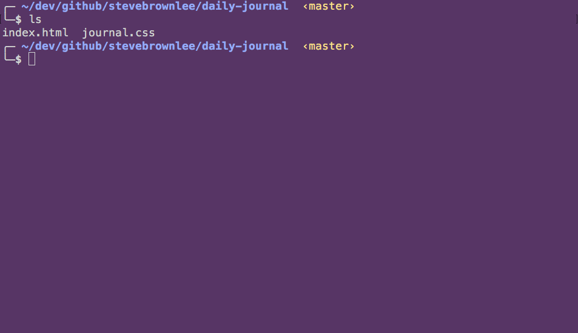
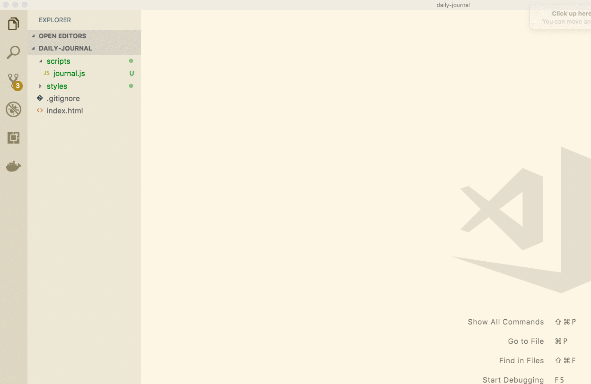
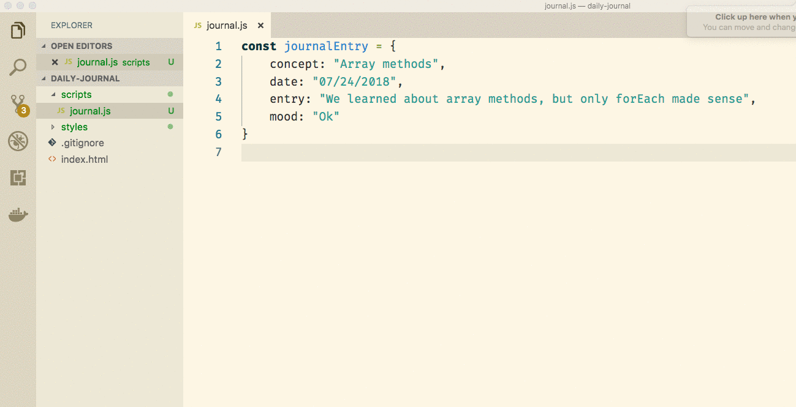

# Daily Journal

You have built your form for entering in journal entries, so now you need to define how the data that you will be collecting in the form should be stored.

## Data Structure for Journal Entries

The four pieces of information are as follows.

1. Date (_Date type_)
1. Concept (_String type_)
1. Journal entry (_String type_)
1. Mood (_String type_)

Since a journal entry is actual thing that you want to track in JavaScript, you need an object. Here's a first attempt of what that object might look like.

```js
{
    date: "07/24/2018",
    concept: "Array methods",
    entry: "We learned about 4 different array methods today. forEach made sense, but the others still confuse me.",
    mood: "Ok"
}
```

Ok, time to write some JavaScript. First, though, let's be responsible and create directories for our CSS files and JavaScript files so that everything doesn't all live in one directory.



> **Refactor:** Make sure you update your `<link>` element in `index.html` to reflect the CSS file's new location. Also add the `<script>` tag before the closing `</body>` tag with the right path in the `src` attribute.

## Making a Journal Entry

Now open `journal.js` and create your first journal entry object.



## Collection of Entries

Once you get this application working, you will very quickly have more than one journal entry. That means that you must store multiple objects in a collection. In JavaScript, we can use arrays for that. Go ahead and move the object into a new `journalEntries` array.



Your task now is to add just a couple more journal entries to your array. Don't add a large number since you are going to learn very soon how to manage this more dynamically.

## Journal Entries in the DOM

The last step in this chapter is to take your raw data structures, and create HTML representations of them so they can be added to the DOM.

### Journal Entry Component Function

You've worked on exercises during which you wrote functions that returned HTML components. Now write a function that builds a journal entry HTML string template.

```js
const journalEntries = [
    {
        concept: "Array methods",
        date: "07/24/2018",
        entry: "We learned about array methods, but only forEach made sense",
        mood: "Ok"
    }
]

/*
    Purpose: To create, and return, a string template that
    represents a single journal entry object as HTML

    Arguments: journalEntry (object)
*/
const makeJournalEntryComponent = (journalEntry) {
    // Create your own HTML structure for a journal entry
    return `

    `
}
```

## Render Journal Entries to the DOM

Create a new element in your `index.html` file that will be the container for all of your journal entries. Place it beneath the form component.

> index.html

```html
<article class="entryLog">

</article>
```

Now write a function whose reponsibility is to iterate your array of journal entries and add them to the DOM.

> journal.js

```js
/*
    Purpose: To render all journal entries to the DOM

    Arguments: entries (array of objects)
*/
const renderJournalEntries = (entries) => {

}

// Invoke the render function
renderJournalEntries(journalEntries)
```

## Your First Journal Entry Rendered to the DOM

Once you have all the functionality written, refresh your browser and you should see your journal entry beneath your form.


