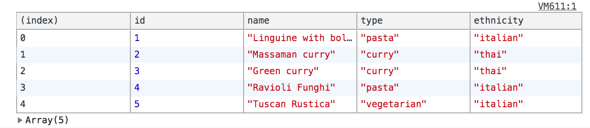

# Fetch your Data

The [fetch API](https://developer.mozilla.org/en-US/docs/Web/API/Fetch_API/Using_Fetch) is a recent addition to native JavaScript that software developers use to interact with data on the Web.

You're going to use the food API that you set up in the last chapter.

## Setup

1. Make sure your API is running. If you need to review, go back to the last chapter for the command.
1. Make a new sub-directory in your project named `src`. This directory will hold your application code.
    ```sh
    mkdir -p ~/workspace/javascript/exercises/food-api/src
    cd $_
    touch index.html
    mkdir scripts
    touch scripts/foodapi.js
    ```
1. Create the boilerplate HTML in VS Code and hook up your `foodapi.js` file into the HTML.

## Querying Data

First, you are going to perform a [GET operation](https://developer.mozilla.org/en-US/docs/Web/HTTP/Methods) to retrieve all the foods!


Paste the following code into your `foodapi.js` JavaScript file and refresh your browser. Remember, **always have your DevTools open**.

> food-api/src/scripts/foodapi.js

```js
fetch("http://localhost:8088/food")
    .then(foods => foods.json())
    .then(parsedFoods => {
        console.table(prasedFoods)
    })
```

You should see this in your console.



Time to explore the code line by line.

### The Request

```js
fetch("http://localhost:8088/food")
```

This makes a request to a specific domain, port address, and resource on the Web.

1. `localhost` is the domain
1. `8088` is the port address
1. `food` is the resource

By default, `fetch` performs a GET operation, so it requires no other configuration.

### The Parsing

```js
.then(foods => foods.json())
```

This line of code accepts the response from your request, parses the body of the response as JSON and returns it to any subsequent `then()` method. It's an abstraction for `JSON.parse()` that you seen before.

### Using the Response

```js
.then(parsedFoods => {
    console.table(prasedFoods)
})
```

This line of code accepts the parsed JSON as the argument to a function, and then uses `console.table()` to display the results.
