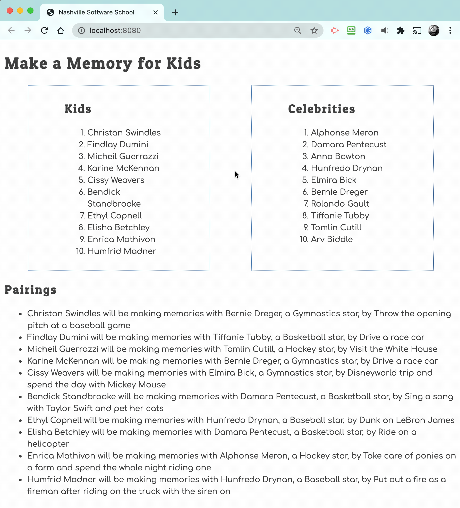

# Events and Debugging Assessment

Time to assess how well you have learned to use the debugging tools in Chrome Dev Tools, and writing click event listeners.

This application is to show kids with illnesses and the memories the would like to make. Celebrities sign up to help kids make memories.

## Event Listeners to Create

1. When the kid name is clicked, it should display their wish.
1. When the celebrity name is clicked, it should display their sport.
1. The pairings list should should contain the pairing in the following format.
    ```html
    {child name} will be making memories with {celebrity name}, a {celebrity sport} star, by {child wish}
    ```

Below is an animation showing how the application should look when complete and how the event listeners should work.



## Setup

Your instruction team will provide a link for you to create your assessment repository. Once your repo is created, clone it to your machine.

1. Make sure you are in your `workspace` directory.
1. `git clone {github repo SSH string}`.
1. `cd` into the directory it creates.
1. `code .` to open the project code.
1. Use the `serve` command to start the web server.
1. Open the URL provided in Chrome.

Make sure your Developer Tools are open at all times while working on this project. Use the messages provided in the Console to determine what code needs to be fixed or implemented, and use breakpoints in the Sources tab to step through your code as you debug.

## Deep Learning

Another reminder from the instruction team. This is NOT A TEST. We are not looking for 100% completion, although if you can make it work completely, then huzzah for you.

What we are looking for is analytical thinking, algorithmic thinking, and efficient learning techniques to bind the concepts together for a solution, and communication with your teammates and instruction team.

If you only get 50% of it complete, but display the above Core Skills and can demonstrate understanding of the fundamental code concepts, then you are learning and growing - which is what we care about.
