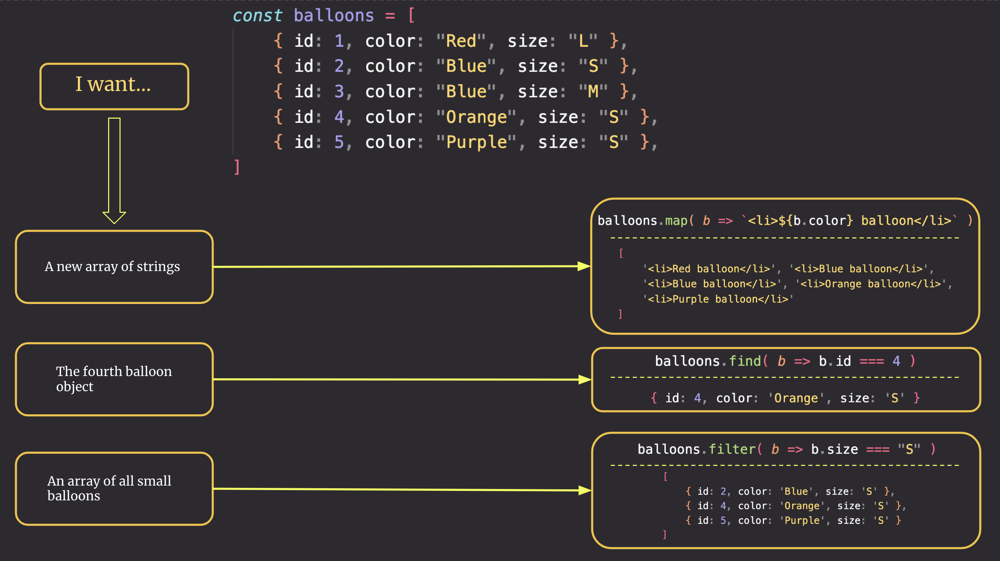

# Self-Assessment

This project will help you assess your ability to apply the JavaScript skills that you practiced in this book.

1. Functions
1. Modules
1. Iteration
1. Objects
1. Arrays
1. Handling browser generated events
1. Generating custom events
1. Handling custom events
1. State management
1. Displaying state as HTML
1. User input with radio options

## Array Methods Refresh



## Application Overview

You will be building an application for a local food truck that offers food that is a fusion of American Southern and Greek cuisines.

A customer should be able to choose a base dish, a vegetable, and a side dish and place their order. Once the order is placed, the total amount for the chosen foods will appear at the bottom.


## Requirements

1. All 10 base dishes should be displayed as radio input options.
1. All 9 vegetables should be displayed as radio input options.
1. All 6 side dishes should be displayed as radio input options.
1. When the user selects an item in any of the three columns, the choice should be stored as state in your database.
1. When a user selects all three options and click the "Purchase Combo" button, a new sales object should be...
    1. Stored as state in the database.
    1. Represented as HTML below the **Monthly Sales** header in the following format **_exactly_**. Your output will not have zeroes, but the actual amount.
        ```html
        Receipt #1 = $00.00
        ```
1. The user's choices should be cleared from the database state once the purchase is made.

## Design

Given the description and animation above...

1. Create an ERD for this application before you begin.
1. Make a list of what modules need to be created to make your application as modular as possible.

Discuss these with your teammates, and then talk to an instructor to review your decisions. Be prepared to defend why you made your choices.

Once an instruction reviews and approves your ERD and ideas about components, an invitation link will be provided to you to start the assessment.

## Setup

Your instruction team will provide a link for you to create your assessment repository. Once your repo is created, clone it to your machine.

1. Make sure you are in your `workspace` directory
1. `git clone {github repo SSH string}`
1. `cd` into the directory it creates
1. `code .` to open the project code
1. Use the `serve` command to start the web server
1. Open the URL provided in Chrome

Make sure your Developer Tools are open at all times while working on this project. Use the messages provided in the Console to determine what code needs to be fixed or implemented, and use breakpoints in the Sources tab to step through your code as you debug.
