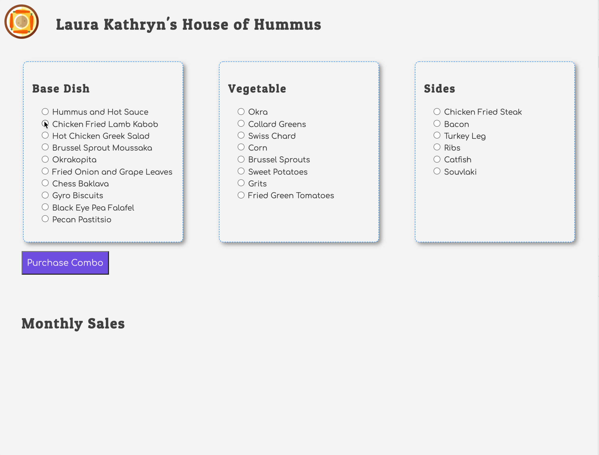

# Events and State Self-Assessment

This project will help you assess your ability to apply the JavaScript skills that you practiced in this book.

1. Generating custom events
2. Handling browser generated, and custom, events
4. State management (transient and permanent)
5. Displaying state as HTML
6. User input with radio options
7. HTTP requests with async/await

## Overview

You will be building an application for a local food truck that offers food that is a fusion of American Southern and Greek cuisines.

A customer should be able to choose a base dish, a vegetable, and a side dish and place their order. Once the order is placed, the total amount for the chosen foods will appear at the bottom.

## Getting Started

Ask a member of your instruction team for a link that will create your assessment repository. Once your repository is created, read the requirements that are provided there.

Once all of your diagrams are complete, and you have a working application, notify them that you are ready for a vocabulary review.
