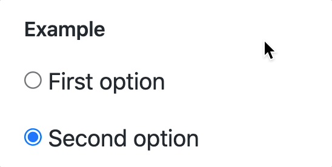
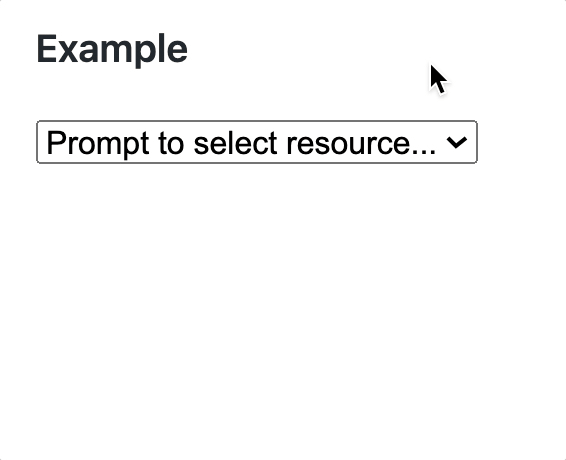

# Display Your Options

To display a group of options, the two most common controls used by designers and developers are:

1. The radio button, which displayed each option an an individual item to be clicked on with a filled-in circle indicating the selected option.
    ```html
    <input type="radio" value="1" name="resource"> First option
    <input type="radio" value="2" name="resource" checked> Second option
    ```

    

1. The dropdown menu using the `<select>` HTML element. Whichever option the user chooses will then be displayed in the select box.
    ```html
    <select id="resource">
        <option value="0">Prompt to select resource...</option>
        <option value="1">First option</option>
        <option value="2">Second option</option>
    </select>
    ```

    

## Getting the Selected Option

To get the option that the user selected, you would access the `.value` property of the `<select>` element, not the individual options.

```js
document.addEventListener(
    "change",
    (changeEvent) => {
        if (changeEvent.target.id === "resource") {
            const chosenOption = changeEvent.target.value
            console.log(chosenOption)  // "1" or "2"
        }
    }
)
```

| | |
|:---:|:---|
| <h1>&#x270e;</h1> |  _Note that you can assign a unique `id` attribute to a `<select>` element, whereas you need to use the `name` attribute when using radio buttons._ |

