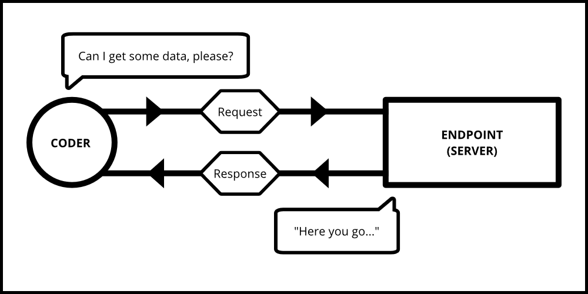
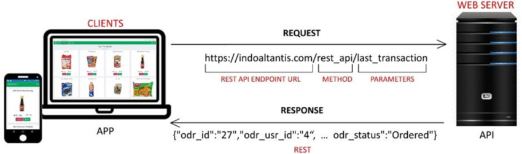

# Fetching Data

Software developers have access to a bountiful world of data that companies, and other developers, make available for them to request and use in their own applications. Up to this point in the course, you've been using your own data contained in a file on your machine.

In this introduction, you are going to request data from someone else's computer somewhere else in the world via the World Wide Web (WWW). The JavaScript language has



## Be Prepared, Beginner

This is one of the most significant cognitive challenges that beginner software developers face. The asynchronous nature of how the web browser handles WWW requests stretches your working memory to capacity. It will take weeks and weeks of practice before you have any chance of truly understanding the mechanism.

You may not gain understanding until your time after NSS and a year or two on the job.

However, you will learn how to write the correct syntax for one, and where you need to make the requests.

## Initial Vocabulary

These are vocabulary terms that you will be encountering here in the coursework, and during your research as you grow your learning efficiency around this concept.

If you are curious to learn more about these terms, please search the Web for more information. Just make sure to use the term _"for beginners"_ in your search.

| Term | Definition |
| --- | --- |
| Fetch | A built-in JavaScript function that performs an HTTP request over the World Wide Web. |
| HTTP | **Hypertext Transfer Protocol** is a set of rules and processes that computers use to send messages to each other over the World Wide Web. |
| JSON | **JavaScript Object Notation** is currently the most popular data format that developers use to transmit data over the World Wide Web. |
| REST | **Representational State Transfer** is a specific kind of architecture that allows for a scalable and efficient system. |
| API | **Application Programming Interface** is a set of defined rules that enable different applications to communicate with each other. |
| REST API | A service available on the World Wide Web that companies and developers maintain to allow other people gain access to data. |


## The Syntax

Here is another visual representation of the request/response cycle between your code and a remote computer via the WWW.



Here is how the code would look for this request.

```js
fetch("https://indoatlantis.com/rest_api/last_transaction")
    .then(response => response.json())
    .then(
        (convertedData) => {
            /*
                Here, and only here, is where you can do something
                with the data that you requested.
            */
        }
    )
```

## The Syntax, a Breakdown


### The Fetch

Defining where on the WWW you want to send the request by passing a URL string to the fetch function.

```js
fetch("https://indoatlantis.com/rest_api/last_transaction")
```

### The Conversion

```js
.then(response => response.json())
```

The first `then()` function waits until the response is received and converts the string

```txt
"{"odr_id": "27", "odr_usr_id": "4", "odr_status": "Ordered"}"
```

into a JavaScript object

```js
{
    "odr_id": "27",
    "odr_usr_id": "4",
    "odr_status": "Ordered"
}
```

### The Action

The second `then()` function needs a discrete function as its only argument. This function will be automatically invoked by JavaScript once the conversion process is complete. The converted data is automatically passed as an argument when it is invoked.

```js
    .then(
        (convertedData) => {
            /*
                Here, and only here, is where you can do something
                with the data that you requested.
            */
        }
    )
```

You will also sometimes see a developer define the action function separately, and pass the reference to the second `then()`.

```js
const handleConvertedData = (convertedData) => {
    /*
        Here, and only here, is where you can do something
        with the data that you requested.
    */
}

fetch("https://indoatlantis.com/rest_api/last_transaction")
    .then(response => response.json())
    .then(handleConvertedData)
```

Now move on to the next chapter to set up the project for writing your first fetch functions.
