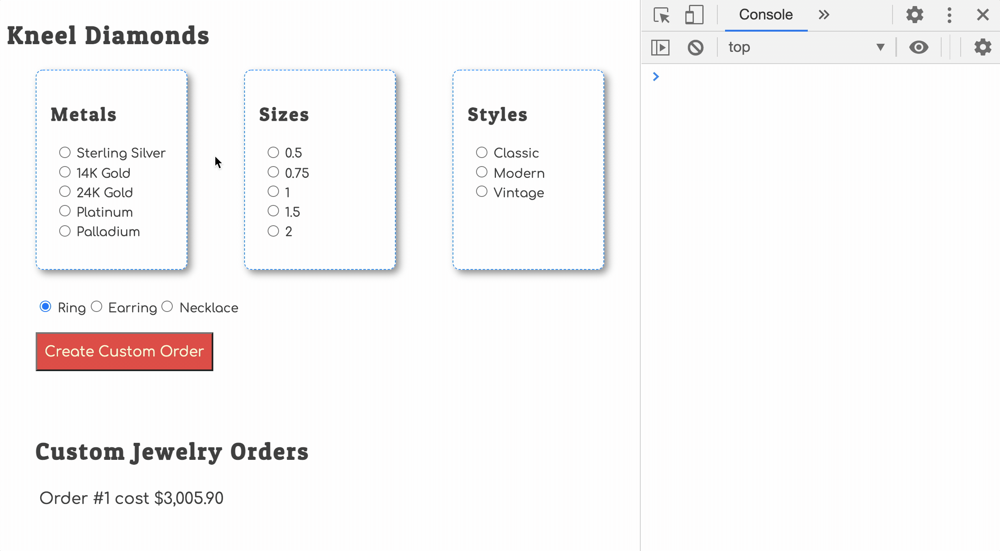

# User Choices as State

You seen the following phrase several times in the chapters of this book.

> When the state of your data changes, your HTML must be regenerated to display that new state to the person using the application.

However, there's one case in your existing application where you are **not** following that design pattern.

When the user chooses a size, styles, or metal, you are updating the value of one of the keys in the `orderBuilder` state in your database. Right now, the HTML is not regenerated when that happens.

Your challenge is to regenerate the HTML every time one of the following functions is invoked in your `database.js` module.

1. `setType()`
1. `setStyle()`
1. `setMetal()`

## Expressing User Choices in HTML

Once you get that working, you run into a problem. Since the HTML is being regenerated every time your choose an option, the user choices are not being retained.

In the animation below, you will see that there are logging messages that the HTML is being regenerated when the state is set, yet the radio buttons that the user selected are not selected.

That means that every time you regenerate the HTML for the radio buttons, you need to determine which one should be checked by default - based on the current state of `orderBuilder`.

Reference: [How to select a radio button by default?](https://stackoverflow.com/questions/5592345/how-to-select-a-radio-button-by-default)

