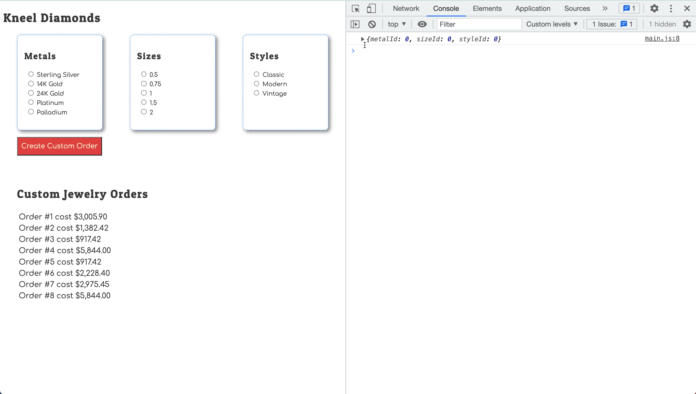

# Storing User Choices

## Learning Objectives

* You should be able to remember that radio button controls generate a _change_ event that you can listen for.
* You should be able to remember that when the user selects a radio input options, that the _value_ of the event target will be the value attribute of the chosen option.
* You should be able to implement an event listener for a group of radio input options.
* You should be able to implement a module that stores the user choices as they are made - the transient state.

## Transient State

Add a new module into your application that will store the transient state as the customers make their choices. Remember that initial state should be established to look exactly like how the data will be stored in your API, but with default values.

* Boolean values should default to `false`
* Integer values should defualt to `0`
* String values should default to an empty string `""`

Then write a setter function to update the value of each property. Make sure you export those functions for use in other modules.

## Change Listeners

Now, you need to listen for when the user makes a choice in one of the option groups. Start with metals.

```js
// The setMetalChoice() function used below is just an example.
// Change it to the name of the setter function you created.
import { setMetalChoice } from "./TransientState.js"

const handleMetalChoice = (event) => {
    // Make sure you change this condition if you named your inputs differently
    if (event.target.name === "metal") {
        setMetalChoice(parseInt(event.target.value))
    }
}
```

And in your component function, listen for the change event and specify the above function as the handler of that event being broadcast by the browser.

```js
 document.addEventListener("change", handleMetalChoice)
 ```

## Log the New State

If you want to make sure that transient state is changing correctly, use a `console.log()` inside the setter functions.


