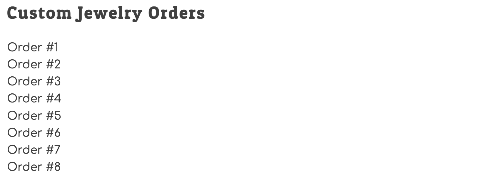

# Diplaying Order

If you haven't yet, create a new module that generates a list of placed orders. Here's a small bit of starter code for you if you want it.

For now, it's fine to just display the primary key of the order. You will display the total price in a future chapter.

```js
export const Orders = async () => {
    const fetchResponse = await fetch("http://localhost:8088/orders")
    const orders = fetchResponse.json()

    let ordersHTML = orders.map(
        (order) => {

        }
    )

    return ordersHTML
}
```



## Custom Events

Now, every time in your application when the permanent state changes in your data store, you will broadcast a custom event that the state has changed. Recall from Indiana Jeans that you can name your custom event whatever you like, but make sure the name reflects what happened.

* "orderSubmitted"
* "stateChanged"
* "newOrderPlaced"

Dispatch a custom event in the `placeOrder()` function once the POST operation is complete so that the main module can listen for it and regenerate the HTML with the new order included.

```js
const customEvent = new CustomEvent("nameYouChose")
document.dispatchEvent(customEvent)
```
## Listening for Custom Events

Now you can put the following code at the bottom of the main module to build all of the HTML now that it knows there is a new submission to render for the user.

```js
document.addEventListener("nameYouChose", event => {
    console.log("State of data has changed. Regenerating HTML...")
    render()
})
```

## Trying it Out

Now make some choices and place a custom order. You should see a new order show up in the browser.


