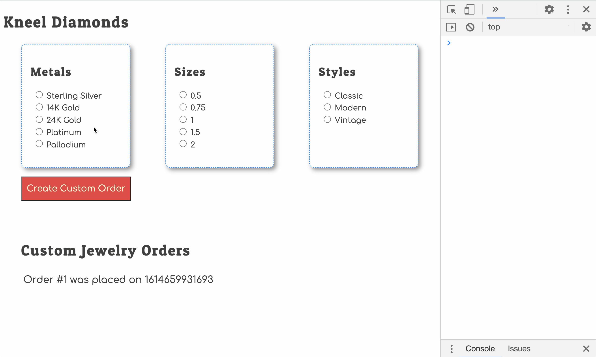

### Custom Events

First, watch this short video about using custom events in JavaScript. It shows a simple demonstration of how you can use custom events to make things happen in your application when you want them to happen instead of only reacting to `click` or `change` events that the browser broadcasts.

Video: [Custom Events in Javascript](https://www.youtube.com/watch?v=b469-2H9Rew)

Now, every time in your application when the permanent state changes in your data store, you will broadcast a notification that the state has changed.

```js
document.dispatchEvent(new CustomEvent("stateChanged"))
```

You can broadcast this message **whenever you want**. Right now, you don't know when that would be, but you'll discover more ways to do this soon.

## Listening for Custom Events

Luckily, reacting to a custom event is just like reacting to a browser generated event like `click` and `change`.  You use an event listener.

When state changes for your application, you need to regenerate the HTML to display the new state to the user.

Which module currently is responsible for starting the process of generating HTML? That's right, it's `main.js`.

That means that the main module should listen for the `stateChanged` event. When it is dispatched by the database module, the main module will generate all the HTML again and display it.

Put the following code at the bottom of the main module.

> #### `kneel-diamonds/scripts/main.js`

```js
document.addEventListener("stateChanged", event => {
    console.log("State of data has changed. Regenerating HTML...")
    renderAllHTML()
})
```

## Custom Order Button Click

1. Open the `KneelDiamonds` module.
1. At the top you will see a blank click event listener.
1. Implement the correct code to check if the order button was clicked.
1. Invoke the `addCustomOrder` function when it is clicked.

## Trying it Out

Now make some choices and place a custom order. You should see a new order show up in the browser.



## Recap

* You implemented a new event listener for the browser-generated `click` event on the order button.
* You wrote a new function in the database module that is responsible for changing permanent state.
* Since it changed permanent state, it dispatched a custom event.
* You implemented a new event listener in the main module for the custom `stateChanged` event.
* That event listener invokes the `renderAllHTML()` function to regenerate the HTML so that new state is displayed to the user.