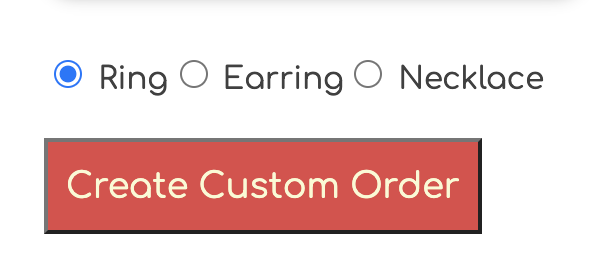
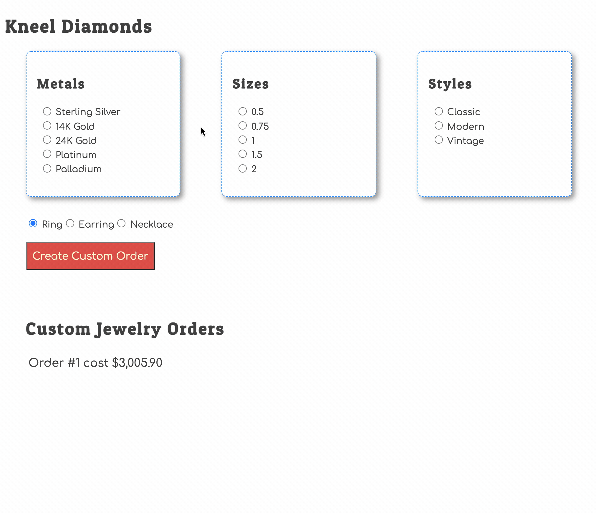

# Custom Earring and Necklace Orders

| | |
|:---:|:---|
| <h1>&#x1F4A1;</h1> |  _There are multiple ways to implement this feature. You will be stretching your **Creative Thinking** Core Skill because there is no "right way" to do this._ |

## Add Ability to Choose Type

Add a radio button group above the order button that allows the user to choose a ring, earrings, or a necklace to be made with the materials chosen.

## Pricing of Types

* If the user chooses a ring, the default prices in the database will be used to show the cost.
* If the user chooses earrings, the price will be 2x the default prices.
* If the user chooses earrings, the price will be 4x the default prices.

## Animation of Implementation

