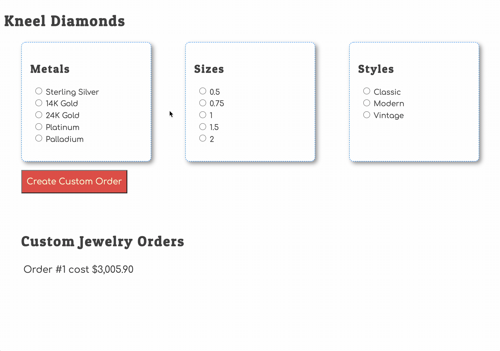

# Finding the Prices for an Order

## Learning Objectives

* You should be able to explain the purpose of the `find()` array method.
* You should be able to define the return value for `find()` if a match is found.
* You should be able to define the return value for `find()` if a match is not found.
* You should be able to understand that an entire function is being passed as the single argument to `find()`.
* You should be able to recite that the function passed to `find()` will be executed for each item in the array.

## Learning Resources

* [find Array Method | JavaScript Tutorial](https://www.youtube.com/watch?v=8SkHWeDoTf0)
* [How to use JavaScript array find method](https://www.youtube.com/watch?v=DgROCYkg-lU)
* [How to Format Currency in ES6](https://www.samanthaming.com/tidbits/30-how-to-format-currency-in-es6/)

## Showing Prices on Custom Orders

You are currently showing a simple message for each order that includes its primary key and timestamp. Time to update it and replace the timestamp with the total cost of the order - a much more valuable piece if information to the person placing the order.

> #### `kneel-diamonds/scripts/Orders.js`

```js
const buildOrderListItem = (order) => {
    const metals = getMetals()
    const sizes = getSizes()
    const styles = getStyles()

    // Find the metal and get its price
    const matchingMetal = metals.find(
        (metal) => {
            return metal.id === order.metalId
        }
    )
    const metalPrice = matchingMetal.price

    // Find the size and get its price
    const matchingSize = sizes.find(
        (size) => {
            return size.id === order.sizeId
        }
    )
    const sizePrice = matchingSize.price

    // Find the style and get its price
    const matchingStyle = styles.find(
        (style) => {
            return style.id === order.styleId
        }
    )
    const stylePrice = matchingStyle.price

    // Add all the prices together
    const totalCost = metalPrice + stylePrice + sizePrice

    return `<li>
        Order #${order.id} cost ${totalCost.toLocaleString("en-US", {
            style: "currency",
            currency: "USD"
        })}
    </li>`
}
```

Once you have that in place, refresh your application in the browser and you will see the prices appear for each order.



## Debugging to Understand

Place a breakpoint on the following line of code.

```js
return metal.id === order.metalId
```

Then refresh your browser again and step through the logic. You will note that the breakpoint is hit 5 different times, because that's how many metals are in that state array.

Make sure you inspect the `id` property on the metal, and the `metalId` property on the order each time to see the values.
