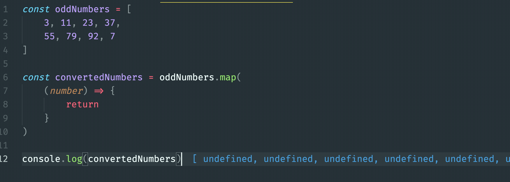
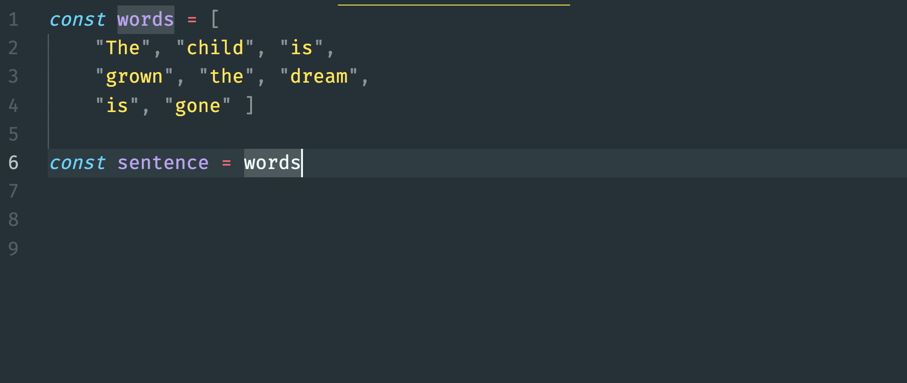

# Showing Custom Jewelry Options

If you hadn't noticed yet, the `main.js` module looks a bit different than it has in previous projects. It doesn't define the main HTML structure of your application. It is deferring _that_ responsibility to the **`KneelDiamonds`** component.

There is a function named `renderAllHTML()` that is defined in the `main.js` module, then immediately invoked. This function is needed later in the growth of the application, because for Kneel Diamonds, you are going to react to the user choosing options.

When the user chooses options, the state of your data is going to change. When the state of your data changes, then all of the HTML must be regenerated to display that new state.

More on that later. Just setting the stage now.

## Render the Metal Options

Your first step is to import and render the **`Metals`** component in the HTML structure defined in the **`KneelDiamonds`** component.

Give it a shot, and if you need to, you can [peek at the solution](./images/kneel-diamonds-show-metals.gif).

## Render Sizes and Styles

Once you show metals, also render the components that show the options for diamond sizes and jewelry styles.

## The Map Array Method

| | |
|:---:|:---|
| <h1>&#x270e;</h1> |  _The **map()** array method is a conversion tool. It generates a new array with as many items as are in the original array, but in the new array, it puts items in the form that you specify._ |

Open the **`Metals`** module and the **`DiamondSizes`** module. You will see that the list items for metals uses the `for..of` loop that you have seen in several previous projects for building all of the HTML representations of data.

The diamond sizes are generated in a way that is both completely different, and exactly the same.

```js
const listItemsArray = sizes.map(
    (size) => {
        return `<li>
            <input type="radio" name="size" value="${size.id}" /> ${size.carets}
        </li>`
    }
)
html += listItemsArray.join("")
```

The `.map()` method also iterates the array, just like `for..of` does. Unlike a `for..of` loop, it invokes the function that you define.

Wait, what function?

This function.

```js
(size) => {
    return `<li>
        <input type="radio" name="size" value="${size.id}" /> ${size.carets}
    </li>`
}
```

That function is the first, and only, argument that the `.map()` method will accept. As it iterates the array, it will take the object at the current location and pass it as an argument to **your** function. Your function defines the `size` parameter.

So an _object_ comes into your function, and a _string_ gets returned. That string goes into a new _array_.

### Original Array

```js
[
    { id: 1, carets: 0.5, price: 405 },
    { id: 2, carets: 0.75, price: 782 },
    { id: 3, carets: 1, price: 1470 },
    { id: 4, carets: 1.5, price: 1997 },
    { id: 5, carets: 2, price: 3638 }
]
```

### Array that Map() Generates

```js
[
   "<li> <input type="radio" name="size" value="1" /> 0.5 </li>",
   "<li> <input type="radio" name="size" value="2" /> 0.75 </li>",
   "<li> <input type="radio" name="size" value="3" /> 1 </li>",
   "<li> <input type="radio" name="size" value="4" /> 1.5 </li>",
   "<li> <input type="radio" name="size" value="5" /> 2 </li>"
]
```

Here's a quick example. An array filled with numbers. Observe how changes made to what the function returns affects the resulting array _(in blue at the end)_.



## The Join() Array Method

The `.join()` array method, luckily, does exactly what its name infers - it _joins_ things together.

More specifically, it join **all** of the individual items in the array into a single string... all squished together.



If you join the strings in this array...

```js
[
   "<li> <input type="radio" name="size" value="1" /> 0.5 </li>",
   "<li> <input type="radio" name="size" value="2" /> 0.75 </li>",
   "<li> <input type="radio" name="size" value="3" /> 1 </li>",
   "<li> <input type="radio" name="size" value="4" /> 1.5 </li>",
   "<li> <input type="radio" name="size" value="5" /> 2 </li>"
]
```

...you end up with one long string filled with HTML.

```html
"<li> <input type="radio" name="size" value="1" /> 0.5 </li>
<li> <input type="radio" name="size" value="2" /> 0.75 </li>
<li> <input type="radio" name="size" value="3" /> 1 </li>
<li> <input type="radio" name="size" value="4" /> 1.5 </li>
<li> <input type="radio" name="size" value="5" /> 2 </li>"
```

## Generate Jewelry Styles Options

Now it's your turn. Use the `.map()` array method in the **`JewelryStyles`** component function to generate one long string of HTML that contains the `<li>` elements for the options.