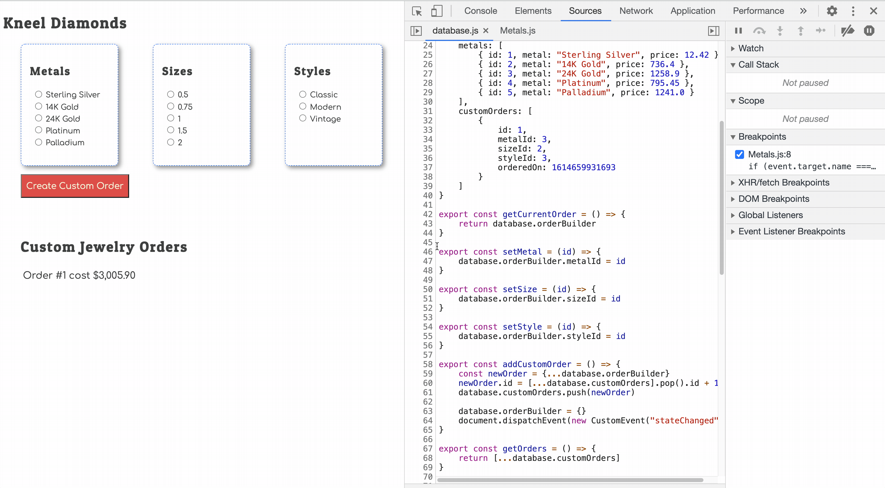

# Saving All State

Using the code examples from the previous chapter that shows how to store the chosen metal as state in the database, update the code in the **`DiamondSizes`** and **`JewelryStyles`** components to do the same.

When the user has chosen all three types of options, the `orderBuilder` state object should have three properties on it.

Here's an example.

```js
{
    metalId: 2,
    styleId: 3,
    sizeId: 1
}
```

Use your debugging skills to watch the state build up every time the user chooses an option.


