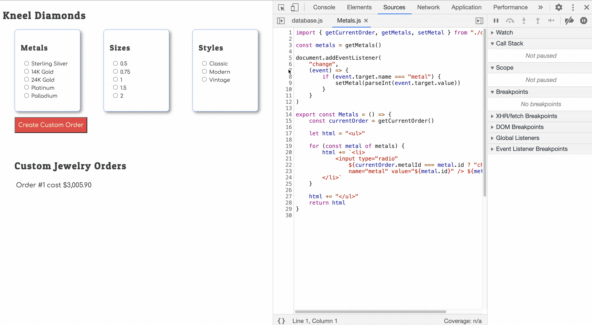

# Modifying State

## Learning Objectives

* You should be able to recite the definition of _state_ as it pertains to web applications.
* You should be able to identify the component whose responsiblity it is to change application state.
* You should be able to understand that functions should be used to change application state.

## Tracking User Choices as State

When a person is providing input in your application, you need to store that input - keep track of it. In this application, when the user chooses one of the radio buttons, they are changing the state of the application.

You need a place to store that state. State is always stored in your database, or data store, for your application. Time to add a new key to your `database` object to keep track of the style, size, and metal that the user clicks on with their mouse.

You can call this new state whatever you like. Here's a suggestion.

> #### `kneel-diamonds/scripts/database.js`

```js
const database = {
    orderBuilder: {},
```

| | |
|:---:|:---|
| <h1>&#x2753;</h1> |  _Can you explain why this state has to be stored as an object, and not an array, string, or number?_ |

## Responsbility of Changing State

Now that you have a new state key in your database, you need a way to store user choices. What are the choices the user is making as she uses the application?

1. Metal
1. Size
1. Style

Our new `orderBuilder` state object will store which one of those options was chosen.

#### What uniquely identifies each object in a database?

> _That's right! The primary key, or `id` property._

Also remember that no other modules are allowed to have direct access to the database. That's why you have exported functions that return _copies_ of the current state. Other modules invoke _those_ function to **get** state.

Now you need to export functions whose responsibility is to **set** state.

> #### `kneel-diamonds/scripts/database.js`

```js
export const setMetal = (id) => {
    database.orderBuilder.metalId = id
}

export const setSize = (id) => {
    database.orderBuilder.sizeId = id
}

export const setStyle = (id) => {
    database.orderBuilder.styleId = id
}
```

## Setting State

Instead of showing an alert when a metal is chosen, you now need to set the corresponding property of the order builder object in application state.

Make sure you update your `import` statement to get the `setMetal()` function.

> #### `kneel-diamonds/scripts/Metals.js`

```js
import { getMetals, setMetal } from "./database.js"

document.addEventListener(
    "change",
    (event) => {
        if (event.target.name === "metal") {
            setMetal(parseInt(event.target.value))
        }
    }
)
```

Use your debugging skills to see how this code works.

1. Put a breakpoint on the line of code with the `if` statement
1. Click on one of the metals
1. Inspect the value of `event.target`
1. Inspect the value of `event.target.name`
1. Inspect the value of `event.target.value`
1. Then, _step into_ the `setMetal()` function and inspect that value of the _parameter_
1. Inspect the value of `database.orderBuilder` after its state is updated


