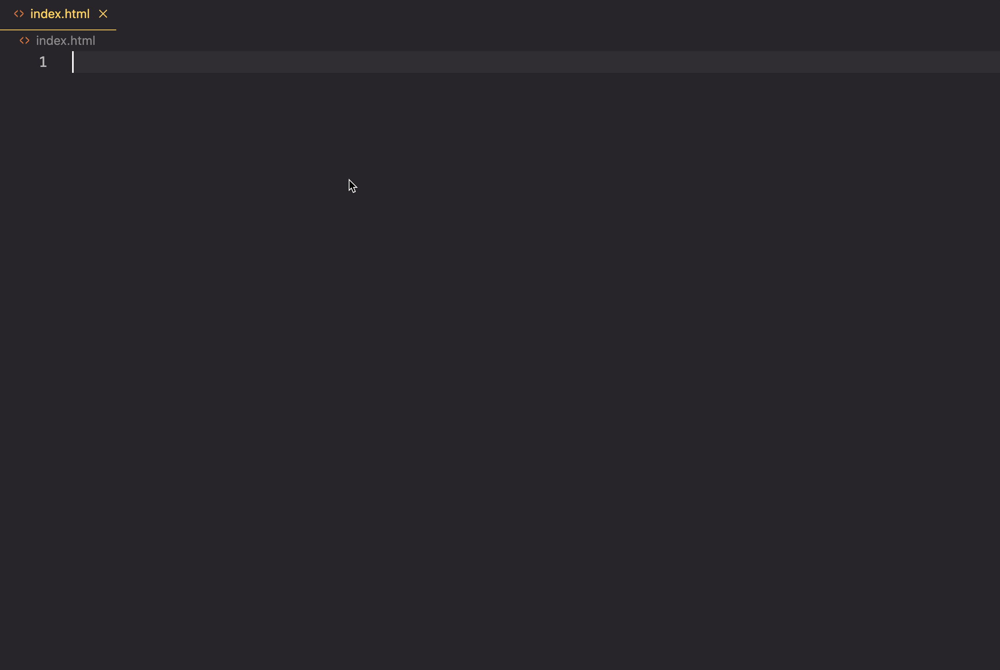

# Kneel Diamonds Project Setup

## Project Directories

Create the following directory for your project.

```sh
~/workspace/kneel-diamonds
```

Then create three sub-directories in that directory.

* api
* styles
* scripts

Then create the starter files.

```sh
touch index.html
touch api/database.json
touch styles/main.css
touch scripts/main.js
```

Once done, open the `kneel-diamonds` directory in Visual Studio Code.

## HTML

Open your `index.html` file in the main project directory and then use a cool shortcut in VS Code to start with a basic HTML structure.

The `!` character.

Then you can use the `link` Intellisense helper to include your `main.css` file.



## JSON Database

Time to create your database file that will be managed by the `json-server` application that you run in your terminal. In the first chapter, you had seen how to define the data that is needed for this application. Time to put it in your database.

Open the `api/database.json` file and add the following data.

```json
{
    "styles": [
        { "id": 1, "style": "Classic", "price": 500 },
        { "id": 2, "style": "Modern", "price": 710 },
        { "id": 3, "style": "Vintage", "price": 965 }
    ],
    "sizes": [
        { "id": 1, "carets": 0.5, "price": 405 },
        { "id": 2, "carets": 0.75, "price": 782 },
        { "id": 3, "carets": 1, "price": 1470 },
        { "id": 4, "carets": 1.5, "price": 1997 },
        { "id": 5, "carets": 2, "price": 3638 }
    ],
    "metals": [
        { "id": 1, "metal": "Sterling Silver", "price": 12.42 },
        { "id": 2, "metal": "14K Gold", "price": 736.4 },
        { "id": 3, "metal": "24K Gold", "price": 1258.9 },
        { "id": 4, "metal": "Platinum", "price": 795.45 },
        { "id": 5, "metal": "Palladium", "price": 1241.0 }
    ],
    "orders": []
}
```
