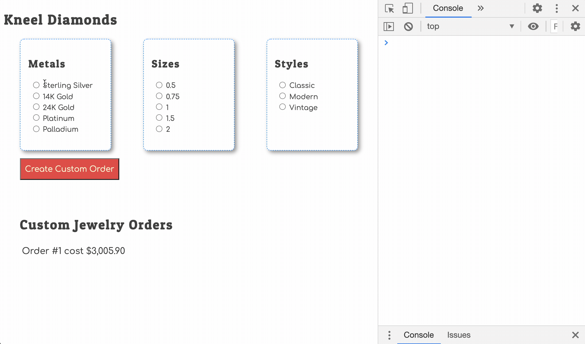

# Defining Your Own Events

In the last two chapters, you implemented code that updated the state of your database by storing options that a person chooses. It's temporary state, in that the user can keep making choices over and over again, and the state of the chosen metal, style, and size will constantly change.

Now it's time to handle making a permanent change to state. You are going to implement the click hander for the purchase button.

It will modify permanent state. When state changes for your application, you need to regenerate the HTML to display the new state to the user.

## Storing a Custom Order

When the user clicks on the `Create Custom Order` button in the application, you need to store their choices permanently. This is where the `customOrder` state comes into play. You will be adding objects to that state array.

Since that's a new task that the application needs to perform, you need a function. The function's sole reponsiblity will be to take the temporary choices currently being stored in the `orderBuilder` state object and make them permanent.

> #### `kneel-diamonds/scripts/database.js`

```js
export const addCustomOrder = () => {
    // Copy the current state of user choices
    const newOrder = {...database.orderBuilder}

    // Add a new primary key to the object
    const lastIndex = database.customOrders.length - 1
    newOrder.id = database.customOrders[lastIndex].id + 1

    // Add a timestamp to the order
    newOrder.timestamp = Date.now()

    // Add the new order object to custom orders state
    database.customOrders.push(newOrder)

    // Reset the temporary state for user choices
    database.orderBuilder = {}

    // Broadcast a notification that permanent state has changed
    document.dispatchEvent(new CustomEvent("stateChanged"))
}
```

### Custom Events

First, watch this short video about using custom events in JavaScript. It shows a simple demonstration of how you can use custom events to make things happen in your application when you want them to happen instead of only reacting to `click` or `change` events that the browser broadcasts.

Video: [Custom Events in Javascript](https://www.youtube.com/watch?v=b469-2H9Rew)

Now, every time in your application when the permanent state changes in your data store, you will broadcast a notification that the state has changed.

```js
document.dispatchEvent(new CustomEvent("stateChanged"))
```

You can broadcast this message **whenever you want**. Right now, you don't know when that would be, but you'll discover more ways to do this soon.

## Listening for Custom Events

Luckily, reacting to a custom event is just like reacting to a browser generated event like `click` and `change`.  You use an event listener.

When state changes for your application, you need to regenerate the HTML to display the new state to the user.

Which module currently is responsible for starting the process of generating HTML? That's right, it's `main.js`.

That means that the main module should listen for the `stateChanged` event. When it is dispatched by the database module, the main module will generate all the HTML again and display it.

Put the following code at the bottom of the main module.

> #### `kneel-diamonds/scripts/main.js`

```js
document.addEventListener("stateChanged", event => {
    console.log("State of data has changed. Regenerating HTML...")
    renderAllHTML()
})
```

Now make some choices and place a custom order. You should see a new order show up in the browser.



## Recap

* You implemented a new event listener for the browser-generated `click` event on the order button.
* You wrote a new function in the database module that is responsible for changing permanent state.
* Since it changed permanent state, it dispatched a custom event.
* You implemented a new event listener in the main module for the custom `stateChanged` event.
* That event listener invokes the `renderAllHTML()` function to regenerate the HTML so that new state is displayed to the user.