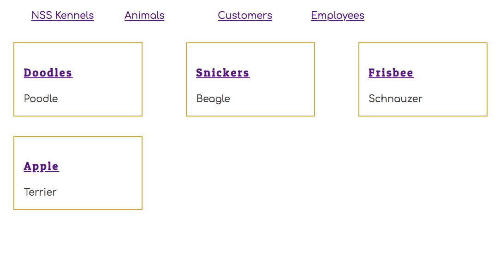

# Individual Items with Dynamic Routing

In this chapter, you will be learning how to render individual resources. So far you are listing all employees, all animals, all customers, and all locations. By the end of the chapter, you will be able to click on one of the cards in the list view and only view the details of a specific item.

You are going to start with animals.

## Refactor Animal Card

### Display Minimal Data

Remove the location name and customer name from being displayed in the **`Animal`** component. You are going to author a new component to display those details. You want the cards in your list view to contain only the information the user needs to find the animal she is looking for. Make sure that you remove the `location` and `customer` keys from your argument list.

Then, you will make the name of the Animal a hyperlink. When the user clicks on the link, a view of that individual animal will be presented with all of the details. Use the `<Link>` component provided by React.

The link component's `to` attribute must include a route parameter.

* To view all animals, you go to the `/animals` route.
* To view the animal with an id of 3, you go to the `/animals/3` route.

```js
import React from "react"
import "./Animals.css"
import { Link } from "react-router-dom"

export const Animal = ({ animal }) => (
    <section className="animal">
        <h3 className="animal__name">
            <Link to={`/animals/${animal.id}`}>
                { animal.name }
            </Link>
        </h3>
        <div className="animal__breed">{ animal.breed }</div>
    </section>
)
```



## Refactor Animal List

Since the specific details of an animals are no longer being displayed in the list view, you can remove the import of the customer and location data.

> ##### `/src/components/animal/AnimalList.js`

```js
// Remove these
import { LocationContext } from "../location/LocationProvider"
import { CustomerContext } from "../customer/CustomerProvider"
```

Then remove the context hooks to get the data arrays.

> ##### `/src/components/animal/AnimalList.js`

```js
// Remove these
const { locations } = useContext(LocationContext)
const { customers } = useContext(CustomerContext)
```

Remove the code that joined the data.

> ##### `/src/components/animal/AnimalList.js`

```js
// Remove these
const owner = customers.find(c => c.id === animal.customerId)
const clinic = locations.find(l => l.id === animal.locationId)
```

And remove the properties that you were sending to the **`Animal`** component. It should look like this now.

> ##### `/src/components/animal/AnimalList.js`

```js
animals.map(animal => {
    return <Animal key={animal.id} animal={animal} />
})
```

## New Animal Details Component

Create a new component in the animal directory which will be responsible for showing all the details of the animal.

> ##### `/src/components/animal/AnimalDetail.js`

```js
import React, { useContext } from "react"
import { CustomerContext } from "../customer/CustomerProvider"
import { LocationContext } from "../location/LocationProvider"
import { AnimalContext } from "./AnimalProvider"
import "./Animals.css"

export const AnimalDetail = (props) => {

    // Context providers needed for the data to be displayed
    const { animals, getAnimals } = useContext(AnimalContext)
    const { locations, getLocations } = useContext(LocationContext)
    const { customers, getCustomers } = useContext(CustomerContext)


    // Component state variables
    const [ animal, setAnimal ] = useState({})
    const [ customer, setCustomer ] = useState({})
    const [ location, setLocation ] = useState({})
    const [ animalId, setId ] = useState({})

    // Effects hooks to run after state changes
    useEffect(() => {
        const animal = animals.find(a => a.id === chosenAnimalId) || {}
        setAnimal(animal)
    }, [animals])

    useEffect(() => {
        const location = locations.find(l => l.id === animal.locationId) || {}
        setLocation(location)
    }, [locations])

    useEffect(() => {
        const customer = customers.find(c => c.id === animal.customerId) || {}
        setCustomer(customer)
    }, [customers])

    useEffect(() => {
        console.log("AnimalDetail: animalId from URL detected")
        const chosenAnimalId = parseInt(props.match.params.animalId)
        setId(chosenAnimalId)

        getAnimals()
        getCustomers()
        getLocations()
    }, [props.match.params.animalId])


    return (
        <section className="animal">
            <h3 className="animal__name">{ animal.name }</h3>
            <div className="animal__breed">{ animal.breed }</div>
            <div className="animal__location">Location: { location.name }</div>
            <div className="animal__owner">Customer: { customer.name }</div>
        </section>
    )

}
```

## Create a New Dynamic Route

A dynamic route component is one that matches a pattern, instead of a static route.

> ##### `/src/components/ApplicationViews.js`

```js
<Route path="/animals/:animalId(\d+)" render={
    props => <AnimalDetails {...props} />
} />
```

This route will match any of the following URIs in the browser.

* `http://localhost:3000/animals/1`
* `http://localhost:3000/animals/42`
* `http://localhost:3000/animals/8`
* `http://localhost:3000/animals/70021`
* `http://localhost:3000/animals/319`

Notice the `:animalId` in the `path` attribute? What that does is capture the 1, 42, 8, 70021, 319, or **whatever number** is at the end of the route. The **`AnimalDetails`** component is the child component of this route, so by using this technique, that component now can access the number with the following property.

```js
const chosenAnimalId = props.match.params.animalId
```

## Try it Out

Now when you click on an animal's name in the list view, you should see your new animal detail view.


## Practice: Locations

Your next task is to refactor your location components. On your location list, display the location name, the number of animals currently being treated, and the number of employees.

When you click the name of a location, you should be taken to a detail view that lists the names of all animals currently being treated, and the names of all employees working there.

> **Tip:** You don't need all of the fancy styling like you see below. Just get the information displayed.

