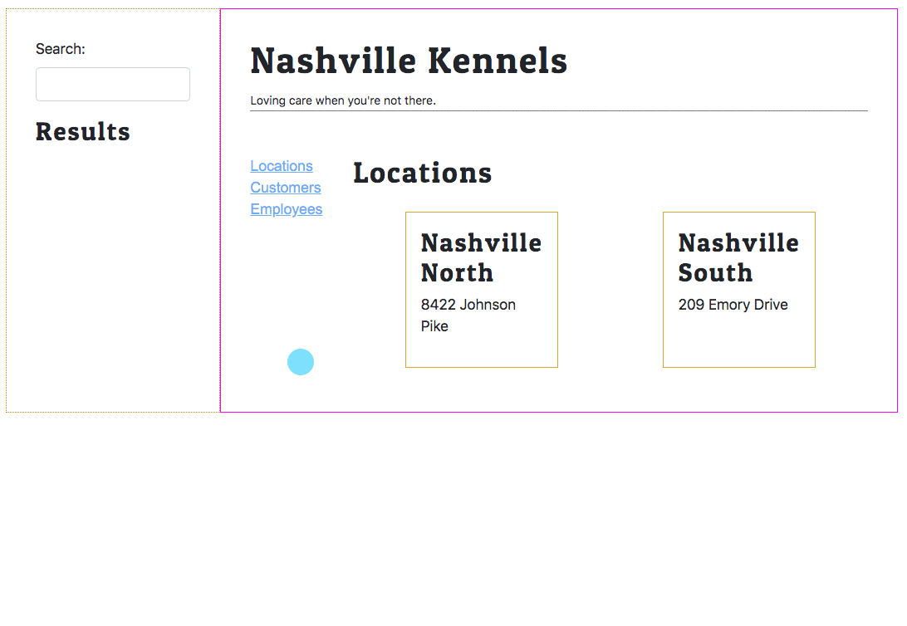

# Viewing One List at a Time

Up until this point in the application, all lists are displayed at the same time. In the previous two chapters, we eliminated the animal list by implementing the search, but the goal of this chapter is that only locations, customers, or employees will be displayed at a time in the main content area.



## Update Dashboard

##### **`src/components/Dashboard.js`**

```js
import React, { useState, useEffect } from "react"
import { LocationProvider } from "./location/LocationProvider"
import LocationList from "./location/LocationList"
import { EmployeeProvider } from "./employee/EmployeeProvider"
import EmployeeList from "./employee/EmployeeList"
import { AnimalProvider } from "./animal/AnimalProvider"
import { CustomerProvider } from "./customer/CustomerProvider"
import CustomerList from "./customer/CustomerList"
import { SearchBar } from "./search/SearchBar"
import { SearchResults } from "./search/SearchResults"
import "./Layout.css"

export default () => {
    const [searchTerms, setTerms] = useState(null)
    const [activeList, setActiveList] = useState("locations")
    const [components, setComponents] = useState()

    const showLocations = () => (
        <LocationProvider>
            <LocationList />
        </LocationProvider>
    )

    const showCustomers = () => (
        <CustomerProvider>
            <CustomerList />
        </CustomerProvider>
    )

    const showEmployees = () => (
        <EmployeeProvider>
            <LocationProvider>
                <EmployeeList />
            </LocationProvider>
        </EmployeeProvider>
    )

    /*
        This effect hook determines which list is shown
        based on the state of the `activeList` variable.
    */
    useEffect(() => {
        if (activeList === "customers") {
            setComponents(showCustomers)
        }
        else if (activeList === "locations") {
            setComponents(showLocations)
        }
        else if (activeList === "employees") {
            setComponents(showEmployees)
        }
    }, [activeList])

    return (
        <div className="mainContainer">
            <div className="searchContainer">
                <AnimalProvider>
                    <CustomerProvider>
                        <LocationProvider>
                            <SearchBar setTerms={setTerms} />
                            <SearchResults searchTerms={searchTerms} />
                        </LocationProvider>
                    </CustomerProvider>
                </AnimalProvider>
            </div>
            <div className="dataContainer">
                <h1>Nashville Kennels</h1>
                <small>Loving care when you're not there.</small>
                <div className="listContainer">
                    <div className="links">
                        <div className="fakeLink href" onClick={() => setActiveList("locations")}>Locations</div>
                        <div className="fakeLink href" onClick={() => setActiveList("customers")}>Customers</div>
                        <div className="fakeLink href" onClick={() => setActiveList("employees")}>Employees</div>
                    </div>
                    <div className="listDisplay">
                        {components}
                    </div>
                </div>

            </div>
        </div>
    )
}
```

## Update Layout CSS

Add the following new CSS to your `Layout.css` stylesheet. This puts the list of links and the main display area side-by-side.

##### **`src/components/Layout.css`**


```css
.listContainer {
    padding-top: 3rem;
    border-top: 1px solid gray;
    display: flex;
    flex-direction: row;
}

.links {
    flex: 1;
}

.listDisplay {
    flex: 5;
}
```