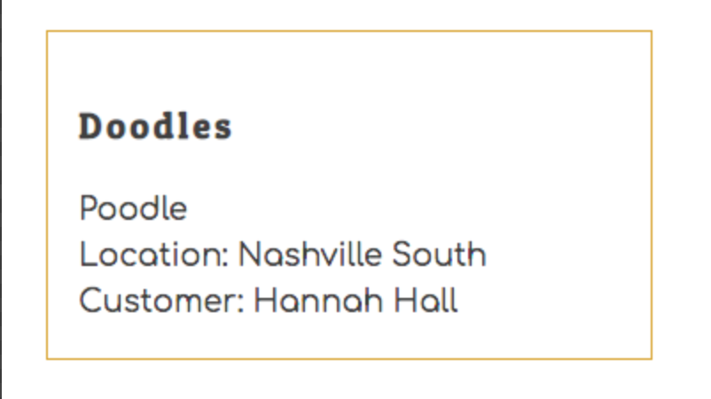

# Joining Data in Multiple Resources

Right now, the data being displayed for animals is not useful. For both the location, and the customer who owns the animal, all you are displaying is the primary key of those objects.


You really want to display the name of the location, and the name of the customer. To do that, you need data from the animal provider, the location provider, and the customer provider. The first step to making it work is updating **`ApplicationViews`** so that the **`AnimalList`** component has all three providers as parent components.

> ##### `src/components/ApplicationViews.js`

```jsx
<AnimalProvider>
    <LocationProvider>
        <CustomerProvider>
            <Route exact path="/animals">
                <AnimalList />
            </Route>
        </CustomerProvider>
    </LocationProvider>
</AnimalProvider>
```

Now the **`AnimalList`** component can access data from all three data providers in order to access the name property on both the customer and the location.

## Importing Multiple Contexts

The next step is to access the context from the two, new providers by importing the context, and then using the Context hook to get the `locations` array and the `customers` array.

> ##### `src/components/animal/AnimalList.js`

```js
import React, { useContext } from "react"
import { AnimalContext } from "./AnimalProvider"
import { LocationContext } from "../location/LocationProvider"
import { CustomerContext } from "../customer/CustomerProvider"
import { Animal } from "./Animal"
import "./Animals.css"

export default () => {
    const { animals } = useContext(AnimalContext)
    const { locations } = useContext(LocationContext)
    const { customers } = useContext(CustomerContext)

    return (
        <div className="animals">
            {animals.map(animal => <Animal key={animal.id} animal={animal} />)}
        </div>
    )
}
```

## Getting Owner and Clinic

Then you need to refactor your function that you are passing to the `.map()` method on the animals array. Use the `.find()` method on both the customers array and the locations array to find the object representation that each foreign key is referencing.

> ##### `src/components/animal/AnimalList.js`

```js
animals.map(animal => {
    const owner = customers.find(c => c.id === animal.customerId)
    const clinic = locations.find(l => l.id === animal.locationId)

    return <Animal key={animal.id}
                location={clinic}
                customer={owner}
                animal={animal} />
})
```

## Display Full Names

The last step is to extract the new `customer` and `animal` keys on the object passed to the **`Animal`** component.

> ##### `src/components/animal/Animal.js`

```js
export const Animal = ({ animal, customer, location }) => (
```

Then display the name property of each one.

```jsx
<div className="animal__location">Location: { location.name }</div>
<div className="animal__owner">Customer: { customer.name }</div>
```

