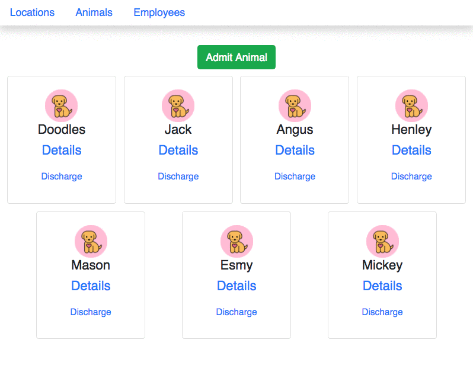

# Adding Animals with Forms in React

In this chapter, you are going to learn how to use use a form to express the state of a component, and then use a function to add the animal to the API and redirect to the full animal list.

**_Quick Note_:** All of the code you will see from here to the end of this chapter needs to be in place before the feature will work.

## Route for Showing Animal Form

First, update your routes in ApplicationViews with a new route for the form.

Remember, you'll also have to `import` the new AnimalForm component once it's created

```jsx
import { AnimalForm } from './animal/AnimalForm'
```

```jsx
// Our shiny new route.
<Route path="/animals/create">
  <AnimalForm />
</Route>
```

Update the **`AnimalsList`** to `useHistory`. Be sure to import it from `react-router-dom`.
```jsx
const history = useHistory();

```


## Add a button for Admitting a New Animal

Update **`<AnimalList>`** with a button that uses the `history.push()` to change the URL of the browser.

**NOTE** You will need to wrap the return in a React.Fragment. Remember, only one element can be returned.

> AnimalList.js

```js
//add this button above your display of animal cards
<section className="section-content">
  <button type="button"
      className="btn"
      onClick={() => {history.push("/animals/create")}}>
      Admit Animal
  </button>
</section>
```


## AnimalManager Method for POSTing Animal

Refactor your **`AnimalManager`** module with a `post` method that implements a `fetch()` for adding a new animal object to your API.

```js
export const addAnimal = (newAnimal) => {
    return fetch(`${remoteURL}/animals`, {
        method: "POST",
        headers: {
            "Content-Type": "application/json"
        },
        body: JSON.stringify(newAnimal)
    }).then(response => response.json())
}
```


## AnimalForm Component

Now it's time to make the **`<AnimalForm>`** component.

**Note** we are going to include a method `handleFieldChange()` that will update state every time the user types a character into any field. This is made possible by having **each input field's `id` property named exactly as each state property**.

Our component's inputs will render based on what is in state. Ultimately, we will collect what is in state and pass it to the `post` method. This allows the UI and state to stay in sync.

The input fields will have corresponding id's:

1. `<input id="name" ... />`
1. `<input id="breed" ... />`
1. `<select id="locationId" ... />`
1. `<select id="customerId" ... />`

We will also incorporate `isLoading` (Dynamic Routing Part 2) so a user cannot select the button multiple times.

> components/animal/AnimalForm.js

```js
import React, { useState, useEffect } from 'react';
import { useHistory } from 'react-router';
import { addAnimal } from '../../modules/AnimalManager';
import './AnimalForm.css'

export const AnimalForm = () => {
	// State will contain both animal data as well as an isLoading flag.
	// Define the initial state of the form inputs with useState()

	const [animal, setAnimal] = useState({
		name: "",
		breed: "",
		locationId: 0,
		customerId: 0
	});

	const [isLoading, setIsLoading] = useState(false);

	// you will need the the `getAll` in the LocationsManager and CustomersManager to complete this section
	const [locations, setLocations] = useState([]);
	const [customers, setCustomers] = useState([]);

	const history = useHistory();

	//when a field changes, update state. The return will re-render and display based on the values in state
	// NOTE! What's happening in this function can be very difficult to grasp. Read it over many times and ask a lot questions about it.
	//Controlled component

	const handleControlledInputChange = (event) => {
		/* When changing a state object or array,
		always create a copy, make changes, and then set state.*/
		const newAnimal = { ...animal }
		let selectedVal = event.target.value
		// forms always provide values as strings. But we want to save the ids as numbers.
		if (event.target.id.includes("Id")) {
			selectedVal = parseInt(selectedVal)
		}
		/* Animal is an object with properties.
		Set the property to the new value
		using object bracket notation. */
		newAnimal[event.target.id] = selectedVal
		// update state
		setAnimal(newAnimal)
	}

    useEffect(() => {
		//load location data and setState
	}, []);

     useEffect(() => {
		//load customer data and setState
	}, []);


	const handleClickSaveAnimal = (event) => {
		event.preventDefault() //Prevents the browser from submitting the form

		const locationId = animal.locationId
		const customerId = animal.customerId

		if (locationId === 0 || customerId === 0) {
			window.alert("Please select a location and a customer")
		} else {
			//invoke addAnimal passing animal as an argument.
			//once complete, change the url and display the animal list
			addAnimal(animal)
				.then(() => history.push("/animals"))
		}
	}

	return (
		<form className="animalForm">
			<h2 className="animalForm__title">New Animal</h2>
			<fieldset>
				<div className="form-group">
					<label htmlFor="name">Animal name:</label>
					<input type="text" id="name" onChange={handleControlledInputChange} required autoFocus className="form-control" placeholder="Animal name" value={animal.name} />
				</div>
			</fieldset>
			<fieldset>
				<div className="form-group">
					<label htmlFor="breed">Animal breed:</label>
					<input type="text" id="breed" onChange={handleControlledInputChange} required autoFocus className="form-control" placeholder="Animal breed" value={animal.breed} />
				</div>
			</fieldset>
			<fieldset>
				<div className="form-group">
					<label htmlFor="location">Assign to location: </label>
					<select value={animal.locationId} name="locationId" id="locationId" onChange={handleControlledInputChange} className="form-control" >
						<option value="0">Select a location</option>
						{locations.map(l => (
							<option key={l.id} value={l.id}>
								{l.name}
							</option>
						))}
					</select>
				</div>
			</fieldset>
			<fieldset>
				<div className="form-group">
					<label htmlFor="customerId">Customer: </label>
					<select value={animal.customerId} name="customer" id="customerId" onChange={handleControlledInputChange} className="form-control" >
						<option value="0">Select a customer</option>
						{customers.map(c => (
							<option key={c.id} value={c.id}>
								{c.name}
							</option>
						))}
					</select>
				</div>
			</fieldset>
			<button className="btn btn-primary"
				onClick={handleClickSaveAnimal}>
				Save Animal
          </button>
		</form>
	)
};

```


> components/animal/AnimalForm.css

```css
fieldset {
    max-width: 40em;
    padding: 4px;
    margin: 2em auto;
    border: 0 none;
    box-shadow: 0 4px 8px 0 rgba(0,0,0,0.2);
    border-radius: 5px;
    background: aliceblue;
}

fieldset input, fieldset button, fieldset select{
    box-sizing: border-box;
    padding: .2em .4em;
    margin: .2em 0;
    outline: none;
    box-shadow: none;
}

fieldset button {
    max-width: 9em;
    padding: .5em;
    margin: .3em auto;
    background-color: cornflowerblue;
    border: none;
    color: cornsilk;
    text-align: center;
    text-decoration: none;
    display: inline-block;
    font-size: 14px;
    border-radius: 2px;
    width: 100%;
    cursor: pointer;
}

fieldset label {
    box-sizing: border-box;
    user-select: none;
    cursor: pointer;
    text-align: right;
}
fieldset input:focus + label {
    color: #933;
}

fieldset .formgrid {
    display: grid;
    grid-template-columns: 1fr 1em 2fr;
    grid-gap: .3em .6em;
    grid-auto-flow: dense;
    align-items: center;
}

fieldset input, fieldset button, fieldset select {
    grid-column: 2 /4;
    width: auto;
    margin: 0
}

fieldset .alignRight {
    text-align: right;
}
```

## Using the Form

Once you've got all these pieces in place, click on the _Admit Animal_ button, fill out the form, and submit it. You should immediately see your new animal in the list.



## Practice: Adding Employees, Owners, and Locations

1. Create forms for employees, owners, and locations.
1. Update **`EmployeeManager`**, **`OwnerManager`**, and **`LocationManager`** with methods to POST new objects to the API.

## Practice: Add Dropdowns for Owners and Locations
Animals can be tied to a location and an owner. How could you create a dropdown to display and choose a location? an Owner?

Remember, this would be a call to the outside world. Hint: `useEffect`. You will also need to store the data in state. You can have several `useEffects`, they are invoked in the order created.