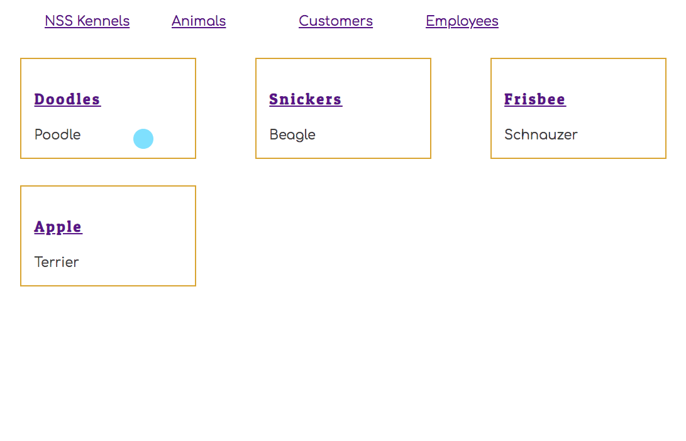
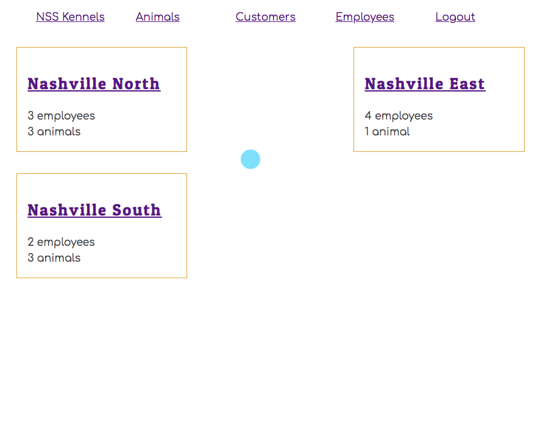

# Individual Items with Nested Data

In this chapter, you are going to use one of the features of `json-server` to get nested data back from the API instead of getting flat data and performing the joins in JavaScript.

You are going to do this with animals.

## Getting the Nested Data

Since the animal detail component is responsible for showing data, and related data about an individual animal, you need a method in your provider to get all of that information for a single animal.

Add the following method to the animal provider. It allows any component to get a single animal, but with the location and customer objects embedded inside the response.

> ##### `/src/components/animal/AnimalProvider.js`

```js
const getAnimalById = (id) => {
    return fetch(`http://localhost:8088/animals/${ id }?_expand=location&_expand=customer`)
        .then(res => res.json())
}
```

Add the new method to your return at the bottom of `AnimalProvider`.

```js
return (
    <AnimalContext.Provider value={
      {
        animals, addAnimal, getAnimals, getAnimalById
      }
    }>
      {props.children}
    </AnimalContext.Provider>
  )
```

Here's how the response will look.

```json
{
  "id": 2,
  "name": "Snickers",
  "breed": "Beagle",
  "locationId": 2,
  "treatment": "React Hook useEffect has a missing dependency: 'setDefaults'. Either include it or",
  "customerId": 4,
  "location": {
    "id": 2,
    "name": "Nashville South",
    "address": "209 Emory Drive"
  },
  "customer": {
    "email": "steve@stevebrownlee.com",
    "password": "123",
    "name": "Steve Brownlee",
    "id": 4
  }
}
```

This eliminates the need to get all of the locations, and all of the customers and use `.find()` array method to get the matching ones inside your code.

The server did the work for you!!

## Animal List Refactor

Just like you did with the employee list, the animal list will now just show a list of animal names, which are hyperlinks. When you click on one animal name, an animal detail component will render.

> ##### `/src/components/animal/AnimalList.js`

```jsx
import React, { useState, useContext, useEffect } from "react"
import { AnimalContext } from "./AnimalProvider"
import { Animal } from "./Animal"
import "./Animals.css"

export const AnimalList = ({ history }) => {
    const { getAnimals, animals } = useContext(AnimalContext)

    // Initialization effect hook -> Go get animal data
    useEffect(()=>{
        getAnimals()
    }, [])

    return (
        <>
            <h1>Animals</h1>

            <button onClick={() => history.push("/animals/create")}>
                Make Reservation
            </button>
            <div className="animals">
                {
                    animals.map(animal => {
                        return <Animal key={animal.id} animal={animal} />
                    })
                }
            </div>
        </>
    )
}
```

> ##### `/src/components/animal/Animal.js`

```jsx
import React from "react"
import "./Animals.css"
import { Link } from "react-router-dom"

export const Animal = ({ animal }) => (
    <section className="animal">
        <h3 className="animal__name">
            <Link to={`/animals/${animal.id}`}>
                { animal.name }
            </Link>
        </h3>
        <div className="animal__breed">{ animal.breed }</div>
    </section>
)
```

## New Animal Details Component

Create a new component in the animal directory which will be responsible for showing all the details of the animal.

> ##### `/src/components/animal/AnimalDetail.js`

```js
import React, { useContext, useEffect, useState } from "react"
import { AnimalContext } from "./AnimalProvider"
import "./Animals.css"

export const AnimalDetails = (props) => {
    const { releaseAnimal, getAnimalById } = useContext(AnimalContext)

    const [animal, setAnimal] = useState({ location: {}, customer: {}})

    useEffect(() => {
        const animalId = parseInt(props.match.params.animalId)
        getAnimalById(animalId)
            .then(setAnimal)
    }, [])

    return (
        <section className="animal">
            <h3 className="animal__name">{animal.name}</h3>
            <div className="animal__breed">{animal.breed}</div>
            <div className="animal__location">Location: {animal.location.name}</div>
            <div className="animal__owner">Customer: {animal.customer.name}</div>
            <button onClick={
                () => {
                    releaseAnimal(animal)
                        .then(() => {
                            props.history.push("/animals")
                        })
                }
            }>
                Release Animal
            </button>
            <button onClick={() => {
                props.history.push(`/animals/edit/${animal.id}`)
            }}>Edit</button>
        </section>
    )
}
```

## Create a New Dynamic Route

Again, just like employees, you have to support a route like the following.

http://localhost:3000/animals/7

We need that 7 in the component so we can get that animal from the API. It's stored in `props.match.params.animalId` in the code above.

> ##### `/src/components/ApplicationViews.js`

```js
<AnimalProvider>
    <Route path="/animals/:animalId(\d+)" render={
        props => <AnimalDetails {...props} />
    } />
</AnimalProvider>
```

## Try it Out

Now when you click on an animal's name in the list view, you should see your new animal detail view.



## Practice: Locations

Your next task is to refactor your location components. On your location list, display the location name, the number of animals currently being treated, and the number of employees.

When you click the name of a location, you should be taken to a detail view that lists the names of all animals currently being treated, and the names of all employees working there.

> **Tip:** You don't need all of the fancy styling like you see below. Just get the information displayed.


