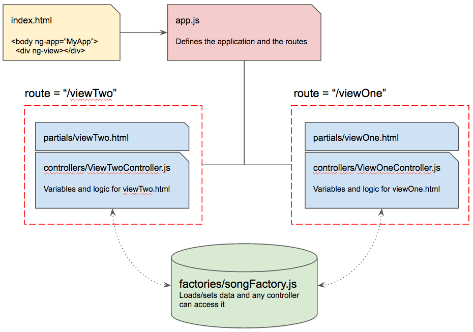

# Angular Factories and Routing

## Angular Route

Install the Angular Route module. This library allows you to easily build a SPA (Single Page Application) where you switch out one view for another - without ever refreshing the browser - and break up your HTML into what are called *partials*.

```bash
npm install angular-route --save
```

Next, you add the `ng-view` helper to an empty element on your page. Later, when you create your partials and have configured Angular Route when to show each one, the HTML in those partials will be injected into this DOM element.

```html
<div ng-view></div>
```

Next, add the dependency to the `angular-route` package to your application.  Inside `app.js` update your definition of your app module to the following.

```js
angular.module("EmployeeApp", ["ngRoute"])
```

### Partials

Partials are HTML files containing components that you need to use in your application to represent data. You'll be creating HTML files that will be responsible for doing one thing only. For example, one file for showing a list of employees, another to show a form for creating an employee, and another for displaying the details of an employee.

```bash
mkdir -p app/employees/partials
mkdir app/employees/controllers
touch app/employees/controllers/EmployeeListCtrl.js
touch app/employees/controllers/EmployeeCreateCtrl.js
touch app/employees/controllers/EmployeeDetailCtrl.js
mkdir app/employees/factories
touch app/employees/partials/list.html
touch app/employees/partials/create.html
touch app/employees/partials/detail.html
```

Now you're going to start using partials to display information. Here's what it your `index.html` should look like.

```html
<!doctype html>

<html lang="en">
<head>
  <meta charset="utf-8">
  <title>NSS Starter Kit - Angular</title>
</head>

<body ng-app="EmployeeApp">

    <div ng-view></div>

    <script src="./lib/node_modules/angular/angular.min.js"></script>
    <script src="./lib/node_modules/angular-route/angular-route.min.js"></script>
    <script src="./app/app.js"></script>
    <script src="./app/employees/factories/EmployeeFactory.js"></script>
    <script src="./app/employees/controllers/EmployeeListCtrl.js"></script>
    <script src="./app/employees/controllers/EmployeeCreateCtrl.js"></script>
    <script src="./app/employees/controllers/EmployeeDetailCtrl.js"></script>
</body>
</html>
```

Next, open the `app/employees/partials/list.html` file and create a *partial* for listing employees.

```html
<div>
  <input type="text" ng-model="query" />
</div>

<div ng-repeat="person in employees | filter: query">
  <a href="#!/employees/{{ person.id }}">{{ person.firstName }} {{ person.lastName }}</a>
</div>
```

Notice anything strange about the anchor tag there? That's a strange looking URL for the `href` property. Well, since you're now starting the process of building a SPA, then you don't want any link to actually refresh the browser, and so by prepending the new location with #, you ensure that. You'll see this in action as we set up the routing.

### Initial route

Now that you have a partial, let's start using Angular routing to show it in the element with the `ng-view` attribute. First, we add an add in a new configuration object for our application, and set `$routeProvider` as a dependency.  Add this into your app.js file.

```js
angular.module("EmployeeApp").config(function ($routeProvider) {
    /**
     * Configure all Angular application routes here
     */
    $routeProvider
        .when("/employees/list", {
            templateUrl: "app/employees/partials/list.html",
            controller: "EmployeeListCtrl"
        })
})
```

### Employee List Controller

```js
angular
.module("EmployeeApp")
.controller("EmployeeListCtrl", function ($scope, $http) {
    $scope.employees = []

    const getEmployees = () => {
        $http({
            method: "GET",
            url: "https://{firebase URL}/employees/.json"
        })
        .then(response => {
            $scope.employees = Object.keys(response.data).map(e => {
                return response.data[e]
            })
        })
    }

    getEmployees()
})
```

What this does is make Angular now watch the values URL in the browser, and when it changes, it tries to match the pattern `/employees/list`. If it matches, it loads the HTML in our partial, and then binds that DOM to the `EmployeeListCtrl` controller. Try it out by putting this URL in your browser `http://localhost:8080/#!/employees/list`.

It should display your list of employees.

### Adding a new employee

Add a new route for `/employees/new` and load the employee form partial.

```js
angular.module("EmployeeApp").config(function ($routeProvider) {
    /**
     * Configure all Angular application routes here
     */
    $routeProvider
        .when("/employees/list", {
            templateUrl: "app/employees/partials/list.html",
            controller: "EmployeeListCtrl"
        })
        .when('/employees/new', {
            templateUrl: 'app/employees/partials/create.html',
            controller: 'EmployeeCreateCtrl'
        })
})
```

> **File:** app/employees/partials/create.html

```html
<section>
  <div>
    First name: <input type="text" ng-model="newEmployee.firstName" />
  </div>
  <div>
    Last Name: <input type="text" ng-model="newEmployee.lastName" />
  </div>
  <button ng-click="hireEmployee()">Hire Employee</button>
</section>
```

> **File:** app/employees/controllers/EmployeeCreateCtrl.js

```js
angular
.module("EmployeeApp")
.controller("EmployeeCreateCtrl", function ($scope, EmployeeFactory) {
    $scope.newEmployee = {}

    $scope.hireEmployee = function () {
        const employee = {
            "firstName": $scope.newEmployee.firstName,
            "lastName": $scope.newEmployee.lastName,
            "employmentStart": Date.now(),
            "employmentEnd": 0
        }

        EmployeeFactory.add(employee).then(() => {
            $scope.newEmployee.firstName = ""
            $scope.newEmployee.lastName = ""
        })
    }
})
```

### Catch-all route

If you want to redirect the user to a particular route if they enter one that you currently don't have a view for, you can use the `otherwise` method on the route provider.

```js
angular.module("EmployeeApp").config(function ($routeProvider) {
    /**
     * Configure all Angular application routes here
     */
    $routeProvider
        .when("/employees/list", {
            templateUrl: "app/employees/partials/list.html",
            controller: "EmployeeListCtrl"
        })
        .when('/employees/new', {
            templateUrl: 'app/employees/partials/create.html',
            controller: 'EmployeeCreateCtrl'
        })
        .otherwise('/employees/list')
})
```

Now, if a route is visited at the URL `http://localhost/#!/employees/garbage` then the employee list view will be loaded instead.

## Multiple controllers

Now, you may be wondering at this point if it's possible to break up this controller. One for managing the list of employees, and another for managing the employee form. Yes, of course it is, and it's recommended, but then we run into the problem of how each of those controllers can read, and modify the same array of employees. Since the `$scope` object is not accessible outside the controller, if we read our employees from the JSON file in the employee list controller, then somehow we have to share that with the employee form controller so that it can add a new employee to it.

## Factories

A factory is responsible for data operations, and initializing data state. Controllers can then use factories to get data, and manipulate it for a specific purpose, or representation. Since each controller has its own scope, and another controller cannot access it, a factory acts as the intermediary, an escrow, between controllers.

Here's an example.

Let's say that you have two controllers, `EmployeeListCtrl`, which will contain all the logic needed to list your employees, and `EmployeeDetailCtrl` which will contain all the logic for displaying the details of individual employees. You don't want to make an XHR call in each of those controllers to get the list of employees. That's duplicating code, and that's *bad*.

You want one, common, mechanism that both controllers can use to get the list of employees. The factory is born. Let's look at a very simplistic construct, before we get to the XHR example.  First we will create a factories folder in the app folder.  Then we will add an `EmployeeFactory.js` file to that folder.  Inside that file we will add the following:

```js
angular
.module("EmployeeApp")
.factory("EmployeeFactory", function ($http) {
    return Object.create(null, {
        "list": {
            value: function () {
                return $http({
                    method: "GET",
                    url: "https://{firebase URL}/employees/.json"
                }).then(response => {
                    const data = response.data

                    // Make an array of objects so we can use filters
                    return Object.keys(data).map(key => {
                        data[key].id = key
                        return data[key]
                    })
                })
            }
        },
        "single": {
            value: function (key) {
                return $http({
                    method: "GET",
                    url: `https://{firebase URL}/employees/${key}/.json`
                }).then(response => {
                    return response.data
                })
            }
        },
        "add": {
            value: function (employee) {
                return $http({
                    method: "POST",
                    url: "https://{firebase URL}/employees/.json",
                    data: {
                        "firstName": employee.firstName,
                        "lastName": employee.lastName,
                        "employmentStart": Date.now(),
                        "employmentEnd": 0
                    }
                })
            }
        }
    })
})
```

Now, in each of your controllers, you can get all employees, which is what you want in `EmployeeListCtrl`, just get one employee, which is what you want in `EmployeeDetailCtrl`, or add a new employee, which is what you want in `EmployeeCreateCtrl`. The factory is a singleton, meaning there's only, ever, one instance of this factory created, so you'll never have to worry about which version of the employee list you're working with, because there's only one version. Period.

Now update your controllers to use the factory methods.

> **File:** EmployeeListCtrl.js

```js
angular
.module("EmployeeApp")
.controller("EmployeeListCtrl", function ($scope, EmployeeFactory) {
    $scope.employees = []

    EmployeeFactory.list(true).then(data => {
        $scope.employees = data
    })
})
```

> **File:** EmployeeCreateCtrl.js

```js
angular
.module("EmployeeApp")
.controller("EmployeeCreateCtrl", function ($scope, EmployeeFactory) {
    $scope.newEmployee = {}

    $scope.addEmployee = function () {
        const employee = {
            "firstName": $scope.newEmployee.firstName,
            "lastName": $scope.newEmployee.lastName,
            "employmentStart": Date.now(),
            "employmentEnd": 0
        }

        EmployeeFactory.add(employee).then(() => {
            $scope.newEmployee.firstName = ""
            $scope.newEmployee.lastName = ""
        })
    }
})
```



## Employee Details with Route Parameters

You can capture URL parameters into JavaScript variables. For example, in Angular, you can configure a route that detects the following URL...

```sh
http://localhost:8080/employees/detail/-L-Im-wJVwZJAWG6oOAV
```

...and in the controller, immediately access the value of `-L-Im-wJVwZJAWG6oOAV` that's at the end of the URL. Let's see how you do it.

First, define a controller, and inject the Angular dependency of `$routeParams`. This allows you to capture any URL parameter that were captured.

> **FIle:** app/employees/controllers/EmployeeDetailCtrl.js

```js
angular.module("EmployeeApp")
.controller("EmployeeDetailCtrl", function ($scope, $routeParams) {

})
```

### Capture Route Parameter

Configure a new route in your `app.js`. Notice that the URL has a colon in front of `employeeId`. The colon is the magic. It tells Angular routing that anything located at that location in the URL should be captured and be made available in the `$routeParams` object that was injected into the controller.

The new route binds the `detail.html` partial to the `EmployeeDetailCtrl` controller.

```js
angular.module("EmployeeApp").config(function ($routeProvider) {
    /**
     * Configure all Angular application routes here
     */
    $routeProvider.
        when("/employees/list", {
            templateUrl: "app/employees/partials/list.html",
            controller: "EmployeeListCtrl"
        })
        .when('/employees/new', {
            templateUrl: 'app/employees/partials/create.html',
            controller: 'EmployeeCreateCtrl'
        })
        .when('/employees/detail/:employeeId', { // <-- Magic happens here
            templateUrl: 'app/employees/partials/detail.html',
            controller: 'EmployeeDetailCtrl'
        })
        .otherwise('/employees/list')
})
```

### Use Route Parameter

Now in the controller, let's use the route parameter to request the employee details.

```js
angular
.module("EmployeeApp")
.controller("EmployeeDetailCtrl",
    function ($scope, $routeParams,EmployeeFactory) {
        $scope.employee = {}

        EmployeeFactory.single($routeParams.employeeId).then(employee => {
            $scope.employee = employee
        })
    }
)
```

### Displaying Employee Info

Now put the following HTML in your `detail.html` partial.

```html
<h1>{{ employee.firstName }} {{ employee.lastName }}</h1>

<h3>Started on {{ employee.employmentStart | date:"fullDate" }}</h3>
```

Go to the employee list and click on one of the employees.
