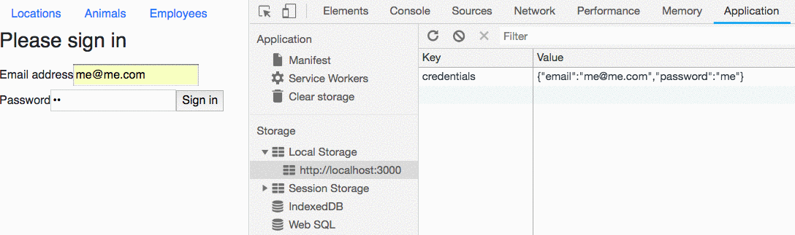

# Conditional Route Rendering

In this chapter, you are going to learn how to configure a `<Route>` to conditionally render one component or another.

## Checking for Simple Authentication

### Login Component

Make a new component named `Login` in a file called `Login.js`.

> Login.js

```js
import React, { Component } from "react"


export default class Login extends Component {

    // Set initial state
    state = {
        email: "",
        password: ""
    }

    // Update state whenever an input field is edited
    handleFieldChange = (evt) => {
        const stateToChange = {}
        stateToChange[evt.target.id] = evt.target.value
        this.setState(stateToChange)
    }

    // Simplistic handler for login submit
    handleLogin = (e) => {
        e.preventDefault()

        /*
            For now, just store the email and password that
            the customer enters into local storage.
        */
        localStorage.setItem(
            "credentials",
            JSON.stringify({
                email: this.state.email,
                password: this.state.password
            })
        )
    }

    render() {
        return (
            <form onSubmit={this.handleLogin}>
                <h1 className="h3 mb-3 font-weight-normal">Please sign in</h1>
                <label htmlFor="inputEmail">
                    Email address
                </label>
                <input onChange={this.handleFieldChange} type="email"
                       id="email"
                       placeholder="Email address"
                       required="" autoFocus="" />
                <label htmlFor="inputPassword">
                    Password
                </label>
                <input onChange={this.handleFieldChange} type="password"
                       id="password"
                       placeholder="Password"
                       required="" />
                <button type="submit">
                    Sign in
                </button>
            </form>
        )
    }
}
```

### Route to Show Login

Now modify **`ApplicationViews`** with a function to check if there is an item in local storage named `credentials`.

```js
export default class ApplicationViews extends Component {

    // Check if credentials are in local storage
    isAuthenticated = () => localStorage.getItem("credentials") !== null

    render() {
        return (
            <React.Fragment>
                <Route exact path="/" component={LocationList} />
                <Route exact path="/animals" component={AnimalList} />
                <Route path="/animals/:animalId" render={(props) => {
                    return <Animal animal={props.location.state.animal} />
                }} />
                <Route path="/employees" component={EmployeeList} />
            </React.Fragment>
        )
    }
}
```

Then configure a new route that will render the login component.

```js
import { Route } from 'react-router-dom'
import React, { Component } from "react"
import AnimalList from './AnimalList'
import LocationList from './LocationList'
import EmployeeList from './EmployeeList'
import Animal from './Animal'
import Login from './Login'


export default class ApplicationViews extends Component {

    // Check if credentials are in local storage
    isAuthenticated = () => localStorage.getItem("credentials") !== null

    render() {
        return (
            <React.Fragment>
                <Route exact path="/" component={LocationList} />
                <Route exact path="/animals" component={AnimalList} />
                <Route path="/animals/:animalId" render={(props) => {
                    return <Animal animal={props.location.state.animal} />
                }} />
                <Route path="/employees" component={EmployeeList} />
                <Route path="/login" component={Login} />
            </React.Fragment>
        )
    }
}
```

Now go to your browser, navigate to the `http://localhost:3000/login` route, fill out the form, then submit it. You should see the object appear in your local storage.


## Conditional Rendering

Now it's time to implement conditional rendering. You will start with the locations view. The following route configuration will only render the **`LocationList`** component if the user is authenticated.

```js
<Route exact path="/" render={props => {
    if (this.isAuthenticated()) {
        return <LocationList />
    } else {
        return <Login />
    }
}} />
```

1. Modify your route to reflect the code above.
1. Remove the `credentials` item from local storage.
1. Visit `http://localhost:3000/`
1. You should be presented with the login screen

Because the item doesn't exist in local storage, the `isAuthenticated` method in **`ApplicationViews`** will return `false`. This causes the condition that you wrote in the `<Route>` to return the **`Login`** component.

1. Now fill out the form to put the item back in local storage.
1. Click on the `Locations` item in your nav bar.
1. You should now see the list of locations.



## Practice: No Content for You!

Ensure that customers can't access locations, animals, or employees unless they submit a login.

## Fun Challenge: Remember Me

1. Add a checkbox beneath the login form labeled _Remember Me_.
1. When the customer logs in and the checkbox is not checked, then save their information to session storage
1. When the customer logs in and the checkbox is checked, then save their information to local storage


