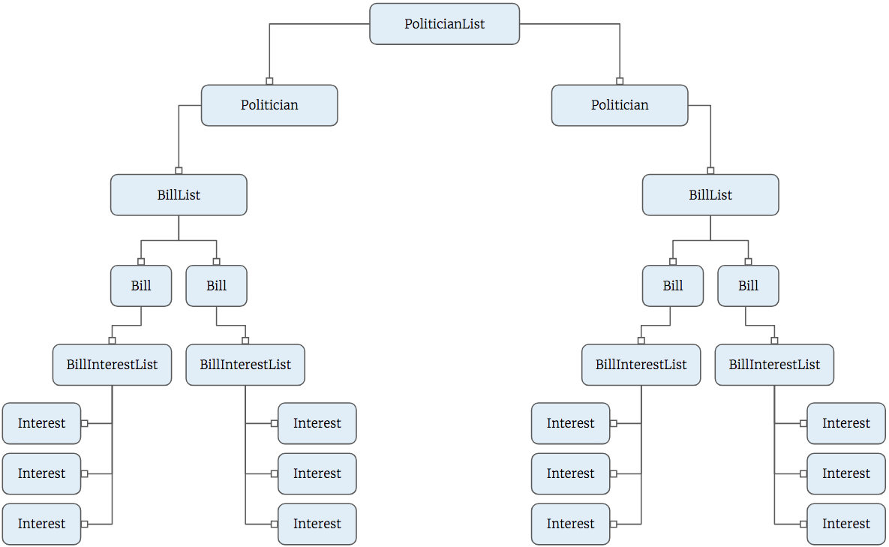

# React Context API for Managing Properties

To avoid passing properties down through child components that aren't using them, other than to pass them down yet again to other child components, you can use the Context API in React to have a component whose sole purpose is to store the data for your application, and then any component can be written to subscribe to the data store.

## Without Context API

Remeber the political candidate exercise back in BrowserifyLand when figuring out how to join related data collections? Let's revisit that and see how we can build the DOM component with React.

Here's the final HTML structure of a database that contains 2 politicians. Each politician sponsors two bills. Each bill has three interests that it legislates.

```html
<article class="politician">
    <header class="politician__name">
        <h1>Abby Fleming</h1>
    </header>
    <section class="politician__bills">
        <h3>Sponsored Bills</h3>
        <div>
            <h4>S. 2325: Northern Mariana Islands U.S. Workforce Act</h4>
            <ul>
                <li>Employment</li>
                <li>Energy</li>
                <li>Natural Resources</li>
            </ul>
        </div>
    </section>
    <section class="politician__influencers">
        <h3>Related PACs</h3>
        <ul>
            <li>American Gas Association</li>
            <li>League of Conservation Voters Action Fund</li>
        </ul>
    </section>
</article>
````

Here's a tree displaying how React components would be built to produce that final structure.



That's a complex DOM structure that you would need to build with React components. Then imagine that all of the state for this application gets loaded in the **`PoliticianList`** component. All data that each child component needs, no matter how deeply that component is nested in the tree, needs to keep trickling down the property waterfall until it finally gets to the component that needs it.

```js
class PoliticianList extends Component {
    state = {
        politicians: [
            { id: 1, name: "Madeline Power"},
            { id: 2, name: "Anulfo Ordaz"}
        ],
        sponsoredBills: [
            { id: 1, politicianId: 1, billId: 4},
            { id: 2, politicianId: 1, billId: 1},
            { id: 3, politicianId: 2, billId: 3},
            { id: 4, politicianId: 2, billId: 2}
        ],
        bills: [
            { id: 1, name: "A"},
            { id: 2, name: "B"},
            { id: 3, name: "C"},
            { id: 4, name: "D"}
        ],
        interests: [
            { id: 1, name: "Health Care"},
            { id: 2, name: "Infrastructure"},
            { id: 3, name: "Finance"},
            { id: 4, name: "Medicaid"},
            { id: 5, name: "Education"}
        ]
        billInterests: [
            { id: 1, billId: 3, interestId: 5},
            { id: 2, billId: 3, interestId: 1},
            { id: 3, billId: 3, interestId: 2},
            { id: 4, billId: 2, interestId: 4},
            { id: 5, billId: 2, interestId: 2},
            { id: 6, billId: 2, interestId: 3},
            { id: 7, billId: 1, interestId: 3},
            { id: 8, billId: 1, interestId: 1},
            { id: 9, billId: 1, interestId: 4}
        ]
    }

    render() {
        return (
            <div>
                {
                    this.state.politicians.map(crook =>
                    <Politician key={crook.id}
                        info={crook}
                        billInterests={this.state.billInterests}
                        sponsoredBills={this.state.sponsoredBills}
                        interests={this.state.interests}
                        bills={this.state.bills} />
                    )
                }
            </div>
        )
    }
}

class Politician extends Component {
    render() {
        const myBills = this.props.sponsoredBills
        .filter(sb =>
            return sb.politicianId === this.props.info.id
        )
        .map(sb =>
            return this.props.bills.find(b =>
                return b.id === sb.billId
            )
        )
        return (
            <div>
                <h2>{this.props.info.name}</h2>
                <BillList
                    billInterests={this.props.billInterests}
                    interests={this.props.interests}
                    bills={myBills} />
            </div>
        )
    }
}

class BillList extends Component {
    render() {
        return (
            <div>
                {
                    <h3>Sponsored Bills</h3>
                    <ol>
                    this.props.bills.map(bill =>
                        <Bill info={bill}
                            key={bill.id}
                            billInterests={this.props.billInterests}
                            interests={this.props.interests} />

                    )
                    </ol>
                }
            </div>
        )
    }
}

class Bill extends Component {
    render() {
        const myInterests = this.props.billInterests
        .filter(bi =>
            return bi.billId === this.props.info.id
        )
        .map(bi =>
            return this.props.interests.find(i =>
                return i.id === bi.billId
            )
        )
        return (
            <li>
                {this.props.name}
                <BillInterestList interests={this.props.myInterests} />
            </li>
        )
    }
}

class BillInterestList extends Component {
    render() {
        return (
            <ul>
            this.props.interests.map(interest =>
                <Interest info={interest} key={interest.id} />
            )
            </ul>
        )
    }
}

class Interest extends Component {
    render() {
        return (
            <li>{this.props.name}</li>
        )
    }
}
```
