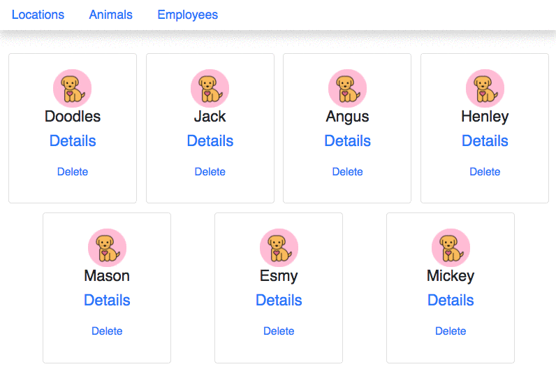

# Dynamic Routing

In this chapter, you are going to render each of the locations, animals, and employees as hyperlinks. When the customer clicks on any of the hyperlinks, they will be taken to a view that represents an individual resource.

## Adding a Dynamic Route

Open your **`ApplicationViews`** component and add a new route to handle `/animals/:animalId`. Also note that the keyword of `exact` has been added to the `/animals` route. Without that keyword, the second route would also handle `/animals/:animalId`.

```js
<Route exact path="/" render={(props) => {
    return <LocationList locations={this.state.locations} />
}} />
<Route exact path="/animals" render={(props) => {
    return <AnimalList animals={this.state.animals} />
}} />
<Route path="/animals/:animalId(\d+)" render={(props) => {
    return <AnimalDetail {...props} deleteAnimal={this.deleteAnimal} animals={this.state.animals} />
}} />
```

Also, add a new import statement at the top.

```js
import AnimalDetail from './animal/AnimalDetail'
```

By adding this route, you are setting up your application to view a single animal at a time, and you determine which animal is to be viewed by looking in the URL. The animal's primary key will be the last part of the URL path.

The path of `/animals/1` would display the details for Doodles the German Shepherd. The path of `/animals/5` would display the details for Derkins the Pug, and so on. Now it's time to create the component reponsible for displaying the details of an animal.

## AnimalDetail Component

You have a Route ready to go, but you're not done yet. The Route renders an **`AnimalDetail`** component, but you don't have that component yet.

> AnimalDetail.js

```js
import React, { Component } from "react"
import "./Animal.css"
import dog from "./DogIcon.png"


export default class AnimalDetail extends Component {
    render() {
        /*
            Using the route parameter, find the animal that the
            user clicked on by looking at the `this.props.animals`
            collection that was passed down from ApplicationViews
        */
        const animal = this.props.animals.find(a => a.id === parseInt(this.props.match.params.animalId)) || {}

        return (
            <section className="animal">
                <div key={animal.id} className="card">
                    <div className="card-body">
                        <h4 className="card-title">
                            
                            {animal.name}
                        </h4>
                        <h6 className="card-title">{animal.breed}</h6>
                        <a href="#"
                            onClick={() => this.props.deleteAnimal(animal.id)
                                            .then(() => this.props.history.push("/animals"))}
                            className="card-link">Delete</a>
                    </div>
                </div>
            </section>
        )
    }
}
```

## Adding the Link for the New Route

Next, modify the **`AnimalList`** component by adding a new `<Link>` element above the hyperlink for deleting.

```jsx
<Link className="nav-link" to={`/animals/${animal.id}`}>Details</Link>
```

Also make sure you import the `Link` component from React Router at the top of the module.

```js
import { Link } from "react-router-dom";
```

Once the browser reloads, click on the _Details_ hyperlink in the first card. It will change the URL in the browser to `http://localhost:3000/animals/1`, and the detail component for the animal will render.



## Practice: All the Details

Now implement dynamic routing for all of the other resources that you are displaying in your application.
