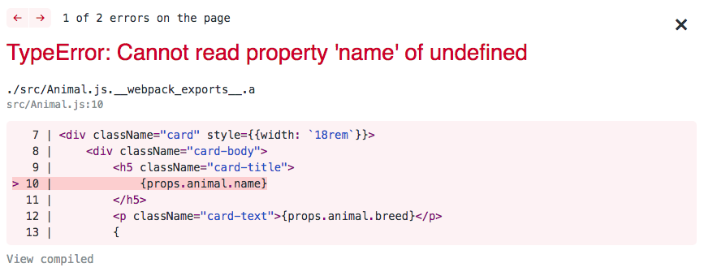

# Dynamic Routing

In this chapter, you are going to render each of the locations, animals, and employees as hyperlinks. When the customer clicks on any of the hyperlinks, they will be taken to a view that represents an individual resource.

## Adding a Dynamic Route

Open your **`ApplicationViews`** component and add a new route to handle `/animals/:animalId`. Also note that the keyword of `exact` has been added to the `/animals` route. Without that keyword, the second route would also handle `/animals/:animalId`.

```js
export default class ApplicationViews extends Component {
    render() {
        return (
            <React.Fragment>
                <Route exact path="/" component={LocationList} />
                <Route exact path="/animals" component={AnimalList} />
                <Route path="/animals/:animalId" component={Animal} />
                <Route path="/employees" component={EmployeeList} />
            </React.Fragment>
        )
    }
}
```

By adding this route, you are setting up your application to view a single animal at a time, and you determine which animal is to be viewed by looking in the URL. The animal's primary key will be the last part of the URL path.

The path of `/animals/1` would display the details for Doodles the German Shepherd. The path of `/animals/5` would display the details for Derkins the Pug, and so on.

If you complete the advanced challenge from the last chapter, then install Bootstrap for your project so that you can make cards out of each animal.

```sh
npm i bootstrap --save
```

To make the card look good, go ahead and add a `breed` property to each of your animals.

> AnimalList.js

```js
...
    state = {
        animals: [
            { id: 1, name: "Doodles", breed: "German Shepherd" },
            { id: 2, name: "Jack", breed: "Cocker Spaniel" },
            { id: 3, name: "Angus", breed: "Dalmatian" },
            { id: 4, name: "Henley", breed: "Carolina Retriever" },
            { id: 5, name: "Derkins", breed: "Pug" },
            { id: 6, name: "Checkers", breed: "Bulldog" }
        ]
    }
...
```

Now you can import the Bootstrap CSS into your `Animal.js` file. You also need to import the `Link` object so that when the customer clicks on one of the animals' card, the dynamic route that you added above is used.

You will notice that the `to` property in the `Link` below matches the pattern of the `Route` you set up earlier.

> Animal.js

```js
import React from "react"
import { Link } from "react-router-dom"
import "bootstrap/dist/css/bootstrap.min.css"


export default props => {
    return (
        <div className="card" style={{width: `18rem`}}>
            <div className="card-body">
                <h5 className="card-title">
                    {props.animal.name}
                </h5>
                <p className="card-text">{props.animal.breed}</p>
                {
                    <Link to={`/animals/${props.animal.id}`}
                          className="card-link">
                        Details
                    </Link>
                }
            </div>
        </div>
    )
}
```

Your list of animals should now look like Bootstrap cards.

Now click on the _Detail_ hyperlink in the first card. It will change the URL in the browser to `http://localhost:3000/animals/1`. Unfortunately, you will also get an error.



This is because when you set up the dynamic `<Route>`, it renders the **`Animal`** component directly, instead of **`AnimalList`**, which is where the animal array was established in its state. At this point you have many options to show the details of a single animal, and this is one of the reasons React is difficult to learn, and very hard to master.

It has no opinions.

Here are some options.

1. Render a different component for this specific case. For example, a **`AnimalDetails`** component.
1. Re-use the **`Animal`** component, but refactor the code a bit so that it can accept the data to be expressed in JSX from different sources.
1. Change how the `<Route>` is configured so that `<Link>` state can be passed in a props.
1. Move the `animals` array from being in the state of **`AnimalList`** to being in the state of **`ApplicationViews`** so that it can manipulated in different ways for different views.

I'm going to show you two ways, and talk about the pros and cons of each one.

### Modify Animal to Accept Different Sources

The first step in this option is to modify the `<Link>` component to pass some state along to the `<Route>`. Since the **`Animal`** component received the entire animal object as a property from **`AnimalList`**, you can pass that object through to the route.

You do this by passing an object to the `to` attribute instead of a string. Put the URL you want to change to in the `pathname` property, and add a `state` property whose value is the animal.

```js
<Link className="card-link"
    to={{
        pathname: `/animals/${animal.id}`,
        state: { animal: animal }
    }}>
    Details
</Link>
```

When you pass state like that to a `<Route>`, then the component that is rendered for that route can access it with the following namespace.

```js
props.location.state.animal
```

Now the **`Animal`** component can receive the animal object by two mechanisms.

1. As a direct property from `AnimalList`, referenced as `props.animal`.
1. As a state property of the route, referenced as `props.location.state.animal`.

Because of this, you will need to add code to determine where the data is coming from.

```js
let animal = {}

// Check if the data is in `props.animal`
if (props.hasOwnProperty("animal")) {
    animal = props.animal

// If not, data will be in `props.location.state.animal`
} else {
    animal = props.location.state.animal
}
```

Now I have a locally-scoped variable of `animal` that I use in my `<Link>` component.

Here's the final code.

```js
export default props => {
    let animal = {}

    if (props.hasOwnProperty("animal")) {
        animal = props.animal
    } else {
        animal = props.location.state.animal
    }

    return (
        <div className="card" style={{width: `18rem`}}>
            <div className="card-body">
                <h5 className="card-title">
                    {animal.name}
                </h5>
                <p className="card-text">{animal.breed}</p>
                <Link className="card-link"
                    to={{
                        pathname: `/animals/${animal.id}`,
                        state: { animal: animal }
                    }}>
                    Details
                </Link>
            </div>
        </div>
    )
}
```

**Pro:** You are now reusing the **`Animal`** component. Reusability is one of the core reasons developers want to use a component based library like React.

**Con:** You've added what is called a _code smell_. This component is now brittle because there is a possibility that a future use of the component will need to load the data a completely different way. That, in turn, will require you to write yet another `if` condition to handle that case. This violates the [Open/Closed Principle](https://en.wikipedia.org/wiki/Open%E2%80%93closed_principle).

### Modify Route to Pass State as Props

For this option your link looks the same.

```js
<Link className="card-link"
    to={{
        pathname: `/animals/${animal.id}`,
        state: { animal: animal }
    }}>
    Details
</Link>
```

In this option, you leave the **`Animal`** component as simple as possible. It will accept the `animal` object through `props`, and no other way. This means that you flip the responsibility onto the code that wants to render `<Animal>` to ensure that it passes the data the correct way.

There are currently two mechanisms by which the **`Animal`** component is rendered.

1. As a child of **`AnimalList`**
1. As the rendered component of the `/animals/:animalId` route.

Therefore, it is the reponsibility of both of those mechanisms to pass the component an `animal` property. **`AnimalList`** already does this, so you need to reconfigure the `<Route>` to ensure it complies with what **`Animal`** needs.

Here's how you do that.

Every `<Route>` has another attribute called `render` that accepts a function as its value. You can put any logic inside that function to customize how you want the corresponding component to be rendered. Since you know that when the customer clicks on the `Details` link in the animal card, the `animal` object will be on the `props.location.state.animal` namespace, you can specify an `animal` property and give it that value.

```js
<Route path="/animals/:animalId" render={(props) => {
    return <Animal animal={props.location.state.animal} />
}} />
```

**Pro:** You are reusing the **`Animal`** component and its internal logic remains consistent, regardless of the machanism by which it was rendered.

**Con:** You've added another possible _code smell_. Again, it's entirely possible that a future feature will implement a `<Link>` component that matches this route, but does not define a `state: { animal: animal }` property. If another developer is working on a feature in which the `animal` object is not available, but only the `id` of the animal, then your code is now at an impasse.

## Practice: Pick your Poison

Implement one of the above mechanisms to view the details of animals.

## Practice: All the Details

Now implement dynamic routing for locations and employees.
