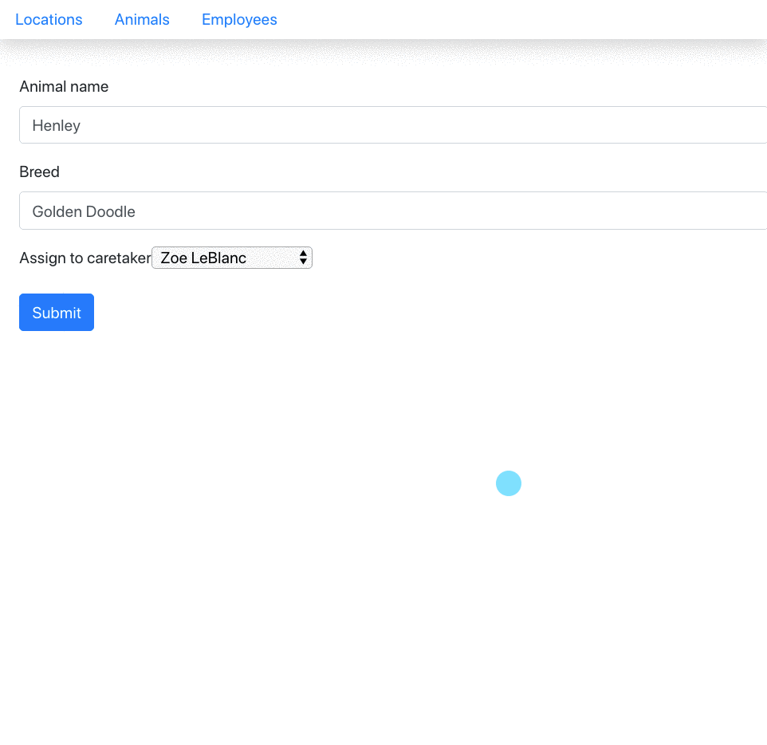

# Dynamic Routing

In this chapter, you are going to render a _Details_ hyperlink for each of the locations, animals, and employees. When the customer clicks on one of the hyperlinks, they will be taken to a view that represents an individual resource.

## What you Will be Building

Here's an animation that portrays how your application will behave after completing this chapter. Note that clicking on _Details_ shows a single animal.


## Component to Represent a Single Animal

Your first task is to build a React component whose single responsibility is to display the details of a single animal. Below is the location of the file to create, and the contents of it. You should note that the properties of the animal are all on the `this.props.animal` namespace. This means that **`ApplicationViews`** will be passing a single object as a property.

More on that further down the chapter.

## AnimalDetail Component

You will be creating three files for rendering an animal detail component.

1. The component
1. CSS for styling the HTML
1. An svg image of a dog

Your instructor will guide you through the code in this component. The are several new concepts that you will need to be shown and then apply.

> components/animal/AnimalDetail.js

```jsx
import React, { Component } from "react"
import "./Animal.css"
import dog from "./DogIcon.svg"


export default class Animal extends Component {
    state = {
        saveDisabled: false
    }

    render() {
        return (
            <section className="animal">
                <div key={ this.props.animal.id } className="card">
                    <div className="card-body">
                        <h4 className="card-title">
                            
                            { this.props.animal.name }
                        </h4>
                        <h6 className="card-title">{ this.props.animal.breed }</h6>
                        <button onClick={
                                () => {
                                    this.setState(
                                        { saveDisabled: true },
                                        () => this.props.dischargeAnimal(this.props.animal.id)
                                    )
                                }
                            }
                            disabled={ this.state.saveDisabled }
                            className="card-link">Delete</button>
                    </div>
                </div>
            </section>
        )
    }
}
```

> components/animal/Animal.css

```css
.ownerList {
    font-size: 0.75em;
}

.icon--dog {
    width: 50px;
    height: 50px;
}
```


### Component State

Hey! What's that `saveDisabled` state variable doing in there? I thought I wasn't supposed to have state anywhere but in **`ApplicationViews`**???

Well, when the user clicks on the delete button, the HTTP operation could potentially take a second or two. This would allow a ridiculously impatient user (which is most people) the ability to click on the button repeatedly. This would generate multiple requests to delete the resource. You want to prevent that.

You can disable HTML buttons with the `disabled` attribute set to **true**. When the user clicks the button, you want to immediately disable it so there is only one `DELETE` operation performed to your API.

All of this has nothing to do with the rest of your application. This concern is 100% contained to this component. Therefore, you will use a local state variable to track whether the delete button is disabled.

You initially don't want it disabled, so the tracking state variable will be initialized to **false**.

```js
state = {
    saveDisabled: false
}
```

Then you will update state when the button is clicked. In the code below, note that `setState()` is being sent a second parameter - an anonymous function _(or lambda)_. Since `setState()` is an asynchronous operation, passing a function as the second parameter ensures that it is invoked _after_ state is set.

```js
() => {
    this.setState(
        { saveDisabled: true },
        () => this.props.deleteAnimal(this.props.animal.id)
    )
}
```

Once this state variable is set to true, the button will be disabled and unable to be clicked.

> **TIP:** _You could write the following code, where state is set first, and then the `deleteAnimal` function is invoked on the line below it. It would work perfectly fine in this specific case because the two are not dependant upon each other at all. The first statement disables a button, and the second performs an HTTP operation. You don't need to "wait" for the button to be disabled before you fire off the HTTP operation._
>
>    ```js
>    () => {
>        this.setState({ saveDisabled: true })
>        this.props.deleteAnimal(this.props.animal.id)
>    }
>    ```

## Dynamic Route and Route Parameters

Now that you have a component responsible for rendering a single animal, you need to configure your application to render this component when the URL matches a certain pattern. Right now, you only have a Route set up to show all animals when the URL matches the following pattern.

```html
http://localhost:3000/animals
```

When you want to display a single animal, their primary key will be at the of of the URL. Here's what the URL will look like to show the first animal in your API.

> **Vocabulary:** The `1` in the URL here is called a [route](https://jaketrent.com/post/access-route-params-react-router-v4/) [parameter](https://scotch.io/courses/using-react-router-4/route-params).

```html
http://localhost:3000/animals/1
```

Open your **`ApplicationViews`** component and add a new route to handle `/animals/:animalId`. Also note that the keyword of `exact` has been added to the `/animals` route. Without that keyword, the second route would also handle `/animals/:animalId`.

Given the route above for the first animal, the value of `1` is captured by React Router and stored in an `animalId` property of a specific namespace - `props.match.params.animalId`.

```jsx
<Route exact path="/" render={(props) => {
    return <LocationList locations={this.state.locations} />
}} />

{/* Make sure you add the `exact` attribute here */}
<Route exact path="/animals" render={(props) => {
    return <AnimalList animals={this.state.animals} />
}} />

{/*
    This is a new route to handle a URL with the following pattern:
        http://localhost:3000/animals/1

    It will not handle the following URL because the `(\d+)`
    matches only numbers after the final slash in the URL
        http://localhost:3000/animals/jack
*/}
<Route path="/animals/:animalId(\d+)" render={(props) => {
    // Find the animal with the id of the route parameter
    let animal = this.state.animals.find(animal =>
        animal.id === parseInt(props.match.params.animalId)
    )

    // If the animal wasn't found, create a default one
    if (!animal) {
        animal = {id:404, name:"404", breed: "Dog not found"}
    }

    return <AnimalDetail animal={ animal }
                deleteAnimal={ this.deleteAnimal } />
}} />
```

Also, add a new import statement at the top.

```js
import AnimalDetail from './animal/AnimalDetail'
```

By adding this route, you are setting up your application to view a single animal at a time, and you determine which animal is to be viewed by looking in the URL. The animal's primary key will be the last part of the URL path.

The path of `/animals/1` would display the details for Doodles the German Shepherd. The path of `/animals/5` would display the details for Derkins the Pug, and so on. Now it's time to create the component reponsible for displaying the details of an animal.


## Adding the Link for the New Route

Next, modify the **`AnimalList`** component by adding a new `<Link>` element above the button for deleting.

```jsx
<Link className="nav-link" to={`/animals/${animal.id}`}>Details</Link>
```

Also make sure you import the `Link` component from React Router at the top of the module.

```js
import { Link } from "react-router-dom";
```

Once the browser reloads, click on the _Details_ hyperlink in the first card. It will change the URL in the browser to `http://localhost:3000/animals/1`, and the detail component for the animal will render.

## Refactor How Delete Works

### Setup

Add this import to the top of **`ApplicationViews`**.

```js
import { withRouter } from 'react-router'
```

Refactor the export at the bottom of **`ApplicationViews`** to look like this.

```js
export default withRouter(ApplicationViews)
```

### Dynamically Changing the User's View

If the user is looking at the detailed view of an animal and wants to discharge an animal from the kennel (i.e. delete the animal from our JSON) you obviously can't show that animal's details again once the operation is complete. Therefore, when the user clicks on the delete button, you are going to redirect the user back to the animal list. The routing package you are using provides a object called [history](https://github.com/ReactTraining/react-router/blob/master/packages/react-router/docs/api/history.md). On that object, there is a method named `push()`.

If you push something on to what's called the _history stack_, it will change the view.

For example, the following code will change the URL in your browser to `http://localhost:3000/animals`, which triggers the routing package to find the matching **`<Route>`** definition in **`ApplicationViews`**. That route returns **`<AnimalList>`**, so we see a list of animals.

```js
this.props.history.push("/animals")
```

You are going to use `push()` in the `deleteAnimal()` function that you previously defined in **`ApplicationViews`**. Refactor the function to redirect to the animal list once the delete operation is successful. In the following code, this is the sequence of events.

1. Perform the DELETE operation to change your API data.
1. Get all animals from the API.
1. Switch the view from Animal Detail 👉🏼 Animal List.
1. Invoke `setState()` to update the `animals` array. This will trigger `render()` and the updated list of animals will appear without the one you just deleted.

```js
deleteAnimal = id => AnimalManager.delete(id)
    .then(AnimalManager.getAll)
    .then(animals => {
        this.props.history.push("/animals"))
        this.setState({ animals: animals })
    })
```

---

## Practice: Kennels: All the Details

Now implement dynamic routing to show the details of individual resources that you are displaying in your application.

* Employee details
* Location details
* Animal details

Make sure you keep the following factors in mind when implementing.

1. Using `this.props.history.push()` in your functions in **`ApplicationViews`** component when you want to change what view the user sees after an API operation is complete.
1. Using a state variable in a component that contains a button which triggers an application level state change (_i.e. new item is added, existing item is deleted, existing item is edited_) to disable the button when clicked.

## Practice: Kandy Korner: Stores, Employees and Candies Oh My

For all of the resources in Kandy Korner, when rendering them in the list view, make the name of each item a hyperlink. When the user clicks on the item, take them to the detail view for that item. Also implement the delete operation for each of the resources.

## Challenge

Implement a modal window to make the user verify that the animal should be discharged. You can use [react-modal]( https://github.com/reactjs/react-modal).

