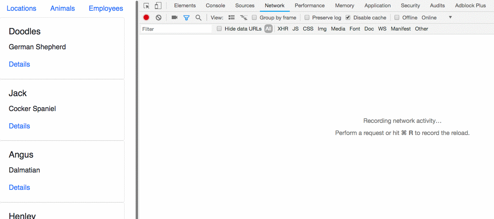

# Populating React Component State from an API

Up to this point, you have used state data that you hard-coded into your application. Now it's time to implement a more realistic way in which you would retrieve your data. You will request it from your JSON API database.

First empty out your current hard-coded state in the **`EmployeeList`** component.

```js
state = {
    employees: []
}
```

## Populate the API

Add a new file to your project named `kennel.json`. Add your employee collection to the file.

```json
{
    "employees": [
        { "id": 1, "name": "Jessica Younker" },
        { "id": 2, "name": "Jordan Nelson" },
        { "id": 3, "name": "Zoe LeBlanc" },
        { "id": 4, "name": "Blaise Roberts" }
    ]
}
```

Open a new terminal window, and start your API with the following command.

```sh
json-server -p 5002 -w kennel.json
```

## Querying the Data from your API

In React, retrieving state from a remote API works in, what seems like, a counterintuitive way. React must first render the component to the DOM without any data, then you will request the data and re-render the component.

One of the lifecycle methods available to every React component is [componentDidMount](https://reactjs.org/docs/react-component.html#the-component-lifecycle). Straight from their docs (emphasis mine):

> `componentDidMount()` is invoked immediately after a component is mounted. Initialization that requires DOM nodes should go here. _If you need to load data from a remote endpoint, this is a good place to instantiate the network request._

The `componentDidMount()` hook runs after the component output has been rendered to the DOM, so if your component needs API data, that is the place to do it. Here is how you would write it to retrieve employee data from an API being served by [json-server](https://github.com/typicode/json-server) on port 5002.

```js
componentDidMount () {
    fetch("http://localhost:5002/employees")
      .then(e => e.json())
      .then(employees => this.setState({ employees: employees }))
}
```

That code used the new `fetch` keyword in JavaScript to query your API, then serialize the response as a JSON object, then take the JSON object and set the state of your component.

Here's what the final component looks like.

```js
import React, { Component } from "react"
import Employee from "./Employee";


export default class EmployeeList extends Component {
    state = {
        employees: []
    }

    componentDidMount () {
        fetch("http://localhost:5002/employees")
        .then(e => e.json())
        .then(employees => this.setState({ employees: employees }))
    }

    render() {
        return (
            <React.Fragment>
                {
                    this.state.employees.map(employee =>
                        <Employee key={employee.id}
                                  employee={employee}
                        />
                    )
                }
            </React.Fragment>
        )
    }
}
```

* Note that you need to have a unique `key` property for each item when you use the `map()` array method to display a component representing each data object in the array.

## Resources

* [React App Requests to JSON API](https://www.youtube.com/watch?v=vwWPM7za3Pk&list=PLhScwEnhQ-bmroyHFduwgOZ1KrdDvk_44) video series
* [React for Everyone](https://www.youtube.com/playlist?list=PLLnpHn493BHFfs3Uj5tvx17mXk4B4ws4p) video series

## Practice

Now it's time to take the rest of the data and expose it through an API with `json-server`. Create a `kennel.json` file in your project and add the animals, locations, and employees collections to it.

```json
{
    "animals": [
        {
            "id": 1,
            "name": "Doodles",
            "breed": "German Shepherd"
        }
    ],
    "employees": [ ],
    "locations": [ ]
}
```

Open a new terminal window, and start your API with the following command.

```sh
json-server -p 5002 -w kennel.json
```

Use the example code above to update all of the List components to retrieve their state from the API.

> **Pro tip:** Remember to use your network tab in the Chrome Developer Tools to watch your network requests and preview the responses.



## Practice: Using Best Practices

Think back to the Nutshell group project you recently completed, and how you applied encapsulation, and the Single Responsibility Principle (SRP), to make modules whose reponsibilities were to interact with your persistent data storage.

Consider how you could create a regular old JavaScript module for this application which has that same responsibility. Then, each list component should import that module and use its methods for querying data.

For example:

Replace this code...

```js
componentDidMount () {
    fetch("http://localhost:5002/employees")
    .then(e => e.json())
    .then(employees => this.setState({ employees: employees }))
}
```

with something like this

```js
componentDidMount () {
    APIManager.getAllEmployees()
        .then(employees => this.setState({
            employees: employees
        }))
}
```

By using this approach, implementing the SRP, the **`APIManager`** module can evolve independently of the **`EmployeeList`** component. Any changes in how the API is accessed does not affect **`EmployeeList`** at all since it is using the abstraction that **`APIManager`** provides for getting data.

## Advanced Challenge: Search your Data

Not for the weak of heart, is this challenge. Put an input box in your navigation bar. When your customer types in any characters, then you must find any objects in the animals, locations, or employees collections that have a name which contains that string.

When the customer presses the ENTER key, all three collections in your API need to be queried to find any item that matches, and then a new component should be shown whose job it is to show the items that were found, if any.


