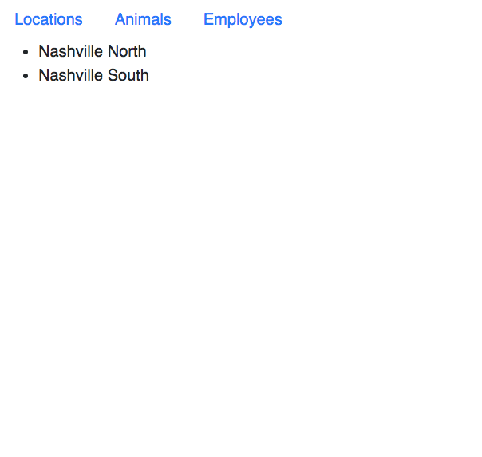

# Routing in React Applications

In a single page application, you are only rendering one DOM tree. You never request another HTML file, but simply create/destroy components in the one you have. If you have multiple views in your application, a universal design pattern is to have a navigation element at the top of the page for people to click on to see different views.

In React, you will use something called a Router to handle rendering different components when the user clicks on navigation items.

## Setup

Make sure you are in your project directory.

```sh
npm install react-router-dom
cd src
touch ApplicationViews.js
mkdir nav
touch nav/NavBar.js
touch nav/NavBar.css
```

## Making Your Components

Your `index.js` is also going to change. Up to this point, you've rendered your component right onto the DOM, but this time, you will be rendering the container component called **`KennelCompany`**. It is a container component because it does not render any HTML itself, but rather has child components that render HTML.

Don't worry if that doesn't make any sense right now. Let's look at an example to help clarify it.

The **`KennelCompany`** component will contain two child components.

1. **`NavBar`** which holds navigation elements to always be displayed.
1. **`ApplicationViews`** which will define all of the URLs that your application will support, and which views will be displays for each one.

Let's make the child components and then build the container component in which they will live.

### Navigation Bar

> nav/NavBar.js

```js
import React, { Component } from "react"
import { Link } from "react-router-dom"
import "./NavBar.css"


export default class NavBar extends Component {
    render() {
        return (
            <nav>
                <Link to="/">Locations</Link>
                <Link to="/animals">Animals</Link>
                <Link to="/employees">Employees</Link>
            </nav>
        )
    }
}
```

Notice the use of the new `<Link/>` component that you get from the React Router package you installed. It has an attribute named `to`. It will render a hyperlink in your DOM, and when clicked, it will change the URL in the browser to the value of the `to` attribute.

### Defining Routes in **ApplicationViews**

Now it's time to define the Routes that our application will respond to. In **`NavBar`**, you defined three link components that will navigation to the routes of...

* `/`
* `/animals`
* `/employees`

In the **`ApplicationViews`** component, you will define how your application will respond when the URL matches each of those patterns. When a user clicks on one of the hyperlinks in the navigation bar, this  code dictates which component should be rendered.

In the example code below, you will notice the use of `<React.Fragment />`. That is simply a React wrapper around your old friend `document.createDocumentFragment()`. What this does is prevent unnecessary `<div>`, `<article>`, or `<section>` tags from being created.

> ApplicationViews.js

```js
import { Route } from 'react-router-dom'
import React, { Component } from "react"
import AnimalList from './AnimalList'
import LocationList from './LocationList'
import EmployeeList from './EmployeeList'


export default class ApplicationViews extends Component {
    render() {
        return (
            <React.Fragment>
                <Route exact path="/" component={LocationList} />
                <Route path="/animals" component={AnimalList} />
                <Route path="/employees" component={EmployeeList} />
            </React.Fragment>
        )
    }
}
```

`exact` is needed on the first route, otherwise it will also match the other two routes, and the **`LocationList`** will be the only component rendered, no matter what the URL is.

The `<Link/>` and the `<Route/>` JSX elements are complementary to each other. If you add a new **`Link`** element in your application with a new URL, then you must create a matching **`Route`** element.

If you add this to your codebase...

```jsx
<Link to="/products">List Products</Link>
```

then you must also add this...

```jsx
<Route path="/products" component={ProductList} />
```

### Creating the KennelCompany

Like was mentioned above, **`KennelCompany`** is simply a container component. It renders no HTML itself, as you'll see. It simply *contains* other components that actually are responsible for the presentation and behavior of the application. In the case of **`KennelCompany`**, it contains two different kinds of components.

1. **`Navbar`**: This is a _Presentation Component_. Directly expresses HTML.
1. **`ApplicationViews`**: This is a _Controller Component_. Its only responsibility to to control the behavior of the system. It maps URLs to components.

> KennelCompany.js

```js
import React, { Component } from "react"

import NavBar from "./nav/NavBar"
import ApplicationViews from "./ApplicationViews"

import "bootstrap/dist/css/bootstrap.min.css"


export default class KennelCompany extends Component {
    render() {
        return (
            <React.Fragment>
                <NavBar />
                <ApplicationViews />
            </React.Fragment>
        )
    }
}
```

Now you can update your `index.js` and its root component must now be `<Router />` which gets imported from the React Router package. In that router, you place the `<KennelCompany />` child component. What this tells React is that *"I will be placing Routes in my KennelCompany component."*

> index.js

```js
import React from "react"
import ReactDOM from "react-dom"
import { BrowserRouter as Router } from "react-router-dom"
import registerServiceWorker from "./registerServiceWorker"
import KennelCompany from "./KennelCompany"
import "./index.css"


ReactDOM.render((
    <Router>
        <KennelCompany />
    </Router>
), document.querySelector("#root"))

registerServiceWorker()
```

### AnimalList Changes

Now the **`AnimalList`** component has to render indepedently of the rest of the application. That means that it is responsible for its own state - the list of animals.

> AnimalList.js

```js
import React, { Component } from "react"


export default class AnimalList extends Component {
    state = {
        animals: [
            { id: 1, name: "Doodles" },
            { id: 2, name: "Jack" },
            { id: 3, name: "Angus" },
            { id: 4, name: "Henley" },
            { id: 5, name: "Derkins" },
            { id: 6, name: "Checkers" }
        ]
    }

    render() {
        return (
            <React.Fragment>
                <ul>
                {
                    this.state.animals.map(animal =>  <li>{animal.name}</li> )
                }
                </ul>
            </React.Fragment>
        )
    }
}
```

## Resources

* [Leveling Up With React: Container Components](https://css-tricks.com/learning-react-container-components/)
* [React Container Components](https://medium.com/@learnreact/container-components-c0e67432e005)
* [Implementing an authentication mechanism with React Router](https://tylermcginnis.com/react-router-protected-routes-authentication/)
* [React Component Patterns by Michael Chan](https://www.youtube.com/watch?v=YaZg8wg39QQ)
* [Advanced React Component Patterns](https://egghead.io/courses/advanced-react-component-patterns)

## Practice

It is time to refactor your application to eliminate the **`Kennel`** component that you built in the last chapter.

```js
import React, { Component } from "react"
import EmployeeList from "./EmployeeList"
import LocationList from "./LocationList"


export default class Kennel extends Component {

    state = {
        employees: [
            { name: "Jessica Younker" },
            { name: "Jordan Nelson" },
            { name: "Zoe LeBlanc" },
            { name: "Blaise Roberts" }
        ],
        locations: [
            { name: "Nashville North" },
            { name: "Nashville South" }
        ]
    }

    render() {
        return (
            <React.Fragment>
                <LocationList locations={this.state.locations} />
                <EmployeeList employee={this.state.employees} />
            </React.Fragment>
        );
    }
}
```

You no longer want all the information to appear at once. Now that your application has a navigation bar to display the different kinds of information, this component now needs to be split up into three separate components.

1. EmployeeList
1. LocationList
1. AnimalList

Each one of these components will now be responsible for their own state. Take the appropriate array from this component's `state` and put it in the corresponding component's state. Once you have completed this step, then test that when you click on a hyperlink in your navigation bar, the correct components gets rendered and the state is expressed as HTML correctly.

The final result should be a bare-bones single page application with a navigation bar.



> **Note:** When you get this working, you may be seeing the error below in your developer console. Use your research skills to find out how to solve that issue. If nothing works after you have tried a couple things, come see the instruction team and we'll discuss.


## Challenge: Functional Presentation Components

Your challenge to to make the list components into Container Components, and move the JSX into smaller, reusable Presentation Components that use the functional syntax of creating a component.

Here's a head start.

> Animal.js

```js
import React from "react"

export default props => {
    return <li>{animal.name}</li>
}
```

> AnimalList.js

```js
import Animal from "./Animal"

...
```
