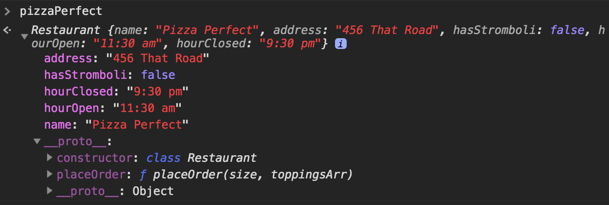

Often we need to represent an idea or concept in our programs — an employee, or a car, or a concert or restaurant. Representing these concepts directly in code comes in two parts: data to represent the state, and functions to represent the behavior. ES6 classes give us a convenient syntax for defining the state and behavior of objects that will represent our concepts.

So far you've represented concepts like these as key-value pairs in simple JavaScript objects.

```js
const restaurant = {
  name: "Nicky's Pizza",
  address: "123 Sesame St",
  hasStromboli: true,
  hourOpen: "11:00 am",
  hourClosed: "10:00 pm",
  placeOrder: (size, toppingsArr) => {
    console.log(`You ordered a ${size} pizza covered in ${toppingsArr.join(", ")})
  }
}
```
Now look at how you would create this object using the `class` keyword.

```js
class Restaurant {

  constructor() {
    this.name = "Nicky's Pizza"
    this.address = "123 Sesame St"
    this.hasStromboli = true
    this.hourOpen = "11:00 am"
    this.hourClosed = "10:00 pm"
  }

  placeOrder(size, toppingsArr) {
    console.log(`You ordered a ${size} pizza covered in ${toppingsArr.join(", ")})
  }
}
```

This allows us to create an object with `const pizzaJoint = new Restaurant()`.

Of course, this is fairly limiting as it is. We can only make an object -- an instance of Restaurant -- the same way every time.

What if we wanted to make a lot of different pizza joints that shared similar properties, but each had its own values for those properties?

Here's a refactor, with the ability to pass in those unique values to each new retaurant we create. That's a lot of properties to write out as parameters for the constructor method, so let's set it up to take an object as an agument, called `props`.

Notice we've also added a new `menu` property and some methods for interacting with it:

```js
class Restaurant {

  constructor(props) {
    this.name = props.name
    this.address = props.address
    this.hasStromboli = props.hasStromboli
    this.hourOpen = props.hourOpen
    this.hourClosed = props.hourClosed
    this.menu = {
      small_pizza: null,
      large_pizza: null,
      soda: null,
      salad: null,
      breadsticks: null
    }
  }

  pizzaOrder(size, toppingsArr) {
    console.log(`You ordered a ${size} pizza covered in ${toppingsArr.join(", ")}. Please pick up before ${this.hourClosed}!`)
  }

  // Update/add properties with a method
  setMenu(menuItems) {
    for (let item in menuItems) {
      console.log(item)
      this.menu[item] = Number(menuItems[item]) //make sure the value is a number, not a string
    }
  }

  // Get a special, combined price for a combo of a small pizza, soda, and a salad.
  comboPrice(side) {
    let discount = .85
    let comboPrice =
      this.menu.small_pizza +
      this.menu.soda +
      this.menu.salad

    return `$${(comboPrice * discount).toFixed(2)}`
  }

}
```
Now you can make many instances of `Restaurant` and each one will be unique, but based on a common definition of how a restaurant will be represented in our project.

```js
const pizzaPerfect = new Restaurant({name: "Pizza Perfect", address: "456 That Road", hasStromboli: false, hourOpen: "11:30 am", hourClosed: "9:30 pm")

const pizzaChain = new Restaurant({ name: "Pizza Hut", address: "8907 This Road", hasStromboli: false, hourOpen: "10:30 am", hourClosed: "11:00 pm")

const italianPlace = new Restaurant({name: "Geno's Joint", address: "4567 Other Road, Suite #45", hasStromboli: true, hourOpen: "11:30 am", hourClosed: "8:30 pm")
```

Logging out a Restaurant instance will show that it's an object, complete with inheritance from the `Restaurant` and `Object` objects:



A few things to note.
* Classes can only contain method definitions, not data properties;
* When defining methods, you use shorthand method definitions;
* Unlike when creating objects, you do not separate method definitions in class bodies with commas

## Practice: Big Scary Birds

> The learning objective for this practice exercise is to use the class syntax to establish a reusable definition of how an object will be defined in a program

Your job is to create a large, flightless bird class that defines the properties of a feathered terror. It should have the following properties:

* height
* flightless (should always be true)
* isExtinct
* name
* running speed
* toString -- This will be a method that outputs a description of the bird based on some of its properties. Example output: "The Cassowary is a big, scary bird that stands up to 6 ft and can run up to 30 mph!"

Create at least 3 instances of the class.

## Practice: Calculated Properties
> The learning objective for this challenge is to write a getter for the `comboPrice` property of a pizza restaurant. This lets you explore the concept of calculated properties.

Up to this point, we have used methods (i.e. functions on objects) to perform logic and calculations needed for a Class. Properties are simple, primitive values like "John", 100, and `true`. With the power of getters and setters in your classes, you can still have properties, but their value is calculated via a function rather than being simple assignment and retrieval.

Take a look at the `Restaurant` class example from earlier. Note how it uses methods to set some values ( the menu prices ) and calculate others ( the combo meal price ). Those work fine, but we can also use special functions called `getters` and `setters` to allow us to get or set values as properties.

Consider the `comboPrice()` method we added to the Restaurant object. `comboPrice` itself is not a behavior, or a process, of the Restaurant, but you had to write it as a method because you needed to add together prices from the menu and return the calculated value. And although the syntax looks like you're defining a method...

```js
class Restaurant {
  // constructor, etc...

  get comboPrice() {
    // Add logic here to calc and return combo price
  }

}

```
...what results is the ability to treat combo price as any other property of `Restaurant`. Look carefully and note the space between `get` and `comboPrice`. It's not a typo. `get` defines this as a getter; `comboPrice` will be the property

```js
// Note the lack of parenthesis after comboPrice. It's a property.
console.log(myRestaurant.comboPrice)
```
### Strech Goal:
>Allow a restaurant to define the items in its combo meal, based on items from the menu (i.e. `this.menu.breadsticks`), using a setter. Then have your `comboPrice` getter use the `combo` property created by the setter instead of the hard-coded menu items to calculate the cost.

Like the getter, the setter allows us to use a function to calculate a value using what looks like a regular property assignment.

```js
class Restaurant {
  // constructor, etc...

  set combo(items) {
    //set items as the property 'combo' on the Restaurant instance
  }

  get comboPrice() {
    //logic to calc and return combo price
  }

}
```
Then the syntax to add the new value is simply `myRestaurant.combo = [myRestaurant.menu.small_pizza, myRestaurant.menu.soda, etc]`

### Extra Stretch Goal!
>Make sure that the value of the `combo` property is an array before setting it. Can't do _that_ with an old-fashioned value assignment, can ya?
