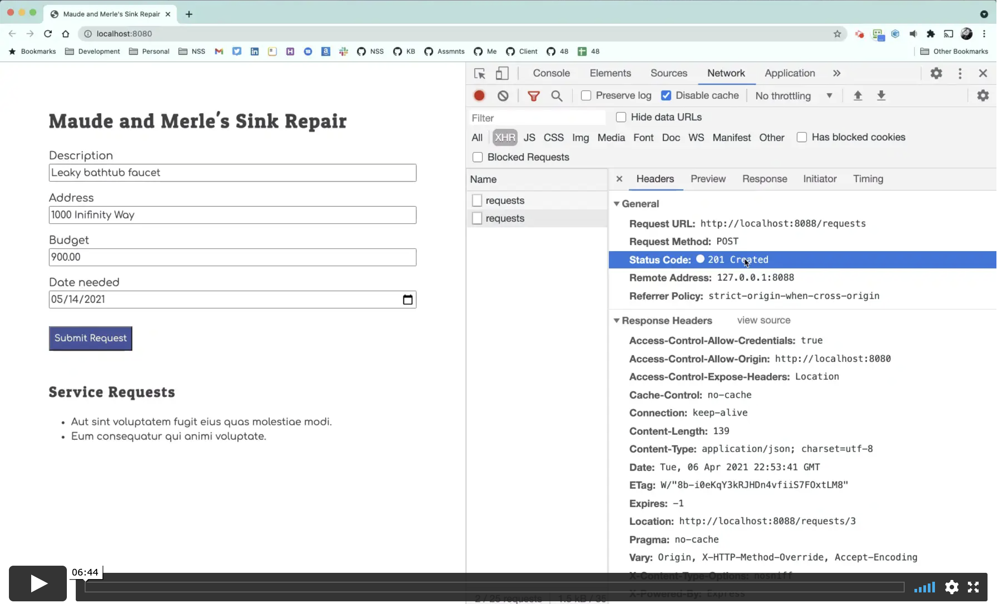

# Saving Permanent State

As the person is typing into the form fields, they are changing the state of the application, but it is transient state because the person hasn't committed to the service request until the button is clicked. When the person clicks the button, your job is to take the transient state and convert it into permanent state by storing it in the `database.json` file by using a `fetch()` call.

Feel free to go back and watch video in chapter 1 or a refresher on fetch.

## HTTP POST Request with Fetch

Place the following function in your `dataAccess.js` module. The POST method on any HTTP request means _"Hey API!! I want you to create something new!"_

```js
export const sendRequest = (userServiceRequest) => {
    const fetchOptions = {
        method: "POST",
        headers: {
            "Content-Type": "application/json"
        },
        body: JSON.stringify(userServiceRequest)
    }


    return fetch(`${API}/requests`, fetchOptions)
        .then(response => response.json())
        .then(() => {

        })
}
```

## HTTP Request Methods

Here are the four main methods used on HTTP requests.

| Method | Description |
|--|--|
| **GET**  | Please give me this resource.  |
| **POST**  | Please create something new.  |
| **PUT**  | Please modify an existing resource.  |
| **DELETE**  | Please delete an existing.  |


## Listen for the Click

Add the following event listener to the **`ServiceForm`** module. Read each line of code, discuss with your teammates, and see if you can understand what everything is doing. Make sure you write down any questions you have about the code for the review with the instruction team.

```js
const mainContainer = document.querySelector("#container")

mainContainer.addEventListener("click", clickEvent => {
    if (clickEvent.target.id === "submitRequest") {
        // Get what the user typed into the form fields
        const userDescription = document.querySelector("input[name='serviceDescription']").value
        const userAddress = document.querySelector("input[name='serviceAddress']").value
        const userBudget = document.querySelector("input[name='serviceBudget']").value
        const userDate = document.querySelector("input[name='serviceDate']").value

        // Make an object out of the user input
        const dataToSendToAPI = {
            description: userDescription,
            address: userAddress,
            budget: userBudget,
            neededBy: userDate
        }

        // Send the data to the API for permanent storage
        sendRequest(dataToSendToAPI)
    }
})
```

## Using Developer Tools with Fetch

Watch the following video for an overview of how to use your Developer Tools to see what data is being sent in the request, and the response, when working the GET and POST requests.

[](https://vimeo.com/533754593)


