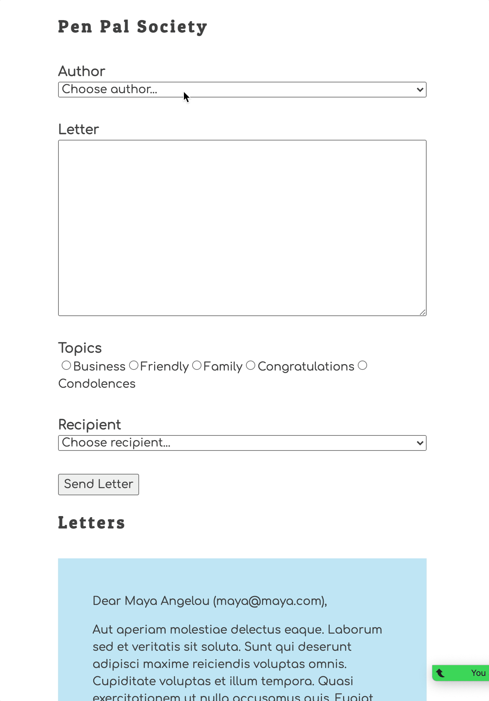

# Asynchronous Request/Response Assessment

This project will help you assess your ability to apply the JavaScript skills that you practiced in this book.

1. Form fields
1. Collecting user input
1. `fetch()` and `then()`
1. Asynchronous state management

## Demo

## Features

### User can choose an author

**Given** a pen pal wants to send a letter

**When** the Pen Pal app loads

**Then** there should be a select element that displays all pen pals to choose for the author

### User can choose an recipient

**Given** a pen pal wants to send a letter

**When** the Pen Pal app loads

**Then** there should be a select element that displays all pen pals to choose for the recipient

### User can choose a letter topic

**Given** a pen pal wants to send a letter

**When** the Pen Pal app loads

**Then** there should be a group of radio buttons for the user to choose a topic

### User can enter the letter body

**Given** a pen pal wants to send a letter

**When** the Pen Pal app loads

**Then** there should be textarea element in which the user can type in the letter body

### User can save letter

**Given** a pen pal wants to send a letter

**When** the Pen Pal app loads

**Then** there should be button labeled Send at the bottom of the form

---

**Given** a pen pal is done writing a letter

**When** the pal clicks the Send button

**Then** the letter should be saved in the API database

**And** the new letter should immediately be rendered in the list of letters below the form

**And** the rendered letter should display the following information

* author
* recipient
* date sent
* email address of author/recipient
* topic of letter

## Deep Learning

Another reminder from the instruction team. This is NOT A TEST. We are not looking for 100% completion, although if you can make it work completely, then huzzah for you.

What we are looking for is effort, critical thinking about the concepts, creative thinking to bind the concepts together for a solution, and collaboration with your teammates and instruction team.

If you only get 50% of it complete, but display the above Core Skills and can demonstrate understanding of the fundamental code concepts, then you are learning and growing - which is what we care about.
